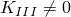
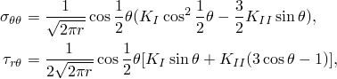
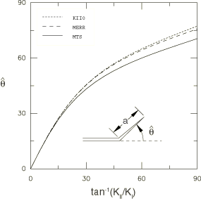
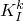
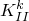
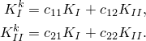
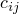
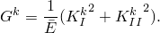
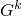
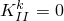

# 2.16.4 Prediction of the direction of crack propagation

### 2.16.4 Prediction of the direction of crack propagation

**Product: **Abaqus/Standard

Various criteria have been proposed to predict the angle at which a pre-existing crack will propagate. Among these criteria are the maximum tangential stress criterion ([Erdogan and Sih, 1963](07s01a01-References.md)), the maximum principal stress criterion ([Maiti and Smith, 1983](07s01a01-References.md)), the maximum energy release rate criterion ([Palaniswamy and Knauss, 1978](07s01a01-References.md), and [Hussain, Pu, and Underwood, 1974](07s01a01-References.md)), the minimum elastic energy density criterion ([Sih, 1973](07s01a01-References.md)), and the T-criterion ([Theocaris, 1982](07s01a01-References.md)). These criteria predict slightly different angles for the initial crack propagation, but they all have the implication that  at the crack tip as the crack extends ([Cotterell and Rice, 1980](07s01a01-References.md)). In Abaqus/Standard we provide three criteria for homogeneous, isotropic linear elastic materials: the maximum tangential stress criterion, the maximum energy release rate criterion, and the  criterion.  is not taken into account in what follows, since a generally accepted theory for crack propagation with  remains to be developed.
### Maximum tangential stress criterion

The near-crack-tip stress field for a homogeneous, isotropic linear elastic material is given by

where *r* and  are polar coordinates centered at the crack tip in a plane orthogonal to the crack front.

The direction of crack propagation can be obtained using either the condition  or ; i.e.,

where the crack propagation angle  is measured with respect to the crack plane.  represents the crack propagation in the "straight-ahead" direction.  if  while  if 
### Maximum energy release rate criterion

Consider a crack segment of length *a* kinking out the plane of the crack at an angle , as shown in [Figure 2.16.4&#8211;1](02s16a55.md).

Figure 2.16.4&#8211;1 Contour for evaluation of the *J*-integral.

 When *a* is infinitesimally small compared with all other geometric lengths (including the length of the parent crack), the stress intensity factors  and  at the tip of the putative crack can be expressed as linear combinations of  and , the stress intensity factors existing prior to kinking for the parent crack:

The -dependences of the coefficients  are given by [Hayashi and Nemat-Nasser (1981)](07s01a01-References.md) and by [He and Hutchinson (1989)](07s01a01-References.md).

For the crack segment we also have the relation

The maximum energy release rate criterion postulates that the parent crack initially propagates in the direction that maximizes .
### KII = 0 criterion

This criterion simply postulates that a crack will initially propagate in the direction that makes .

It can be seen from [Figure 2.16.4&#8211;1](02s16a55.md) that the maximum energy release rate criterion and the  criterion predict nearly coincident crack propagation angles. By comparison, the maximum tangential stress criterion predicts smaller crack propagation angles.
### Reference

### Reference

"Contour integral evaluation,"  Section 11.4.2 of the Abaqus Analysis User's Guide