# 3.2.3 Hybrid incompressible solid element formulation

### 3.2.3 Hybrid incompressible solid element formulation

**Products: **Abaqus/Standard  Abaqus/Explicit

Many problems involve the prediction of the response of almost incompressible materials. This is especially true at large strains, since most solid materials show relatively incompressible behavior under large deformations. In this section we describe the augmented virtual work basis provided in Abaqus/Standard for such cases. The method is described in the context of incompressible elasticity theory, since that is where it is most likely to be used.

When the material response is incompressible, the solution to a problem cannot be obtained in terms of the displacement history only, since a purely hydrostatic pressure can be added without changing the displacements. The nearly incompressible case (that is, when the bulk modulus is much larger than the shear modulus or Poisson's ratio, , is greater than 0.4999999) exhibits behavior approaching this limit, in that a very small change in displacement produces extremely large changes in pressure, so that a purely displacement-based solution is too sensitive to be useful numerically (for example, round-off on the computer may cause the method to fail). We remove this singular behavior in the system by treating the pressure stress as an independently interpolated basic solution variable, coupled to the displacement solution through the constitutive theory and the compatibility condition, with this coupling implemented by a Lagrange multiplier. This independent interpolation of pressure stress is the basis of these "hybrid" elements. More precisely, they are "mixed formulation" elements, using a mixture of displacement and stress variables with an augmented variational principle to approximate the equilibrium equations and compatibility conditions. The hybrid elements also remedy the problem of volume strain "locking," which can occur at much lower values of  (i.e.,  0.49). Volume strain locking occurs if the finite element mesh cannot properly represent incompressible deformations. Volume strain locking can be avoided in regular displacement elements by fully or selectively reduced integration, as described in "Solid isoparametric quadrilaterals and hexahedra,"  Section 3.2.4.

We begin by writing the internal virtual work:

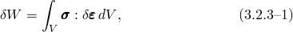where  is the virtual strain:

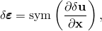where  is the virtual displacement field,  is the true (Cauchy) stress, *V* is the current volume, and 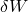 is the virtual work as defined by this equation. See "Equilibrium and virtual work,"  Section 1.5.1, for a detailed discussion of the virtual work concept.

In a displacement-based formulation the Cauchy stress, , is obtained with the constitutive equations from the deformation, usually in rate form:

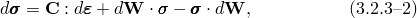where  is the "material stiffness matrix" and 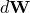 is the rate of rotation (spin) of the material.

We modify the Cauchy stress by introducing an independent hydrostatic pressure field  as follows:

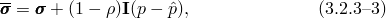where

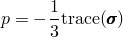is the hydrostatic pressure stress and  is a small number. If  was set equal to zero, the hydrostatic component in  would be identical to the independent pressure field , corresponding to a pure "mixed" formulation. The small nonzero value (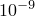) is chosen to avoid equation solver difficulties. This relation is used in incremental form:

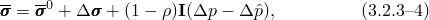where 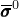 is the modified Cauchy stress at the start of the increment. We use the modified Cauchy stress in the virtual work expression and augment the expression with the Lagrange multiplier enforced constraint 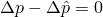:

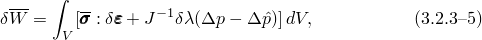with *J* the volume change ratio (Jacobian) and  a Lagrange multiplier whose interpolation must still be determined. 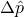 will be interpolated over each element so that the constraint is satisfied in an integrated (average) sense. Since  is the value of the equivalent pressure stress increment computed from the kinematic solution, [Equation 3.2.3&#8211;4](03s02a61.md) does not make sense if the material is fully incompressible because then  cannot be computed. For the purpose of development we regard the bulk modulus as finite, and we will be able to show that the final formulation approaches a usable limit as we allow the bulk modulus to approach infinity.

For the formulation of the tangent stiffness (the Jacobian), we need to define the rate of change of 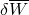. Therefore, we rewrite the virtual work equation in terms of the reference volume :

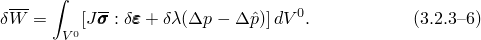The rate of change 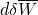 is then readily obtained as

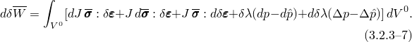We rewrite this expression in terms of the current volume:

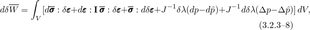where we used the identity 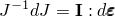.

The rate of the modified stress follows from [Equation 3.2.3&#8211;4](03s02a61.md) and the constitutive equations:

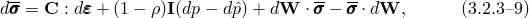where

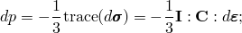and we used the fact that 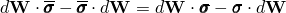, since  and  differ only in the hydrostatic part. Substituting these expressions into the expression for the rate of virtual work yields

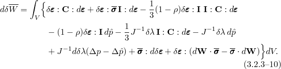

It remains to choose . To get a symmetric expression for the rate of virtual work, we choose

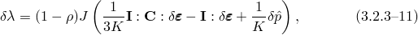where

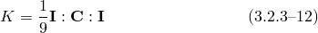is the (instantaneous) bulk modulus. This is a suitable choice for , because the (independent) term proportional to 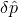 ensures that the modified incremental pressure field, , is properly constrained to the incremental pressure, . If we assume that the volumetric moduli 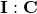 and *K* change slowly with strain and ignore changes in volume, we can write for the second variation 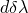:

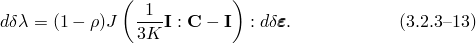Hence, we find for the virtual work expression:

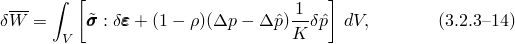where

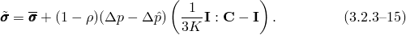For the rate of change of virtual work we find

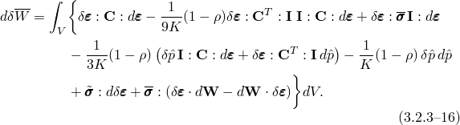The initial stress term can be approximated by

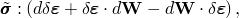which can be written as

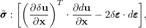so that the final expression for the rate of virtual work becomes

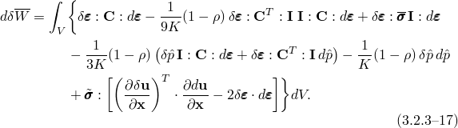

The asymmetric term 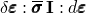 is significant only if large volume changes occur. Hence, the term is ignored except for material models with volumetric plasticity, such as the (capped) Drucker-Prager model and the Cam-clay model. For these models the constitutive matrix  is usually asymmetric anyway so that the addition of this nonsymmetric term does not affect the cost of the analysis. It was assumed in the expression for  that the (volumetric) moduli change only slowly with strain. This is not the case for material models with volumetric plasticity, in which these moduli can change abruptly. This may lead to slow convergence or even convergence failures. Failures usually occur only in higher-order elements, since in lower-order elements 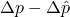 approaches zero at every point and the error in  has no impact.
### Reference

### Reference

"Solid (continuum) elements,"  Section 28.1.1 of the Abaqus Analysis User's Guide