# 3.2.4 Solid isoparametric quadrilaterals and hexahedra

### 3.2.4 Solid isoparametric quadrilaterals and hexahedra

**Products: **Abaqus/Standard  Abaqus/Explicit

The library of solid elements in Abaqus contains first- and second-order isoparametric elements. The first-order elements are the 4-node quadrilateral for plane and axisymmetric analysis and the 8-node brick for three-dimensional cases. The library of second-order isoparametric elements includes "serendipity" elements: the 8-node quadrilateral and the 20-node brick, and a "full Lagrange" element, the 27-node (variable number of nodes) brick. The term "serendipity" refers to the interpolation, which is based on corner and midside nodes only. In contrast, the full Lagrange interpolation uses product forms of the one-dimensional Lagrange polynomials to provide the two- or three-dimensional interpolation functions.

All these isoparametric elements are available with full or reduced integration. Gauss integration is almost always used with second-order isoparametric elements because it is efficient and the Gauss points corresponding to reduced integration are the Barlow points ([Barlow, 1976](07s01a01-References.md)) at which the strains are most accurately predicted if the elements are well-shaped.

The three-dimensional brick elements can also be used for the analysis of laminated composite solids. Several layers of different material, in different orientations, can be specified in each solid element. The material layers or lamina can be stacked in any of the three isoparametric coordinates, parallel to opposite faces of the master element ([Figure 3.2.4&#8211;1](03s02a62.md)). These elements use the same interpolation functions as the homogeneous elements, but the integration takes the variation of material properties in the stacking direction into account.

Hybrid pressure-displacement versions of these elements are provided for use with incompressible and nearly incompressible constitutive models (see "Hybrid incompressible solid element formulation,"  Section 3.2.3, and "Hyperelastic material behavior,"  Section 4.6.1, for a detailed discussion of the formulations used).
### Interpolation

Isoparametric interpolation is defined in terms of the isoparametric element coordinates *g*, *h*, *r* shown in [Figure 3.2.4&#8211;1](03s02a62.md). These are material coordinates, since Abaqus is a Lagrangian code. They each span the range  to 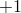 in an element. The node numbering convention used in Abaqus for isoparametric elements is also shown in [Figure 3.2.4&#8211;1](03s02a62.md). Corner nodes are numbered first, followed by the midside nodes for second-order elements. The interpolation functions are as follows.

First-order quadrilateral:

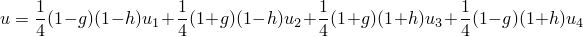

Figure 3.2.4&#8211;1 Isoparametric master elements.

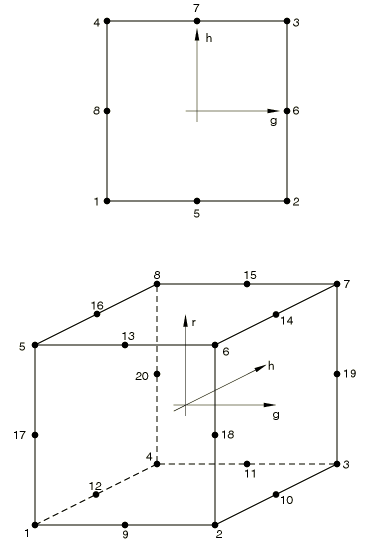

Second-order quadrilateral:

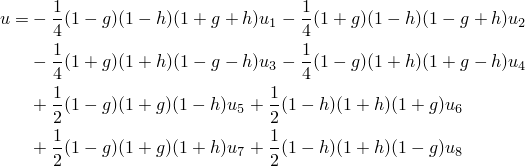

First-order brick:

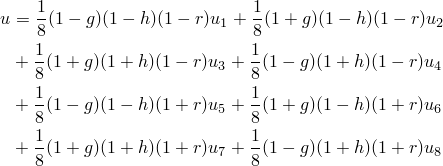

20-node brick:

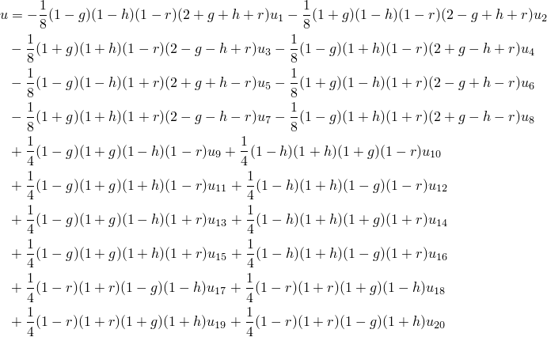
### Integration of homogeneous solids

All the isoparametric solid elements are integrated numerically. Two schemes are offered: "full" integration and "reduced" integration. For the second-order elements Gauss integration is always used because it is efficient and it is especially suited to the polynomial product interpolations used in these elements. For the first-order elements the single-point reduced-integration scheme is based on the "uniform strain formulation": the strains are not obtained at the first-order Gauss point but are obtained as the (analytically calculated) average strain over the element volume. The uniform strain method, first published by [Flanagan and Belytschko (1981)](07s01a01-References.md), ensures that the first-order reduced-integration elements pass the patch test and attain the accuracy when elements are skewed. Alternatively, the "centroidal strain formulation," which uses 1-point Gauss integration to obtain the strains at the element center, is also available for the 8-node brick elements in Abaqus/Explicit for improved computational efficiency. The differences between the uniform strain formulation and the centroidal strain formulation can be shown as follows:

For the 8-node brick elements the interpolation function given above can be rewritten as

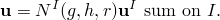The isoparametric shape functions  can be written as

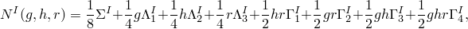where

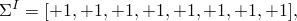

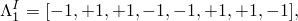

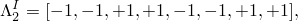

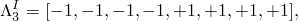

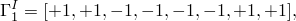

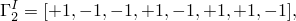

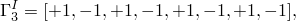

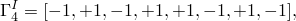and the superscript *I* denotes the node of the element. The last four vectors, 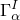 ( has a range of four), are the hourglass base vectors, which are the deformation modes associated with no energy in the 1-point integration element but resulting in a nonconstant strain field in the element.

In the uniform strain formulation the gradient matrix 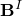 is defined by integrating over the element as

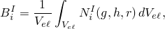

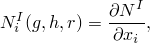where 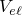 is the element volume and *i* has a range of three.

In the centroidal strain formulation the gradient matrix  is simply given as

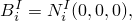which has the following antisymmetric property:

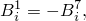

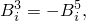

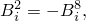

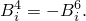It can be seen from the above that the centroidal strain formulation reduces the amount of effort required to compute the gradient matrix. This cost savings also extends to strain and element nodal force calculations because of the antisymmetric property of the gradient matrix. However, the centroidal strain formulation is less accurate when the elements are skewed. For two-dimensional plane elements and hexahedron elements in a parallelepiped configuration the uniform strain approach is identical to the centroidal strain approach.

Full integration means that the Gauss scheme chosen will integrate the stiffness matrix of an element with uniform material behavior exactly if the Jacobian of the mapping from the isoparametric coordinates to the physical coordinates is constant throughout the element; this means that opposing element sides or faces in three-dimensional elements must be parallel and, in the case of the second-order elements, that the midside nodes must be at the middle of the element sides. If the element does not satisfy these conditions, full integration is not exact because some of the terms in the stiffness are of higher order than those that are integrated exactly by the Gauss scheme chosen. Such inaccuracy in the integration does not appear to be detrimental to the element's performance. As will be discussed below, full integration in Abaqus in first-order elements includes a further approximation and is more accurately called "selectively reduced integration."

Reduced integration usually means that an integration scheme one order less than the full scheme is used to integrate the element's internal forces and stiffness. Superficially this appears to be a poor approximation, but it has proved to offer significant advantages. For second-order elements in which the isoparametric coordinate lines remain orthogonal in the physical space, the reduced-integration points have the Barlow point property ([Barlow, 1976](07s01a01-References.md)): the strains are calculated from the interpolation functions with higher accuracy at these points than anywhere else in the element. For first-order elements the uniform strain method yields the exact average strain over the element volume. Not only is this important with respect to the values available for output, it is also significant when the constitutive model is nonlinear, since the strains passed into the constitutive routines are a better representation of the actual strains.

Reduced integration decreases the number of constraints introduced by an element when there are internal constraints in the continuum theory being modeled, such as incompressibility, or the Kirchhoff transverse shear constraints if solid elements are used to analyze bending problems. In such applications fully integrated elements will "lock"---they will exhibit response that is orders of magnitude too stiff, so the results they provide are quite unusable. The reduced-integration version of the same element will often work well in such cases.

Finally, reduced integration lowers the cost of forming an element; for example, a fully integrated, second-order, 20-node three-dimensional element requires integration at 27 points, while the reduced-integration version of the same element only uses 8 points and, therefore, costs less than 30% of the fully integrated version. This cost savings is especially significant in cases where the element formation costs dominate the overall costs, such as problems with a relatively small wavefront and problems in which the constitutive models require lengthy calculations. The deficiency of reduced integration is that, except in one dimension and in axisymmetric geometries modeled with higher than first-order elements, the element stiffness matrix will be rank deficient. This most commonly exhibits itself in the appearance of singular modes ("hourglass modes") in the response. These are nonphysical response modes that can grow in an unbounded way unless they are controlled. The reduced-integration second-order serendipity interpolation elements in two dimensions---the 8-node quadrilaterals---have one such mode, but it is benign because it cannot propagate in a mesh with more than one element. The second-order three-dimensional elements with reduced integration have modes that can propagate in a single stack of elements. Because these modes rarely cause trouble in the second-order elements, no special techniques are used in Abaqus to control them.

In contrast, when reduced integration is used in the first-order elements (the 4-node quadrilateral and the 8-node brick), hourglassing can often make the elements unusable unless it is controlled. In Abaqus the artificial stiffness method and the artificial damping method given in [Flanagan and Belytschko (1981)](07s01a01-References.md) are used to control the hourglass modes in these elements. The artificial damping method is available only for the solid and membrane elements in Abaqus/Explicit. To control the hourglass modes, the hourglass shape vectors, 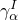, are defined:

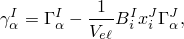which are different from the hourglass base vectors, . It is essential to use the hourglass shape vectors rather than the hourglass base vectors to calculate the hourglass-resisting forces to ensure that these forces are orthogonal to the linear displacement field and the rigid body field (see [Flanagan and Belytschko (1981)](07s01a01-References.md) for details). However, using the hourglass base vectors to calculate the hourglass-resisting forces may provide computational speed advantages. Therefore, for the 8-node brick elements Abaqus/Explicit provides the option to use the hourglass base vectors in calculating the hourglass-resisting forces. For hexahedron elements in a parallelepiped configuration the hourglass shape vectors are identical to the hourglass base vectors.

The hourglass control methods of [Flanagan and Belytschko (1981)](07s01a01-References.md) are generally successful for linear and mildly nonlinear problems but may break down in strongly nonlinear problems and, therefore, may not yield reasonable results. Success in controlling hourglassing also depends on the loads applied to the structure. For example, a point load is much more likely to trigger hourglassing than a distributed load. Hourglassing can be particularly troublesome in eigenvalue extraction problems: the low stiffness of the hourglass modes may create many unrealistic modes with low eigenfrequencies.

A refinement of the [Flanagan and Belytschko (1981)](07s01a01-References.md) hourglass control method that replaces the artificial stiffness coefficients with those derived from a three-field variational principle is available in Abaqus/Explicit. The approach is based on the enhanced assumed strain and physical hourglass control methods proposed in [Engelmann and Whirley (1990)](07s01a01-References.md), [Belytschko and Bindeman (1992)](07s01a01-References.md), and [Puso (2000)](07s01a01-References.md). It can provide increased resistance to hourglassing for nonlinear problems and coarse mesh displacement solution accuracy for linear elastic problems at a small additional computational cost.

Experience suggests that the reduced-integration, second-order isoparametric elements are the most cost-effective elements in Abaqus for problems in which the solution can be expected to be smooth. Note that in the case of incompressible material behavior, such as hyperelasticity at finite strain, the mixed formulation elements with reduced integration should be used (see "Hybrid incompressible solid element formulation,"  Section 3.2.3, and "Hyperelastic material behavior,"  Section 4.6.1). When large strain gradients or strain discontinuities are expected in the solution---such as in plasticity analysis at large strains, limit load analysis, or analysis of severely loaded rubber components---the first-order elements are usually recommended. Reduced integration can be used with such elements, but because the hourglass controls are not always effective in severely nonlinear problems, caution should be exercised.

Fully integrated first-order elements should not be used in cases where "shear locking" can occur, such as when the elements must exhibit bending behavior. The incompatible mode elements ("Continuum elements with incompatible modes,"  Section 3.2.5) should be used for such applications.
### Fully integrated first-order isoparametric elements

For fully integrated first-order isoparametric elements (4-node elements in two dimensions and 8-node elements in three dimensions) the actual volume changes at the Gauss points are replaced by the average volume change of the element. This is also known as the selectively reduced-integration technique, because the order of integration is reduced in selected terms, or as the 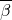 technique, since the strain-displacement relation (-matrix) is modified. This technique helps to prevent mesh locking and, thus, provides accurate solutions in incompressible or nearly incompressible cases: see [Nagtegaal et al. (1974)](07s01a01-References.md). In addition, Abaqus uses the average strain in the third (out-of-plane) direction for axisymmetric and generalized plane strain problems. Hence, in the two-dimensional elements only the in-plane terms need to be modified. In the three-dimensional elements the complete volumetric terms are modified. This may cause slightly different behavior between plane strain elements and three-dimensional elements for which a plane strain condition is enforced by boundary conditions.

In a finite-strain formulation the selectively reduced-integration procedure works as follows. Define the modified deformation gradient

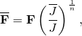where 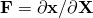 is the deformation gradient; *n* is the dimension of the element;  is the Jacobian at the Gauss point; and 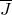 is the average Jacobian over the element,

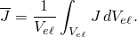For three-dimensional elements  and *J* () are the volume change; for two-dimensional elements 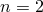 and *J* () are the change in area. Note that in the last case  is the change in area averaged over the element *volume*, which is different from the actual element area for distorted elements with variable thickness.

The modified rate of deformation tensor, , is obtained from the modified deformation gradient 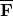 as

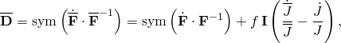where 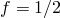 for two-dimensional elements, 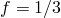 for three-dimensional elements, and  is the identity matrix in two or three dimensions. This expression can also be written directly in terms of the velocities:

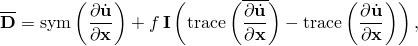where

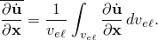This expression is used in the virtual work equation, where it is used to obtain the nodal forces from the element stresses. In Abaqus the central difference operator is used to define an increment of strain from the rate of deformation tensor, so we can write

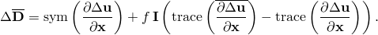In the above 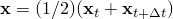 is the position of the point at the middle of the increment.

For axisymmetric and generalized plane strain elements, the out-of-plane component of the deformation gradient is obtained by averaging over the original element volume,

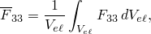and the out-of-plane strain increment is calculated by averaging over the current element volume,

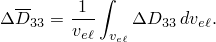Both of these averages are calculated analytically.
### Integration of composite solids

The composite solid elements are also integrated numerically to obtain the element matrices. Gauss quadrature is used in the layer plane, and Simpson's rule is used in the stacking direction. These integration positions are referred to as "integration points" and "section points," respectively, for output purposes. The number of section points required for the integration through the thickness of each layer is specified by the user.
### Reference

### Reference

"Solid (continuum) elements,"  Section 28.1.1 of the Abaqus Analysis User's Guide