# 3.2.9 Axisymmetric elements allowing nonlinear bending

### 3.2.9 Axisymmetric elements allowing nonlinear bending

**Product: **Abaqus/Standard

Abaqus/Standard includes a library of solid elements whose geometry is initially axisymmetric and that allow for nonlinear analysis in which bending can occur about the plane 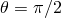 in the (*r*, *z*, ) cylindrical coordinate system of the model. The geometric model is defined in the *r*&#8211;*z* plane only. The displacements are the usual isoparametric interpolations with respect to *r* and *z*, augmented by Fourier expansions with respect to . Since the elements are written for bending about the plane  only, they cannot be used to model torsion of the structure about the original axis of symmetry. Because the elements are intended for nonlinear applications, the orthogonality properties associated with Fourier modes cannot be used to reduce the problem to a series of smaller, uncoupled, cases, since the stiffness before projection onto the Fourier modes is not necessarily constant. For this reason these elements are significantly more expensive to use than the corresponding axisymmetric elements intended for axisymmetric deformations.
### Interpolation

The coordinate system used with these elements is the cylindrical system (*r*, *z*, ), where *r* measures the distance of a point from the axis of the cylindrical system, *z* measures its position along this axis, and  measures the angle between the plane containing the point and the axis of the coordinate system and some fixed reference plane that contains the coordinate system axis. The order in which the coordinates and displacements are taken in these elements is based on the convention used in Abaqus for axisymmetric elements, so that *z* is the second coordinate. This allows these elements to be used in conjunction with other elements in the library that allow only axisymmetric deformation. This order is not the same as that used in three-dimensional elements in Abaqus in which *z* is the third coordinate, nor is it the order (*r*, , *z*), usually taken in cylindrical systems.

The original geometry of the elements is assumed to be axisymmetric with respect to the axis of the coordinate system and, thus, independent of . Let , 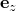, and 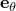 be unit vectors in the radial, axial, and circumferential directions at a point in the undeformed state. The reference position  of the point can be represented in terms of the original radius *R* and the axial position *Z*:

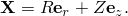Similarly the displacement  of the point can be represented in terms of the components 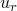, , and  with respect to these same vectors at the original position of the point:

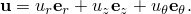For small radial and circumferential displacements the circumferential displacement is proportional to the change in circumferential angle (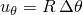), but for large displacements this relation becomes nonlinear (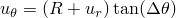), as shown in [Figure 3.2.9&#8211;1](03s02a67.md).

Figure 3.2.9&#8211;1 Displacement and rotation in the *r*&#8211; plane.

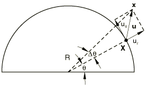 The distinction is of importance only in geometrically nonlinear analysis with radially applied concentrated loads and/or sliding radial boundary conditions.This definition of the degrees of freedom is equivalent to applying transformations to the global (*x*, *y*, *z*) degrees of freedom associated with a standard continuum element. Hence, the nonlinear equations associated with these elements have the same structure as the equations for standard continuum elements.

A general interpolation scheme for  using Fourier terms with respect to  is used:

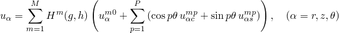where *g*, *h* are isoparametric coordinates in the original *R*&#8211;*Z* plane; 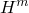 are polynomial interpolation functions; and 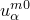, 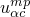, and 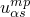 are solution amplitude values. *M* is the number of terms used for interpolation with respect to *g*, *h*; and *P* is the number of terms used in the Fourier interpolation with respect to . Purely axisymmetric deformation results when 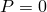.

We reduce the number of variables in such an element by assuming that bending is allowed only about one plane, , so that the plane , *n* integer, is a plane of symmetry. The only terms that satisfy this condition are

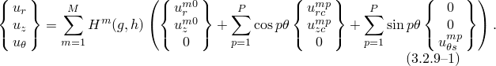 For convenience we use the values of the  and  displacement components at specific locations around the model between  and  instead of the Fourier amplitudes 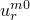 and 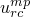. The main reason for this is to allow the elements to be used with interface elements, such as slide lines, for which physical displacement values are required. This is accurate only if it is assumed that the relative displacements in the -direction are small so that the interface conditions are considered with respect to  and  only; that is, in planes of constant . In addition, we omit the subscript *s* in the expression for the circumferential displacement: 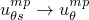. [Equation 3.2.9&#8211;1](03s02a67.md) is, therefore, rewritten

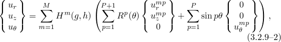where  are trigonometric interpolation functions and 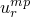,  are physical radial and axial displacement components at 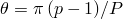.

The 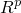 interpolators at the associated positions 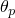 are taken as

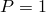:

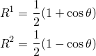and

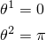

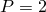:

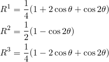and

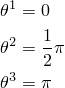

:

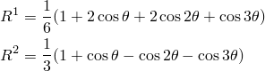

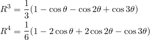and

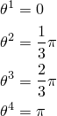

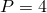:

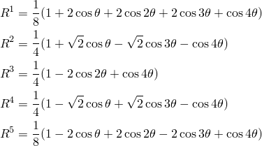and

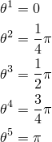

 is the highest-order interpolation offered with respect to  in these elements: the elements become significantly more expensive as higher-order interpolation is used; and it is assumed that, because of this, full three-dimensional modeling is less expensive than using these elements with 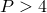.
### Integration

The integration scheme used in these elements is a product of integration with respect to element coordinates in surfaces that were originally in the &#8211;*Z* plane and integration with respect to . For the former the same scheme is used as in the corresponding purely axisymmetric elements (for example, either full or reduced Gauss integration in the isoparametric quadrilaterals). For integration with respect to  the trapezoidal rule is used, with the number of integration points set to 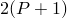.
### Deformation gradient

For a material point in space the deformation gradient  is defined as the gradient of the current position  with respect to the original position :

The current position  can be described in terms of the original position 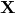 and the displacement 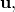

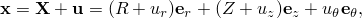and the gradient operator can be described in terms of partial derivatives with respect to the cylindrical coordinates:

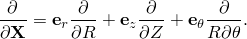

Since the radial and circumferential base vectors depend on the original circumferential coordinate : , , the partial derivatives of these base vectors with respect to  are nonvanishing:

With this result the deformation gradient is obtained as

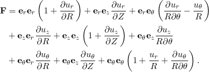Alternatively, this can be written in matrix form with components relative to the local reference basis , , :

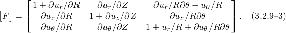

To be able to analyze approximately incompressible material behavior, the volume change in the fully integrated 4-node quadrilaterals is assumed to be independent of *g* and  in an *R*&#8211;*Z* plane. Hence, 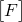 is modified according to

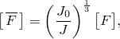where 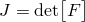 is the volume change at the integration point and 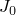 is the average volume change over the *R*&#8211;*Z* plane of the element. In addition, the part of the axisymmetric hoop strain that does not depend on  is made independent of *g* and *h*. Experience has shown this considerably improves the solution accuracy for axisymmetric problems. Thus, we use

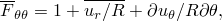where

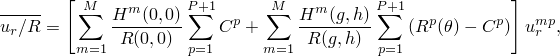with  the leading (constant) term in .
### Strain and rotation increments

Strain and rotation increments are calculated from the integrated velocity gradient matrix, , defined as

where . This expression is not easily evaluated directly, since points that were in an *R*&#8211;*Z* plane in the undeformed shape will no longer be located in the same plane after deformation. Instead, we calculate the gradient of  with respect to the reference state and obtain  with the transformation

In matrix form this can be written as

with

The strain increments are approximated as the symmetric part of :

As was the case for the deformation gradient, we modify the volume strain increment in the fully integrated 4-node quadrilaterals to be independent of *g* and *h* in an *R*&#8211;*Z* plane, which yields

where  is the unit matrix,  is the volume strain increment at the integration point, and  is the average volume strain increment over the *R*&#8211;*Z* plane of the element. In addition we use the approximation

The spin increments, , are approximated as the antisymmetric part of , which in matrix form becomes

### Virtual work

The formulation of equilibrium (virtual work) requires linearization of the strain-displacement relation in the current state. For fully integrated 4-node elements the volume strain modification provides

where

and

As was the case for the strain increments, the linearized strain-displacement relation involves taking derivatives in the deformed shape (), which is troublesome since points that were in an *R*&#8211;*Z* plane in the undeformed shape will no longer be located in the same plane. Hence,  is computed in a similar manner to :

In matrix form this can be written as

where

For fully integrated, 4-node quadrilaterals we again use the approximation

The displacements and, hence, the displacement variations, are interpolated in terms of nodal displacement variations with [Equation 3.2.9&#8211;2](03s02a67.md). The derivatives of the displacements with respect to , *Z*, and  are readily obtained from these expressions:

### Stiffness in the current state

Since the elements are formulated in terms of Cartesian components of displacements, the equations presented in "Solid element formulation,"  Section 3.2.2, apply. For the 4-node quadrilaterals, we can adapt [Equation 3.2.2&#8211;1](03s02a60.md) to the averaged volume change formulation, which yields

The second variation in  is obtained with the standard procedure

where  has the same form as  After introduction of the corotational stress rate,  this yields

This can be worked out in terms of nodal degrees of freedom with the expressions for  and  obtained in the previous paragraph on virtual work.
### Hourglass control

In the 4-node reduced integration element the hourglass modes must be controlled. These modes are similar to the ones in regular axisymmetric elements but have some additional features.

The hourglass pattern can vary along the circumference, which requires application of an hourglass stiffness at multiple points around the circumference.

Hourglassing can also occur in the circumferential direction.Hence, at each integration point around the circumference, we calculate the hourglass strains

Here  is the deformation gradient as given by [Equation 3.2.9&#8211;3](03s02a67.md) and  and  are the hourglass modes in the deformed and undeformed geometry respectively:

where  is the same hourglass operator as used for the 4-node axisymmetric continuum elements and  and  are the nodal positions at angle  in the deformed and undeformed states. Observe that since the initial geometry is axisymmetric,  is independent of :

In the deformed state we write

With [Equation 3.2.9&#8211;2](03s02a67.md) this becomes

The hourglass "strain" transforms into an hourglass "force" with the hourglass stiffness *c*:

This hourglass stiffness can be obtained with the same procedure as used for the regular axisymmetric elements, where the only difference is the scaling factor required to reflect the fact that each point reflects only part of the circumference. The first variation of  is readily obtained as

Here  follows from [Equation 3.2.9&#8211;7](03s02a67.md), and for  we obtain

Similarly, we obtain for the second variation

where  and  follow with the same expressions as used in the first variation.
### Pressure loads and load stiffness

For geometrically linear problems equivalent nodal loads due to applied surface pressures and body forces are readily calculated since the geometry is axisymmetric. For geometrically nonlinear problems the treatment of body forces does not change because of the fixed direction of the forces and because the forces are proportional to the volume, which is assumed to change by a negligible amount. However, for surface pressures nonaxisymmetric deformations must be taken into consideration.

The equivalent nodal loads associated with surface pressure *p* can be obtained by considering the virtual work contribution

 where  is the parametric surface coordinate in the *R*&#8211;*Z* plane and

with  and . Hence, the current position of a point can be expressed in terms of the surface interpolator  and the standard circumferential interpolators:

The terms in [Equation 3.2.9&#8211;8](03s02a67.md) can be worked out as follows:

and, hence,

Hence, we obtain the virtual work contribution

With use of the interpolation functions we, thus, obtain the equivalent nodal forces:

 For geometrically linear analysis this reduces to the standard axisymmetric equivalent nodal loads

The load stiffness matrix follows by linearization:

 with

In the case of hydrostatic pressure (*p* dependent on *z*) some additional terms appear. These terms are readily obtained from the expression

With use of the interpolation functions we, thus, obtain the additional load stiffness contributions:

### Mass matrix

At each material point the displacement components in the three directions (radial, axial, circumferential) are dependent only on the corresponding nodal displacement components. Hence, the mass matrix does not involve any coupling between the radial, axial, and circumferential degrees of freedom, and we can write the mass matrix in the form of three separate expressions:

Here the superscripts *m* and *n* refer to a particular node in the *r*&#8211;*z* plane, and the superscripts *p* and *q* refer to a particular position along the circumference. The interpolation functions , , and  are the product of interpolation functions  in the *r*&#8211;*z* plane and interpolation functions in the -direction:

The volume integral used to form the mass matrix can be split into an integral over the *r*&#8211;*z* cross-section and an integral around the circumference. For the *r*&#8211;*r* component of the mass matrix this yields

This matrix can be written in a convenient form by defining the primitive mass matrix,

This primitive mass matrix is the same mass matrix that is used for the regular axisymmetric elements. We can also define the circumferential distribution matrices

The radial, axial, and circumferential components of the mass matrix then take the form

The circumferential distribution matrices can be evaluated for various values of the number of terms *P* in the Fourier series. After some calculations the following results are obtained:

:

:

:

:

### Hybrid and pore pressure elements

For hybrid and pore pressure elements additional degrees of freedom *p* are added. In the hybrid elements these degrees of freedom are internal to the element and represent the hydrostatic pressure in the material. In the pore pressure elements the degrees of freedom represent the hydrostatic pressure in the fluid as interpolated from the pressure variables at the external, user-defined nodes. Let the interpolation function for the (hydrostatic or pore) pressure in the *r*&#8211;*z* plane be denoted by . The interpolation functions are the same as for the regular axisymmetric hybrid and pore pressure elements, respectively. Along the circumference, we observe that in the geometrically linear formulation the volumetric strain  only shows cosine dependence:

Hence, we choose the hydrostatic/pore pressure to have cosine dependence only:

In the nonlinear case  will exhibit higher-order variations in . For approximately incompressible materials, these higher-order terms are likely to lead to "locking" of the finite element mesh for nonaxisymmetric deformations. In the hybrid formulation, however, the higher-order terms in  are not used for calculation of hydrostatic pressure: only the cosine terms as used in the interpolation for *p* are used. Hence, the hybrid elements prevent locking in the nonaxisymmetric modes as well as in the axisymmetric modes.
### Pore pressure gradient

For a material point in space in the pore pressure element, the pore pressure gradient calculation involves taking derivatives of the pore pressure with respect to the current position . Again, we do not evaluate the gradient directly but calculate it with respect to the original position , with the following transformation:

where  is the deformation gradient, and the cylindrical components of the scalar gradient of the pore pressure with respect to  are readily obtained from the following expressions:

### Reference

### Reference

"Axisymmetric solid elements with nonlinear, asymmetric deformation,"  Section 28.1.7 of the Abaqus Analysis User's Guide