# 3.3.1 Solid infinite elements

### 3.3.1 Solid infinite elements

**Products: **Abaqus/Standard  Abaqus/Explicit

The stress analyst is often faced with problems defined in unbounded domains or problems in which the region of interest is small compared with the surrounding medium. The unbounded or infinite medium can be approximated by extending the finite element mesh to a far distance, where the influence of the surrounding medium on the region of interest is considered small enough to be neglected. This approach calls for experimentation with mesh sizes and assumed boundary conditions at the truncated edges of the mesh and is not always reliable. It is particularly of concern in dynamic analysis, when the boundary of the mesh may reflect energy back into the region being modeled. A better approach is to use "infinite elements": elements defined over semi-infinite domains with suitably chosen decay functions. Abaqus provides first- and second-order infinite elements that are based on the work of [Zienkiewicz et al. (1983)](07s01a01-References.md) for static response and of [Lysmer and Kuhlemeyer (1969)](07s01a01-References.md) for dynamic response. The elements are used in conjunction with standard finite elements, which model the area around the region of interest, with the infinite elements modeling the far-field region.
### Static analysis

The solution in the far field is assumed to be linear, so only linear behavior is provided in the infinite elements. The static behavior of the infinite elements is based on modeling the basic solution variable, *u* (in stress analysis *u* is a displacement component) with respect to spatial distance *r* measured from a "pole" of the solution, so that 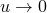 as 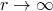, and 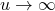 as . The interpolation provides terms of order , 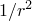, and, when the solution variable is a stress-like variable (such as the pore liquid pressure in the analysis of flow through a porous medium), 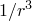 as . The far-field behavior of many common cases, such as a point load on a half-space, is thereby included. This modeling is achieved by using standard quadratic or cubic interpolation for 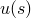 in 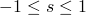, where *s* is a mapped coordinate that is chosen such that the mapping 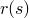 causes  as 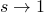. We obtain two- and three-dimensional models of domains that reach to infinity by combining this interpolation in the *s*-direction in a product form with standard linear or quadratic interpolation in orthogonal directions in the mapped space.

In using infinite elements for static analysis, the pole must be located so as to provide a reasonable far-field solution for the particular problem being modeled. The infinite elements in Abaqus are written with nodes on the interface between the finite and infinite elements and, on each edge that stretches to infinity, a node that must be placed in the infinite direction such that the straight line from that node through the corresponding interface node passes through the pole for that ray at a distance on the other side of the interface from the infinite element equal to the distance between these nodes ([Figure 3.3.1&#8211;1](03s03a68-Solid-infinite-elements.md)).

Figure 3.3.1&#8211;1 Pole node location for an infinite element.

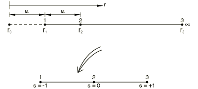

The one-dimensional concept is, thus, based on a node (node 1) on the interface between the finite and infinite elements, distance 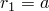 from the pole and at 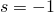 in the mapped space, and node 2, at 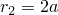 from the pole (the pole is at ) and at  is the mapped space. The  mapping is chosen as

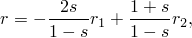so that

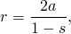which inverts to give

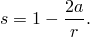

When an element with  and  behavior is required, we combine this geometric mapping with standard quadratic interpolation of *u* with respect to *s*, written in terms of its values at node 1 and at node 2:

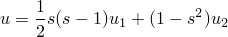(this gives 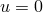 at 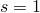, where ). Using the inverted geometric mapping to define 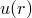 then gives

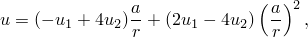which provides the desired behavior. Likewise, when  behavior is also required, we use cubic interpolation of *u* with respect to *s*, written in terms of its values at nodes 1 and 2 and at a third node, which we choose to place at 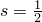:

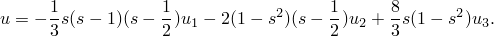The inverted geometric mapping then provides

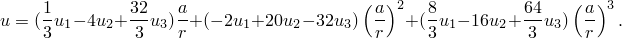The infinite elements in Abaqus consist of two- and three-dimensional elements for uncoupled stress analysis that use quadratic interpolation for displacement components and two- and three-dimensional elements for coupled stress-pore liquid pressure elements, in which the displacements use quadratic interpolation and the pore liquid pressure uses cubic interpolation in the infinite direction. This higher-order interpolation is used for the pore liquid pressure for compatibility: since the displacement varies as , the strain (and, therefore, the stress) may vary as .
### Dynamic response

The dynamic response of the infinite elements is based on consideration of plane body waves traveling orthogonally to the boundary. Again, we assume the response adjacent to the boundary is of small enough amplitude so that the medium responds in a linear elastic fashion.

The equilibrium equation is

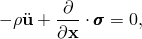where  is the material's density,  is the material particle acceleration,  is the stress, and  is position.

We assume the material's response is isotropic, linear elastic, and---thus---can be written as

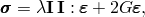where  is the strain and

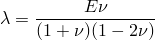and

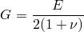are Lam's constants (*E* is Young's modulus and  is Poisson's ratio). Introducing this material response in the equilibrium equation, and assuming small strain:

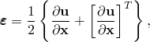provides the governing equation for the motion

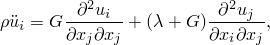where index notation has been used for simplicity.

We consider plane waves traveling along the *x*-axis. Two body wave solutions of this form exist for this equation. One describes plane, longitudinal ("push") waves, which have the form

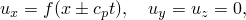where, by substitution in the governing equation above, we find that the wave speed, , is

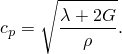The other solution of this form is the "shear" wave solution

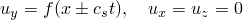or

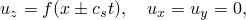where---again by substitution in the governing equation---we obtain

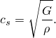In each case the solution 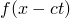 represents waves moving in the direction of increasing *x*, while 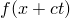 represents waves moving in the direction of decreasing *x*.

Now consider a boundary at 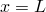 of a medium modeled by finite elements in 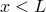. We introduce distributed damping on this boundary, such that

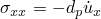and

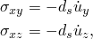where we will now choose the damping constants 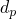 and 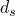 to avoid reflection of longitudinal and shear wave energy back into the medium in . Plane, longitudinal waves approaching the boundary have the form 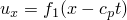, 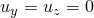. If they are reflected at all as plane, longitudinal waves, their reflection will travel away from the boundary in some form 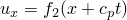, . Since the problem is linear, superposition provides the total displacement 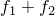, with corresponding stresses 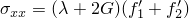, all other , and velocity 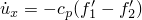. For this solution to satisfy the damping behavior introduced on the boundary at  requires

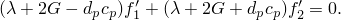We can, therefore, ensure that  (so that ) for any  by choosing

A similar argument for shear waves provides

These values of boundary damping are built into the infinite elements in Abaqus. From the above discussion we see that they transmit all normally impinging plane body waves exactly (provided that the material behavior close to the boundary is linear elastic). General problems involve nonplane body waves that do not impinge on the boundary from an orthogonal direction and may also involve Rayleigh surface waves and Love waves. Nevertheless, these "quiet" boundaries work quite well even for such general cases, provided that they are arranged so that the dominant direction of wave propagation is orthogonal to the boundary or, at free surfaces and interfaces where Rayleigh or Love waves are of concern, they are orthogonal to the surface (see, for example, [Cohen and Jennings, 1983](07s01a01-References.md)). As the boundaries are "quiet" rather than silent (perfect transmitters of all waveforms), and because the boundaries rely on the solution adjacent to them being linear elastic, they should be placed some reasonable distance from the region of main interest.

During dynamic response analysis following static preload (as is common in geotechnical applications), the traction provided by the infinite elements to the boundary of the finite element mesh consists of the constant stress obtained from the static response with the quiet boundary damping stress added. Since the elements have no stiffness during dynamic analysis, they allow a net rigid body motion to occur, which is usually not a significant effect.
### Reference

### Reference

"Infinite elements,"  Section 28.3.1 of the Abaqus Analysis User's Guide