# 3.3.2 Acoustic infinite elements

### 3.3.2 Acoustic infinite elements

**Products: **Abaqus/Standard  Abaqus/Explicit

Problems in unbounded domains, or problems in which the region of interest is small compared to the surrounding medium, are common in acoustic analysis. For example, a submarine deep underwater may experience loads due to the fluid and radiate sound into the fluid, as if the ocean were infinitely large. The extent to which an exterior fluid may be considered "unbounded" or "infinite" depends on the number of wavelengths between the body or region of interest and the nearest boundary: the higher this number, the more likely that the influence of these boundaries is small enough to be neglected. For example, the effect of the surrounding fluid on a submarine in a relatively shallow harbor may be like an infinite medium at high frequencies, but the harbor bottom and free surface may exert an effect at lower frequencies. Similarly, a loudspeaker in air may radiate sound from the high-frequency tweeter as if the surrounding air were infinite, but the effects of the walls of the room may affect the radiation pattern of the low-frequency woofer.

Abaqus provides a range of features to model exterior fluid effects. All of the surrounding fluid may be modeled with finite elements; clearly, this is practical only if the extent of the surrounding medium is small. At the next level of sophistication, the user may model a small region of fluid and apply a simple radiation boundary condition to the terminating surface. These radiation boundary conditions are derived using simple models of waves passing through a boundary. Abaqus provides several alternative formulations of these boundary conditions (see "Coupled acoustic-structural medium analysis,"  Section 2.9.1, and "Acoustic, shock, and coupled acoustic-structural analysis,"  Section 6.10.1 of the Abaqus Analysis User's Guide). These radiation conditions do not add degrees of freedom to the system and do not affect the symmetry of the matrix.

Finally, acoustic infinite elements are provided, which allow the retained finite element fluid region to be even smaller, with similar accuracy. The acoustic infinite element formulation differs from the radiation boundary condition formulation in several key respects. In the infinite elements the infinite exterior is subdivided into elements, and a method of weighted residuals statement is enforced on the elements in a manner entirely analogous to the usual finite element method. Degrees of freedom, corresponding to interpolation functions in the infinite direction, are added to the overall matrix system. The method of weighted residuals used in Abaqus results in nonsymmetric infinite element matrices, so the relative cost of these elements is higher than that of a simple radiation boundary condition. However, the accuracy of the infinite elements is sufficiently high that the finite element region can be reduced considerably, offsetting the cost in many applications.
### Transient formulation

The solution in the unbounded acoustic medium is assumed to be linear and governed by the same equations as the finite acoustic region:

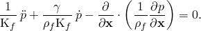 is used here to denote the volumetric drag parameter. Consider the infinite exterior of a region of acoustic fluid bounded by a convex surface and a conventional finite element mesh defined on this surface. Each facet of this surface mesh, together with the normal vectors at the nodes, defines a subdivision of the infinite exterior that will be referred to as the "infinite element." Application of the method of weighted residuals results in a weak form of this equation over the infinite element volume:

This equation is formally identical to that used in the finite element region (see "Coupled acoustic-structural medium analysis,"  Section 2.9.1); however, the choice of basis functions for the weight, 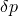, and for the solution field, , will be different. Selection of these functions has been the subject of considerable experimentation and analysis (for example, see [Allik, 1991](07s01a01-References.md), and [Burnett, 1994](07s01a01-References.md)). In Abaqus considerations of accuracy, numerical stability, time-domain well-posedness, and economy have led to the selection of a form proposed by Astley ([Astley, 1994](07s01a01-References.md)). Here, the Fourier transform is applied to the equilibrium equation, and the functions for the solution field are chosen as tensor products of conventional finite element shape functions in the directions tangential to the terminating surface and polynomials in , where *r* is a coordinate in the infinite direction, and a spatially oscillatory factor. The weights are chosen as complex conjugates of the solution field functions times a  factor. This combination has shown to result in an element with several desirable properties. First, if the material properties are constant with respect to frequency in steady-state analysis, the mass, damping, and stiffness element matrices are constant as well; equivalently, in transient analysis the element results in a second-order differential equation for the pressure. Moreover, the damping matrix has positive eigenvalues, a necessary condition for well-posedness in transient analysis. Analytical investigations of the formulation demonstrate that the element captures the exact solutions for radiation impedances for modes of a sphere; the order of the spherical mode modeled exactly is equal to the order of the polynomial used in the infinite direction. The element integrals do not contain oscillatory kernels and can be evaluated using standard Gauss quadrature methods. Finally, the element can be formulated using the usual coordinate map due to [Bettess (1984)](07s01a01-References.md) so that arbitrary convex terminating surfaces can be used.

To continue with the derivation, we transform the weighted residual statement into the frequency domain:

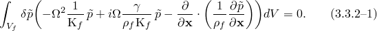Now the weight and solution interpolation functions are defined as

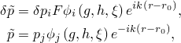where 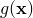, 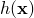, and 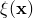 are the parent element coordinates; 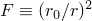; 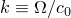; 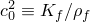; and 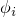 are element shape functions with indices varying over the number of degrees of freedom of the element. The mapping and shape functions are described below.

Inserting the shape functions into [Equation 3.3.2&#8211;1](03s03a69.md) and integrating by parts, we obtain the following element equation:

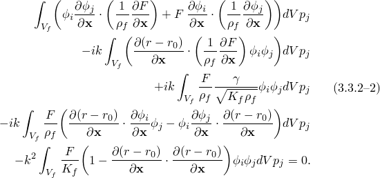

This equation is clearly nonsymmetric, due to the fact that the weight and trial functions are not identical. Nevertheless, if the material properties are constant as a function of frequency, each element matrix corresponding to the terms above is constant as well. Gradients of density inside the element volume have been ignored in the formulation.

The element shape functions are defined as follows:

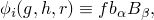where

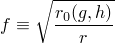in two spatial dimensions and

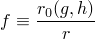in three. This function serves to specify the minimum rate of decay of the acoustic field inside the infinite element domain. The subindex 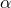 ranges over the *n* nodes of the infinite element on the terminating surface, while the subindex  ranges over the number of functions used in the infinite direction. The function index *i* is equal to the subindex  for the first *n* functions, 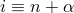 for the second *n* functions, and so on.

The functions 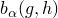 are conventional two-dimensional shape functions (in three dimensions) or, with 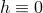, one-dimensional shape functions for axisymmetric or two-dimensional elements. The role of these functions is to specify the variation of the acoustic field in directions tangent to the terminating surface. The variation of the acoustic field in the infinite direction is given by the functions 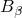, which are members of a set of ten ninth-order polynomials in 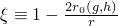. The members of this set are constructed to correspond to the Legendre modes of a sphere. That is, if infinite elements are placed on a sphere and if tangential refinement is adequate, an *i*th order acoustic infinite element will absorb waves associated with the  (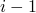)th Legendre mode.  The first member of this set corresponds to the value of the acoustic pressures on the terminating surface; the other functions are generalized degrees of freedom. Specifically,

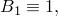and

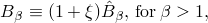where

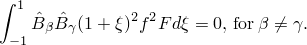This last condition is enforced to improve conditioning of the element matrices at higher order and results in different functions in two and three spatial dimensions. All of the  are equal to zero at the terminating surface, except for .

The coordinate map is described in part by the element shape functions, in the usual isoparametric manner, and in part by a singular function. Together they map the true, semi-infinite domain onto the parent element square or cube. To specify the map for a given element, we first define distances 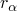 between each infinite element node  on the terminating surface and the element's reference node, located at :

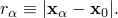 Intermediate points in the infinite direction are defined as offset replicas of the nodes on the terminating surface:

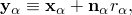where  is the "node ray" at the node. The "node ray" at a node is the unit vector in the direction of the line between the reference point and the node.

We use the interpolated reference distance on the terminating surface,

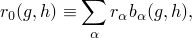in the definition of the parent coordinate, , corresponding to the infinite direction:

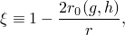where *r* is the distance between an arbitrary point in the infinite element volume and the reference point, 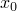. With these definitions, the geometric map can be specified as

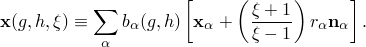

The infinite elements are not isoparametric, since the map uses a lower-order function of the parent coordinates than the interpolation scheme does. However, this singular mapping is convenient and invertible.

The phase factor 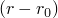 appears in the element formulation. This factor models the oscillatory nature of the solution inside the infinite element volume but must also satisfy some additional properties. First, it must be zero at the face of the infinite element that connects to the finite element mesh. Second, it must be 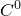 continuous across infinite element lateral boundaries. Third, it should be such that the mass-like term in the infinite element equation,

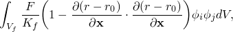be positive semi-definite. This last criterion is not essential for execution of a steady-state analysis, but it is essential for the well-posedness of a transient analysis. Defining

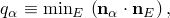where the subscript *E* refers to all elements at node , the definition

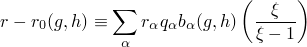satisfies these requirements. The inclusion of the factor  is the only departure from the definition used in [Astley (1994)](07s01a01-References.md).

In a transient analysis the element matrix equation is transformed back to the time domain, using constant material properties taken from the value at zero frequency. The resulting second-order ordinary differential equation for the pressure degrees of freedom is added to the overall system in the model and integrated in the usual manner.
### Steady-state analysis

In steady-state analysis the formulation for the acoustic infinite elements is consistent with that used for acoustic finite elements (see "Coupled acoustic-structural medium analysis,"  Section 2.9.1, and "Acoustic, shock, and coupled acoustic-structural analysis,"  Section 6.10.1 of the Abaqus Analysis User's Guide). First, the complex density

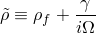is defined. The resulting weighted residual statement is

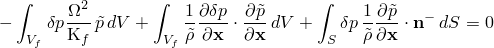after integration by parts.

The expression for the basis and weight functions is formally identical to the preceding transient development, but with the complex wave number

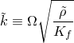used in the definition of the spatially oscillatory term in the weight and basis functions:

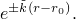 After substitution and some simplification, the acoustic infinite element expression becomes

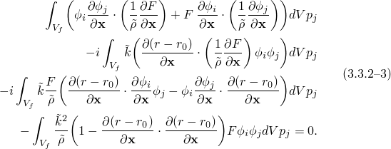Now

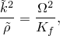so the mass matrix 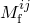 is the same as for the transient case. It is real-valued.

The remaining terms are complex; and, as in the case for acoustic finite elements, they are manipulated into real and imaginary parts. We use

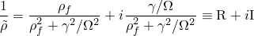 to obtain

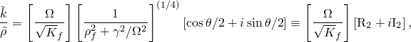where

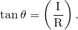Using also

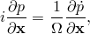we obtain real-valued element matrices as follows:

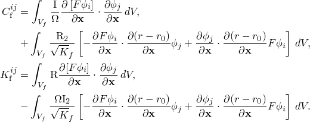These are used directly in [Equation 2.9.1&#8211;24](02s09a41.md).
### Lateral face terms due to impedance conditions

An infinite element volume may have an impedance boundary condition defined on a face extending to infinity. Such a definition can be used to model, for example, an infinite half-space of water above a lossy seabed or under a layer of ice. The derivation of the contribution of the impedance condition to the infinite element matrix is straightforward and follows the derivation for finite elements (see "Coupled acoustic-structural medium analysis,"  Section 2.9.1). The contributing term in the transient case is

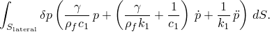Applying the infinite element basis and weight functions, the lateral face contributes to the mass, damping, and stiffness matrices of the acoustic infinite element:

In steady-state and eigenvalue analysis the corresponding frequency-domain representation is used.
### Coupling between acoustic and solid infinite elements

Lateral faces of acoustic and solid infinite elements (that is, those that extend to infinity) can be coupled to each other. For example, two infinite half-spaces may interact at their interface. As in the case of lateral-face impedance terms, the derivation of the contribution of the coupling condition to the infinite element matrix follows the derivation for finite elements to the greatest degree possible. We restrict the consideration to solid medium infinite elements that share an edge with the acoustic medium infinite elements and where the acoustic infinite element is the slave in a tied contact condition. The contributing terms in the transient case are

on the acoustic infinite element and

on the solid infinite element.

In tied contact between fluid and solid medium elements, a tributary area of the slave node is defined, and the conservation of momentum and continuity of displacement is enforced between the slave node and the master surface. On a lateral face of an infinite element, the "area" is unbounded, so an area measure based on the acoustic infinite element formulation,

is defined. This area measure is used to compute a volumetric acceleration load on the acoustic infinite element:

The structural displacement, , is evaluated at the shared edge to compute this coupling condition. For consistency the boundary traction on the solid medium infinite element due to the acoustic pressure is defined as

In steady-state and eigenvalue analysis the corresponding frequency-domain representation is used.
### References

### References

"Acoustic, shock, and coupled acoustic-structural analysis,"  Section 6.10.1 of the Abaqus Analysis User's Guide

"Infinite elements,"  Section 28.3.1 of the Abaqus Analysis User's Guide