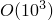

# 3.5.1 Beam element overview

### 3.5.1 Beam element overview

The element library in Abaqus contains several types of beam elements. A "beam" in this context is an element in which assumptions are made so that the problem is reduced to one dimension mathematically: the primary solution variables are functions of position along the beam axis only. For such assumptions to be reasonable, it is intuitively clear that a beam must be a continuum in which we can define an axis such that the shortest distance from the axis to any point in the continuum is small compared to typical lengths along the axis. This idea is made more precise in the detailed derivations in "Beam element formulation,"  Section 3.5.2. There are several levels of complexity in the assumptions upon which the reduction to a one-dimensional problem can be made, and different beam elements in Abaqus use different assumptions.

The simplest approach to beam theory is the classical Euler-Bernoulli assumption, that plane cross-sections initially normal to the beam's axis remain plane, normal to the beam axis, and undistorted. The beam elements in Abaqus that use cubic interpolation (element types B23, B33, etc.) all use this assumption, implemented in the context of arbitrarily large rotations but small strains. The Euler-Bernoulli beam elements are described in "Euler-Bernoulli beam elements,"  Section 3.5.3. This approximation can also be used to formulate beams for large axial strains as well as large rotations. The beam elements in Abaqus that use linear and quadratic interpolation (B21, B22, B31, B32, PIPE21, PIPE22, PIPE31, PIPE32, etc.) are based on such a formulation, with the addition that these elements also allow "transverse shear strain"; that is, the cross-section may not necessarily remain normal to the beam axis. This extension leads to Timoshenko beam theory ([Timoshenko, 1956](07s01a01-References.md)) and is generally considered useful for thicker beams, whose shear flexibility may be important. (These elements in Abaqus are formulated so that they are efficient for thin beams---where Euler-Bernoulli theory is accurate---as well as for thick beams: because of this they are the most effective beam elements in Abaqus.) The large-strain formulation in these elements allows axial strains of arbitrary magnitude; but quadratic terms in the nominal torsional strain are neglected compared to unity, and the axial strain is assumed to be small in the calculation of the torsional shear strain. Thus, while the axial strain may be arbitrarily large, only "moderately large" torsional strain is modeled correctly, and then only when the axial strain is not large. We assume that, throughout the motion, the radius of curvature of the beam is large compared to distances in the cross-section: the beam cannot fold into a tight hinge. A further assumption is that the strain in the beam's cross-section is the same in any direction in the cross-section and throughout the section. Some additional assumptions are made in the derivation of these elements: these are introduced in the detailed derivation in "Beam element formulation,"  Section 3.5.2.

For certain important designs the beam is constructed from thin segments made up into an open section. The response of such open sections is strongly effected by warping, when material particles move out of the plane of the section along lines parallel to the beam axis so as to minimize the shearing between lines along the wall of the section and along the beam axis. The beam element formulation ("Beam element formulation,"  Section 3.5.2) includes provision for such effects. Beam elements that allow for warping of open sections (B31OS, B32OS etc.) are also derived. The particular approach used for modeling open-section warping in Abaqus is based on the assumption that the warping amplitude is never large anywhere along the beam axis because the warping will be constrained at some points along the beam---perhaps because one or both ends of the beam are built into a stiff structure or because some form of transverse stiffeners are added.

The regular beam elements can be used for slender and moderately thick beams. For extremely slender beams, for which the length to thickness ratio is  or more and geometrically nonlinear analysis is required (such as pipelines), convergence may become very poor. For such cases use of the hybrid elements, in which the axial (and transverse) forces are treated as independent degrees of freedom, can be beneficial. The hybrid beam formulation is described in "Hybrid beam elements,"  Section 3.5.4. Distributed pressure loads applied to beams (for example, due to wind or current) will rotate with the beam, leading to follower force effects. The derivation of the load stiffness that accounts for this effect is presented in "Load stiffness for beam elements,"  Section 6.5.2.

In some piping applications thin-walled, circular, relatively straight pipes are subjected to relatively large magnitudes of internal pressure. This has the effect of creating high levels of hoop stress around the wall of the pipe section so that, if the section yields plastically, the axial yield stress will be different in tension and compression because of the interaction with this hoop stress. The PIPE elements allow for this effect by providing uniform radial expansion of the cross-section caused by internal pressure.

In other piping cases thin-walled straight pipes might be subjected to large amounts of bending so that the section collapses ("Brazier collapse"); or a section of pipe may already be curved in its initial configuration---it might be an "elbow." In such cases the ovalization and, possibly, warping, of the cross-section may be important: these effects can reduce the bending stiffness of the member by a factor of five or more in common piping designs. For material linear analysis these effects can be incorporated by making suitable adjustments to the section's bending stiffness (by multiplying the bending stiffness calculated from beam theory by suitable flexibility factors); but when nonlinear material response is a part of the problem it is necessary to model this ovalization and warping explicitly. Elbow elements are provided for that purpose; they are described in "Elbow elements,"  Section 3.9.1. Elbow elements look like beam elements to the user, but they incorporate displacement variables that allow ovalization and warping and so are much more complex in their formulation. In particular, ovalization of the section implies a strong gradient of strain with respect to position through the wall of the pipe: this requires numerical integration through the pipe wall, on top of that used around the pipe section, to capture the material response. This makes the elbow elements computationally more expensive than beams.

Since consideration of planar deformation only provides considerable simplification in formulating beam elements, for each beam element type in Abaqus a corresponding beam element is provided that only moves in the () plane. However, the open-section beams are provided only in three dimensions for reasons that are obvious.
### Reference

### Reference

"Beam modeling: overview,"  Section 29.3.1 of the Abaqus Analysis User's Guide