# 3.5.3 Euler-Bernoulli beam elements

### 3.5.3 Euler-Bernoulli beam elements

**Product: **Abaqus/Standard

In these elements it is assumed that the internal virtual work rate is associated with axial strain and torsional shear only. Further, it is assumed that the cross-section does not deform in its plane or warp out of its plane, and that this cross-sectional plane remains normal to the beam axis. These are the classical assumptions of the Euler-Bernoulli beam theory, which provides satisfactory results for slender beams.

Let 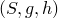 be material coordinates such that *S* locates points on the beam axis and 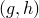 measures distance in the cross-section. In addition, let 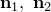 be unit vectors normal to the beam axis in the current configuration: 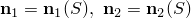. Then the position of a point of the beam in the current configuration is

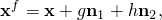where 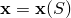 is the point on the beam axis of the cross-section containing 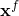. Then

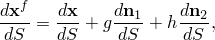and so length on the fiber at  is measured in the current configuration as

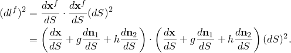Now since the beam is slender, we will neglect terms of second-order in *g* and *h*, the distance measuring material coordinates in the cross-section. Thus,

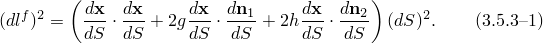
### Strain measures

The internal virtual work rate associated with axial stress is

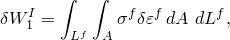where and 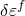 are any material stress and strain measures associated with axial deformation at the point  of the beam, since strains are assumed to be small. For this purpose we will use Green's strain so that

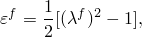where 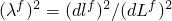, the square of the ratio of current configuration length to reference configuration length in the axial direction on the fiber. From [Equation 3.5.3&#8211;1](03s05a75.md) and its equivalent in the reference configuration, we have

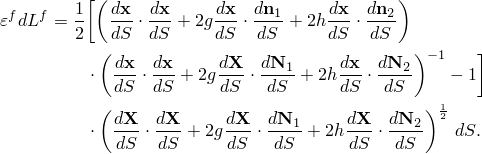Again, neglecting all but first-order terms in *g* and *h* because of the slenderness assumption, this becomes

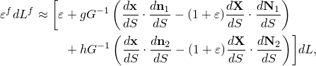where

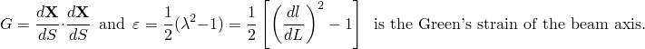This simplification allows us to write the internal virtual work rate associated with axial stress as

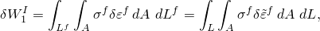where

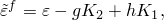with

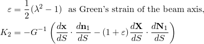and

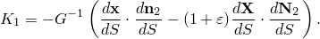Now the cross-sectional base vectors 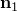 and  are assumed to remain normal to the beam axis, so

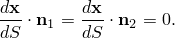Hence,

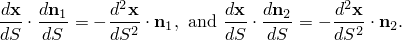So we have

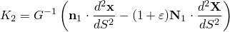and

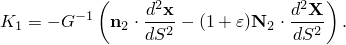

This defines the generalized strains associated with axial stretch. For torsional strain the internal virtual work rate is

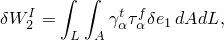where

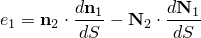and 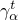 is the proportionality constant between shear strains and torsional strains (see "Beam element formulation,"  Section 3.5.2, for details). For computational simplicity the form of the torsional strains is taken to be

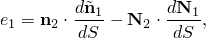where

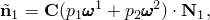and

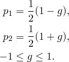This assumes a linear interpolation of rotation  along the beam. Thus, the generalized strain measures for these beams are

axial strain,

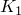 and 

the beam curvature change measures, and

the torsional strain.With these measures, the internal virtual work rate can be written

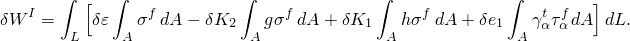
### Internal virtual work rate Jacobian

For the Jacobian matrix of the overall Newton method, [Equation 2.1.1&#8211;3](02s01a13.md), the variation of this internal work rate with respect to nodal displacement variations must be formed. The constitutive theory is written as

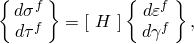and so

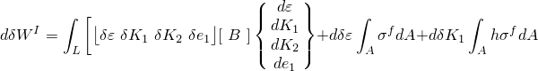

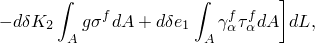where 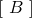 is the section stiffness matrix obtained by integration over the cross-section. See "Beam element formulation,"  Section 3.5.2, for more information on section integration.
### First variations of strains

Taking the variations of the above strain definitions gives directly

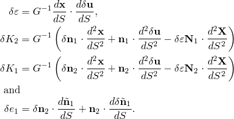In these expressions we need 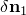 and 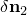 as well as 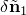; these are now derived. From the expression for 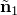, namely

another ancillary vector 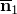, normal to the tangent, is defined by

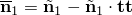so that

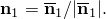In addition,

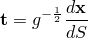so that

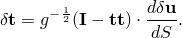Since 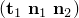 form an orthonormal triad,

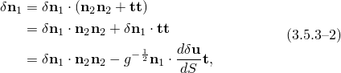 because . From the definition of , it is straightforward to show that

So

and

Thus,

We can also write

and

Combining terms appropriately,

Hence, from [Equation 3.5.3&#8211;2](03s05a75.md)

In a similar manner one can show that

The first variations of strain become

so that

In addition,

so that

since  form an orthonormal triad,

because

### Second variations of strains

The second variation of the axial strain is simply

To compute the second variations of bending strain, we need expressions for . These are obtained by approximating

from which

Using these expressions, the second variations of bending strains are written as

and

For the torsional strain contribution to the initial stress matrix, we approximate

This matrix is again unsymmetric.
### Interpolation

In the virtual work equation the strains include second derivatives of displacement. For this reason continuity of rotation as well as displacement is needed so that the Hermitian polynomial interpolation functions are the minimum interpolation order needed. These are used here. The Hermite cubic is written in terms of the function value and its derivative at the ends of the interval:

with node 1 at  and node 2 at .

These functions are used in Abaqus to interpolate the components of displacement  and the initial position vector , so that the elements are basically isoparametric. In addition, rotation of  about the beam axis, , is interpolated linearly. This interpolation is unsatisfactory for the user, because the nodal variables are

The last four of these variables are difficult to work with; furthermore, making them the same in all elements sharing the same node causes excessive constraint of axial stretch in these elements, especially if the beam axis is not continuous through the node, as in a frame structure or "T" junction.

To avoid this difficulty, the following procedure is adopted. At a node the tangent to the beam axis is

so

 Now suppose we store as degrees of freedom at the node,

where  is the rotation definition introduced above. Since the initial geometry and hence , the initial direction of the beam axis, is known,  where  is the rotation matrix defined by , and hence

 is defined by these variables and the initial geometry. Furthermore,  is directly available from  and . Thus, the above set is a satisfactory set of nodal variables. To eliminate the unwanted axial strain constraint, in Abaqus the stretch  at the node of each such element is taken as an internal variable, local to the element (a third internal node is created for this purpose, and so it is not shared with neighboring elements.)

It should be remarked that the above transformation ([Equation 3.5.3&#8211;3](03s05a75.md)) is nonlinear. This leads to some complications---for example, the d'Alembert forces no longer have the simple form  rather, a matrix  replaces  where  and  use the transformation ([Equation 3.5.3&#8211;3](03s05a75.md)) and its appropriate time derivatives. The resulting Jacobian is nonsymmetric; Abaqus ignores the nonsymmetric terms.
### Integration

The cross-section integration has already been discussed in the context of the shear beams---it is the same for these beams. Along the beam axis, the integration schemes are as described below.

**Stiffness and internal forces**

Three Gauss points are used. Two Gauss points are not sufficient because the torsional strain is not independent.

**Mass and distributed loads**

Three Gauss points are used. Rotary inertia is not included in the mass, except for rotation of the section about the beam axis, where it is included to avoid singularity in perfectly straight beams.
### Reference

### Reference

"Beam modeling: overview,"  Section 29.3.1 of the Abaqus Analysis User's Guide