# 3.5.6 Meshed beam cross-sections

### 3.5.6 Meshed beam cross-sections

**Product: **Abaqus/Standard
### Overview

The beam theory introduced in "Beam element formulation,"  Section 3.5.2, applies to homogeneous beams (made out of a single material) and assumes that the shear center of the beam cross-section is either known or can be easily calculated. However, if the beam cross-section is arbitrarily shaped and/or the beam is made of more than one material layer, finding the cross-section shear center and warping function are no longer trivial tasks. To perform these tasks, the cross-section has to be numerically integrated using a finite element discretization over the two-dimensional cross-section region. The nodal degrees of freedom of the finite element cross-section model represent warping displacements (in general, in and out-of-plane warping degrees of freedom) that allow the shear center and beam torsional stiffness to be determined. Numerical integration of this meshed section also provides the stiffness and inertia statistics: integrated axial stiffness 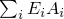, integrated bending stiffness 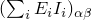, integrated shear stiffness 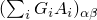, total mass per unit length 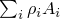, and rotary inertia 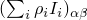.

The warping function and the shear center are derived for shear flexible Timoshenko beams under the following assumptions:

Cross-sections are solid or closed and thin-walled and have a torsional constant that is of the same order of magnitude as the polar moment of inertia of the section. Hence, in the elastic range the warping is small, and it is assumed that warping prevention at the ends can be neglected. The axial warping stresses are assumed to be negligible, but the torsional shear stresses are assumed to be of the same order of magnitude as the stresses due to axial forces and bending moments. In this case the warping is dependent on the twist and can be eliminated as an independent variable, which leads to a considerably simplified formulation. Hence, the theory is based on a solid cross-section with unconstrained warping. Using the notation from "Beam element formulation,"  Section 3.5.2, we assume that  and the axial strains due to warping can be neglected: .

Beams can be made out of linear elastic materials either with isotropic properties or orthotropic shear properties defined by two shear moduli  and  given in two perpendicular directions. The stress-strain relationship for the elastic orthotropic material in the beam cross-section axis yields

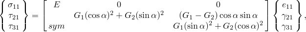where  represents the beam's axial stress, 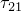 and 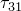 represent two shear stresses, and the angle  is a user-defined material orientation. For the isotropic material properties the above relationship becomes

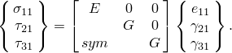

Material fibers are aligned with or perpendicular to the beam axis; hence, in-plane warping can be neglected and the out-of-plane degree of freedom is the only unknown warping value. This assumption can be inaccurate if the beam consists of materials with very different stiffness properties.
### Defining the shear center and warping function

At a given stage in the deformation history of the beam, the position of a material point in the cross-section is given by the expression

 Applying the assumptions made for meshed sections, the expressions for the axial and transverse shear strain components simplify to

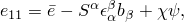

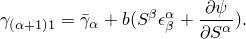 Express these strain components relative to the centroid and the shear center strains, respectively, as

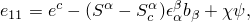

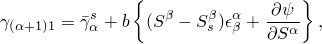where 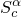 is a section centroid, 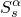 is a section shear center,  is the axial strain at the centroid, and 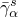 is the shear strain at the shear center.

The elastic energy in the beam is

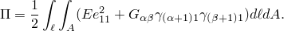

Using the strain definitions relative to the section strains at the centroid and the shear center, the elastic energy can be written as

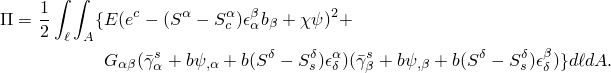

Although we assume no warping prevention (i.e., 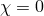), the above energy leads to the following condition that requires the warping function to be orthogonal to the axial and bending energies:

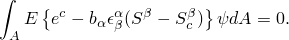The cross-section centroid is defined as the point about which the coupling between axial and bending vanishes. Hence, the centroid location follows from

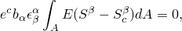 and

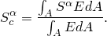 The shear center is defined as the point about which the coupling between twist and transverse shear vanishes. Hence, the following term is zero in the elastic energy:

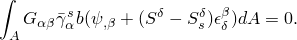

Let us express the warping function as a sum of three parts: a warping function 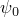 superimposed on the unknown rigid translation  and rigid rotation about the yet unknown shear center . This assumption can be written as

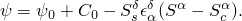 Substituting the above into the expression for elastic energy, using the property of the shear center, and minimizing the energy with respect to the warping function, we get

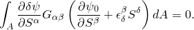 This equation is solved numerically over the meshed section and gives the value of 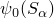.

Recall that the warping function satisfies the orthogonality condition

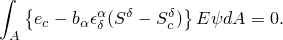Substituting , grouping axial and bending terms, and using the centroid definition, we get

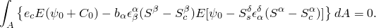 This expression must be true for any value of axial strain 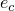 and curvatures 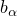, so we can write two separate equations that provide constant  and shear center components :

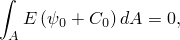

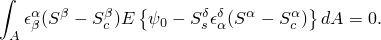 Hence,

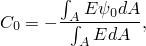

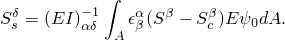 Finally, the section integrated stiffness properties are defined as

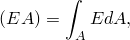

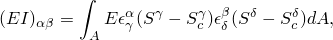

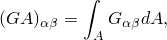

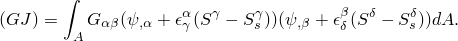 The integrated inertia properties are

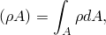

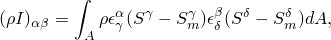 where 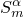 is the center of mass given by the equation

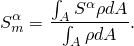

We assume elastic section behavior in transverse shear and we neglect the effect at the individual material points (shear strain and stress is averaged over the section). This leads to the following relationships for transverse shear stiffness:

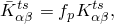

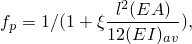

where *k* equals 1.0 for meshed cross-sections and  depends on the finite element interpolation.