# 3.6.2 Axisymmetric shell elements

### 3.6.2 Axisymmetric shell elements

**Products: **Abaqus/Standard  Abaqus/Explicit

These two shell elements are axisymmetric versions of the shells described in the previous section and use the "reduced-integration penalty" method of [Hughes et al. (1977)](07s01a01-References.md). While these are shell elements, they are also simple extensions of the two-dimensional beam elements B21 and B22. The extension is the inclusion of the hoop terms. These elements are thus one-dimensional, deforming in a radial plane. The Cartesian coordinates in this plane are *r* (radius) and *z* (axial position). Distance along the shell reference surface in such a plane is measured by the material coordinate *S* (see [Figure 3.6.2&#8211;1](03s06a80.md)).

Figure 3.6.2&#8211;1 Axisymmetric shell.

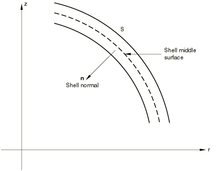
### Interpolation and integration

The 2-node element (SAX1) uses one-point integration of the linear interpolation function for the distribution of loads. The mass matrix is lumped. The 3-node element (SAX2) uses two-point integration of a quadratic interpolation function for the stiffness and three-point integration of a quadratic interpolation function for the distribution of loads. SAX2 uses a consistent mass matrix. All integrations use the Gauss method. The integration through the thickness follows the usual numerical or exact scheme used in Abaqus.
### Theory

This shell theory allows for finite strains and rotations of the shell. The strain measure used is chosen to give a close approximation (accurate to second-order terms) to log strain. Thus, the theory is intended for direct application to cases involving inelastic or hypoelastic deformation where the stress-strain behavior is given in terms of Kirchhoff stress ("true" stress in the usual engineering literature) and log strain, such as metal plasticity. The theory is approximate, but the approximations are not rigorously justified: they are introduced for simplicity and seem reasonable. These approximations are as follows:

A "thinness" assumption is made. This means that, at all times, only terms up to first order with respect to the thickness direction coordinate are included.

The thinning of the shell caused by stretching parallel to its reference surface is assumed to be uniform through the thickness and defined by an incompressibility condition on the reference surface of the shell. Obviously this is a relatively coarse approximation, especially in the case where a shell is subjected to pure bending. It is adopted because it is simple and models the effect of thinning associated with membrane straining: this is considered to be of primary importance in the type of applications envisioned, such as the failure of pipes and vessels subjected to over-pressurization.

The thinning of the shell is assumed to occur smoothly---that is to say, gradients of the thinning with respect to position on the reference surface are assumed to be negligible. This means that localization effects, such as necking of the shell, are only modeled in a very coarse way. Again, the reason for adopting this approximation is simplicity---details of localization effects are not important to the type of application for which the elements are designed.

All stresses except those parallel to the reference surface are neglected; and, for the nonnegligible stresses, plane stress theory is assumed. As with (c) above, this precludes detailed localization studies, but introduces considerable simplification into the formulation.

Plane sections remain plane. This has been shown to be consistent with the thinness assumption, (a) above, for most material models. Here it is simply assumed without further justification.

Transverse shears are assumed to be small, and the material response to such deformation is assumed to be linear elastic. Transverse shear is introduced because the elements used are of the "reduced integration, penalty" type (see [Hughes et al., 1977](07s01a01-References.md), for example). In these elements position on the reference surface and rotation of lines initially orthogonal to the reference surface are interpolated independently: the transverse shear stiffness is then viewed as a penalty term imposing the necessary constraint at selected (reduced integration) points. This transverse shear stiffness is the actual elastic value for relatively thick shells. For thinner cases the penalty must be reduced for numerical reasons---this is done in Abaqus in the manner described in [Hughes et al. (1977)](07s01a01-References.md).

The theory is now described in detail. The concepts are taken from various sources, most especially [Budiansky and Sanders (1963)](07s01a01-References.md) and [Rodal and Witmer (1979)](07s01a01-References.md). The position of a material point in the shell is given by

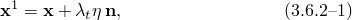where

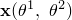

is the position of a point on the reference surface of the shell;

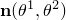

is a unit vector in the "thickness" direction, this direction being initially orthogonal to the reference surface;

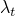

is the stretch of the shell in the thickness direction;

measures position with respect to the thickness direction, in the reference configuration; and

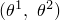

are material coordinates in the reference surface.

The assumptions listed above imply that 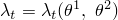 only and that 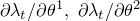 are small quantities. [Equation 3.6.2&#8211;1](03s06a80.md) is written at the end of an increment, and at the start of an increment the same equation is written as

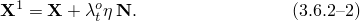The metric at the end of an increment is

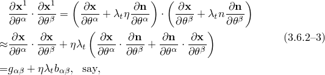where

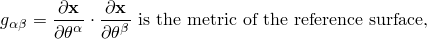and

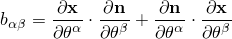is an approximation to the curvature tensor (second fundamental form) of the reference surface.  would be precisely the curvature tensor as it is usually defined if

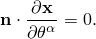This is only approximately true for these elements, because a small transverse shear is allowed.

At the start of the increment the same quantities are

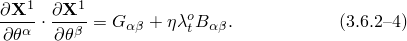

Axisymmetric shells undergoing axisymmetric deformations have the great simplification that principal directions do not rotate. Thus, by assuming that  and  are oriented in these principal directions ( is meridional and  is circumferential), the stretch ratios that occur within the increment in these directions are written as

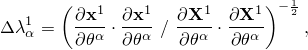where from this point onward the summation convention has been dropped for indexes  and . Using [Equation 3.6.2&#8211;3](03s06a80.md) and [Equation 3.6.2&#8211;4](03s06a80.md) and truncating to first order in  then gives

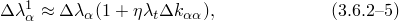where

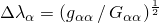and

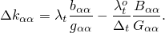The incremental strain, 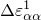 , is defined as

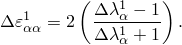Because this expression approximates the increment of log strain correctly to second-order terms, it can be thought of as a central difference approximation for the rate of deformation. This expression is used because we anticipate that strain increments of a maximum of 20 percent per increment will be used: at that magnitude the difference between this definition of incremental strain and the increment of log strain is about 1%, which seems to be acceptable (4 % of the increment). At lower---and probably more typical---values of strain increment, the error is very much less. Again expanding to first order in the thickness direction coordinate, , we obtain

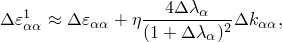where 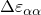 is the incremental strain of the reference surface---the membrane strain. Now consider the term

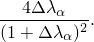Write 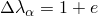, where *e* represents the change in length per unit length that occurs within the increment (the "nominal strain" with respect to the configuration at the beginning of the increment).

Then

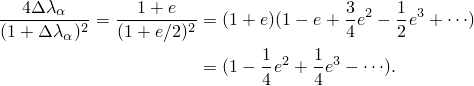Again, if 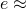 20 percent, this means that

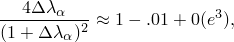and so once again using the argument that practical applications will involve strain increments of no more than a few percent, we approximate

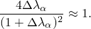This then gives

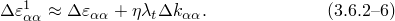The stretch ratio in the thickness direction is assumed to be defined by the following relation on the reference surface:

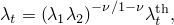where 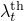 is the thickness stretch ratio caused by thermal expansion.

From the definition of 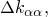

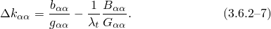The transverse shear strains are written as

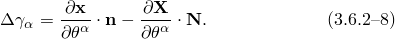This simple form is used because these strains are always assumed to be small. This completes the statement of the incremental strain definitions, and so---together with a virtual work statement to represent equilibrium---a theory is available. However, it is necessary to satisfy the minimum requirement that the theory provide constant strain under appropriate motions. This is essential if the theory is to be suitable for many practical cases, most especially those involving thermal loading. Interestingly, the theory in [Rodal and Witmer (1979)](07s01a01-References.md) appears to violate this requirement. To achieve this, a modified incremental curvature change measure is defined as

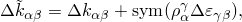where

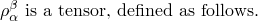We know that the radii of curvature of the -line at the end and at the beginning of an increment are given by

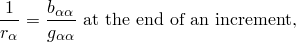and

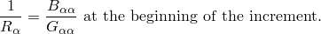In these expressions, as in the following development, no summation is implied by a repeated index . If the -line is stretched uniformly by 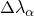 during the increment, we require that

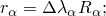and, further, such uniform stretch of the shell must give constant strain so that since we assume

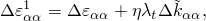we need

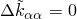under such circumstances. In this motion

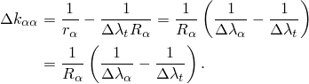

Defining

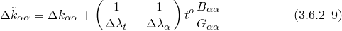and assuming

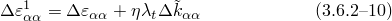satisfies the requirement. [Equation 3.6.2&#8211;9](03s06a80.md) may be simplified by substituting in the definition of 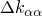 in [Equation 3.6.2&#8211;7](03s06a80.md) to give

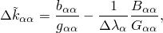and so

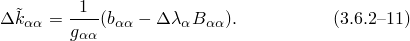

The formulation is completed by the assumption that the virtual work equation can be written

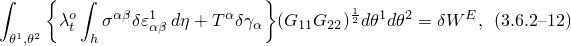where

are the Kirchhoff stresses at a point;

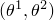

in the shell, defined by plane stress theory using the summation of the strain increments in [Equation 3.6.2&#8211;10](03s06a80.md) to define the strain at this point;

are the variations of the strain increments in [Equation 3.6.2&#8211;10](03s06a80.md);

are the transverse shear forces per unit area, defined by ; where

are the transverse shear strains from [Equation 3.6.2&#8211;8](03s06a80.md),

*h*

is the original thickness of the shell,

is the elastic transverse shear stiffness (reduced according to the suggestions of [Hughes et al. (1977)](07s01a01-References.md) if the shell is too thin, to avoid numerical problems);and

is the virtual external work rate.This completes the statement of the formulation.
### Reference

### Reference

"Axisymmetric shell element library,"  Section 29.6.9 of the Abaqus Analysis User's Guide