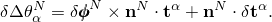

# 3.6.4 Triangular facet shell elements

### 3.6.4 Triangular facet shell elements

**Product: **Abaqus/Standard

Element type STRI3 in Abaqus/Standard is a facet shell---a plate element used to approximate a shell. The element has three nodes, each with six degrees of freedom. The strains are based on thin plate theory, using a small-strain approximation. Arbitrary rigid body rotations are accounted for exactly by formulating the deformation of the element in a local coordinate system that rotates with the element. The element also satisfies the patch test, so that it will produce reliable results with appropriate meshes.

The bending of the element is based on a discrete Kirchhoff approach to plate bending, using Batoz's interpolation functions ([Batoz et al., 1980](07s01a01-References.md)). This formulation satisfies the Kirchhoff constraints all around the boundary of the triangle and provides linear variation of curvature throughout the element. However, the membrane strains are assumed constant within the element. In addition, a curved shell is approximated by this element as a set of facets formed by the planes defined by the three nodes of each element. For these reasons it is necessary to use a reasonably well refined mesh in most applications.
### Kinematics

A local orthonormal basis system,  and , is defined in the plane of each element in the reference configuration, using the standard Abaqus convention.  and  measure distance along  and  in the reference configuration.

Figure 3.6.4&#8211;1 Triangular facet shell in the reference configuration.

The membrane strains are then defined as

where

is the metric in the current configuration, and

is the metric in the reference configuration.

Here  and  are the spatial coordinates of a point in the current and reference configurations, respectively. Curvature changes are defined incrementally. To account for large rigid body rotations we use a local coordinate system that rotates with the plane defined by the three nodes of the element. The basis vectors chosen for this local system are  and . Since the membrane strains are assumed to be small, these vectors will be approximately orthonormal. The components of incremental rotation of the normal to the plate are defined as  about  and  about . The incremental displacement of the reference surface of the plate along the normal to the plane of its nodes is defined as . (Note that  will be zero at the nodes at all times because the plane containing  and  always passes through the nodes.) The Kirchhoff constraints are, approximately,

and

[Batoz (1980)](07s01a01-References.md) assumes that  and  vary quadratically over the element and that  is defined independently along each of the three sides of the element as a cubic function. The Kirchhoff constraints are then imposed at the corners and at the middle of each element edge along the direction of the edge to give

and

where  is the array

In the above expressions  and  are interpolation functions that are defined by [Batoz (1980)](07s01a01-References.md), and the incremental rotation components at the nodes, , are defined as

where

and  are the increments of the rotational degrees of freedom at the node *N*,  is the rotation matrix defined by , and  is the normal to the plane of the element's nodes at the beginning of the increment. Finally, the incremental curvature change measures are defined as

The three membrane strains and three curvature strains complete the basic kinematic description of the element, except that the use of six degrees of freedom per node introduces a spurious rotation at each node (only two incremental rotations at each node appear in the above equations---the rotation about the normal to the plane of the element's nodes does not enter). To deal with this problem, we define a generalized strain to be penalized with a small stiffness at each node as

where

and *j*, *k* are the node numbers in cyclic order forming the two sides of the triangle at the node *i*.
### First variations of strain

The first variations of strain are

where

and in ,

Also, for the "strain" used to introduce the extra stiffness at the nodes to avoid singularity caused by the component of rotation about the normal,

### Second variations of strain

The second variations of strain are

where

and

Here  and  are coordinates in the plane of the element, normalized so that the nodes of the element are at (0,0), (1,0) and (0,1).
### Internal virtual work rate

The internal virtual work rate is defined as

where  is the strain at a point, *f*, away from the reference surface;  are the stress components at *f*; *h* is the shell thickness; and  is the penalty stiffness used to constrain the spurious rotation.

The formulation now proceeds as for the shell elements described in "Shear flexible small-strain shell elements,"  Section 3.6.3, using a 3-point integration scheme in the plane of the element.
### Reference

### Reference

"Shell elements: overview,"  Section 29.6.1 of the Abaqus Analysis User's Guide