# 3.6.5 Finite-strain shell element formulation

### 3.6.5 Finite-strain shell element formulation

**Products: **Abaqus/Standard  Abaqus/Explicit

This section describes the formulation of the quadrilateral finite-membrane-strain element S4R, the triangular element S3R and S3 obtained through degeneration of S4R, and the fully integrated finite-membrane-strain element S4.
### Geometric description

At a given stage in the deformation history of the shell, the position of a material point in the shell is defined by

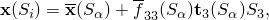where the subscript *i* and other Roman subscripts range from 1 to 3. Subscripts  and other lowercase Greek subscripts which describe the quantities in the reference surface of the shell range from 1 to 2. In the above equation 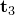 is the normal to the reference surface of the shell. The gradient of the position is

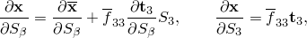where we have neglected derivatives of 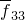 with respect to 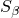. Note that in the above  are local surface coordinates that are assumed to be orthogonal and distance measuring in the reference state.  is the coordinate in the thickness direction, distance measuring and orthogonal to  in the reference state. The thickness increase factor  is assumed to be independent of .

In the deformed state we define local, orthonormal shell directions 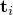 such that

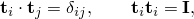where  is the Kronecker delta and  is the identity tensor of rank 2. Summation convention is used for repeated subscripts. The in-plane components of the gradient of the position are obtained as

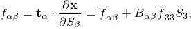where we have introduced the reference surface deformation gradient

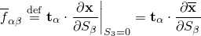and the reference surface normal gradient

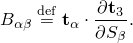

In the original (reference) configuration we denote the position by  (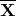 for the reference surface) and the direction vectors by 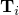, which yields

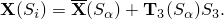The gradient of the position is

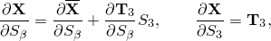and the in-plane components of the gradient are obtained as

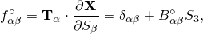where we have assumed that the in-plane direction vectors follow from the surface coordinates with

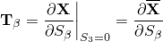and defined the original reference surface normal gradient,

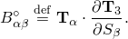The original reference surface normal gradient is obtained in the finite element formulation from the interpolation of the nodal normals with the shape functions. In the deformed configuration it is not derived from the nodal normals but is updated independently based on the gradient of the incremental rotations.
### Parametric interpolation

The position of the points in the shell reference surface is described in terms of discrete nodal positions with parametric interpolation functions . The functions are  continuous, and  are nonorthogonal, nondistance measuring parametric coordinates. For the reference surface positions one, thus, obtains

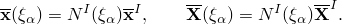The gradients of the position with respect to  are

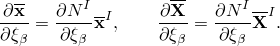Note that uppercase Roman superscripts such as *I* denote nodes of an element and that repeated superscripts imply summation over all nodes of an element.

Now consider the original configuration. The unit normal to the shell reference surface is readily obtained as

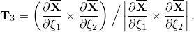Subsequently, we define two orthonormal tangent vectors  and distance measuring coordinates  along these vectors. The derivatives of these coordinates with respect to  follow from

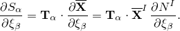The gradient of  with respect to  is readily obtained by inversion:

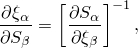which makes it possible to obtain the gradient operator

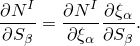The original reference surface normal gradient is obtained from the nodal normals 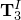 with

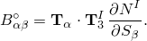Since the original reference surface normal gradient is obtained by taking derivatives with respect to orthogonal distance measuring coordinates, we will call 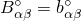 the original *curvature* of the reference surface.
### Membrane deformation and curvature

It is convenient to define the inverse of the reference surface deformation gradient

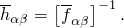With this expression we can define the gradient operator in the current state:

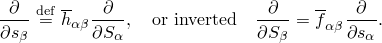The gradient operator in the current state can also be defined as the derivative with respect to distance measuring coordinates  along the base vectors , since

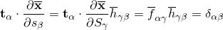and, hence,

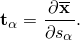Hence, it is possible to write for the 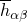:

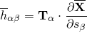since

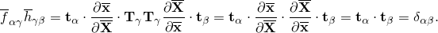In an incremental analysis we can also define the incremental deformation tensor

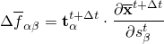and its inverse

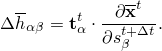With a local coordinate system defined in the current state, the current gradient of the normal can be transformed into the curvature of the surface:

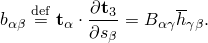
### Orientation update

The equations given in the earlier sections are valid for any local coordinate system defined in the current state. The  vectors at the beginning of the analysis are determined following the standard Abaqus conventions. In this section, we outline the way in which the in-plane coordinates are made corotational.

To obtain the updated version of , we follow a two-step approach. First, we construct orthogonal vectors 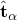 tangential to the surface (following Abaqus conventions). Subsequently, we calculate

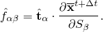We then apply an in-plane rotation 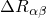 to the vectors: :

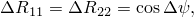

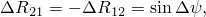where  is to be determined such that the resulting deformation tensor is symmetric, as

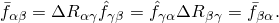From this follows

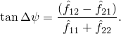Thus, we can calculate the updated local material directions as

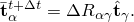
### Curvature change

We assume that the nodal spin will be interpolated with the interpolation functions . During an increment the nodal spin is assumed to be constant; consequently, the value of the spin at each material point will be constant. Hence, we can use the same interpolation functions for the incremental finite rotation vector 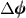:

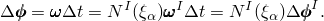The finite rotation vector can be split in a rotation amplitude  and a rotation axis :

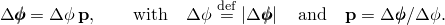To rotate the shell normal, we use quaternion algebra. The incremental nodal rotation is represented by the rotation quaternion 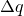, which is defined by

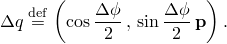An updated shell normal is then obtained according to

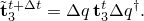This updated shell normal does not actually have to be calculated: it is used only for the derivation of the expression for the curvature change. It is not equal to the shell normal used at the start of the next increment , which will again be chosen perpendicular to the reference surface. The updated normal used here will be approximately orthogonal to the reference surface, depending upon the amount of transverse shear deformation. The gradient of the updated shell normal can be obtained by differentiation:

The second term on the right-hand side can be written in the form

Hence, the scalar parts of the first two terms cancel each other and the vector parts reinforce each other, leading to

The inverse of a rotation quaternion such as  is equal to its conjugate  (). Hence, we can write

where we have formally defined the incremental gradient update vectors

which must be expressed in terms of the gradient of the incremental rotation. From the definition of the incremental quaternion  follows

 thus, for , again with use of the incremental quaternion definition

From the definition of  and   follows

 After substitution in the expression for  and some algebra one obtains

 Note that  when .

For the gradient  of the updated shell normal we obtain

 where we have introduced the two-dimensional alternator :

Note that the *change* in  is independent of .

Calculation of  involves taking the gradient with respect to the reference configuration. It is more convenient to use the reference surface curvature tensor

We then introduce the incremental curvature update vectors

which makes it possible to write the update equation as

This expression makes it feasible to calculate the update in the reference surface curvature by taking gradients in the latest updated state only.
### Deformation gradient

We already have obtained an expression for the deformation gradient in the reference surface, and we have assumed that the thickness change is constant:

At other points in the shell we obtain for the in-plane component

We neglect terms of order , which yields the simplified relation

We can write this as the product of a finite-membrane deformation and a bending perturbation:

It will be assumed that the deformation (strain and rotation) due to bending is small and, therefore,

### Membrane strain increment

The membrane strain increment follows from the incremental stretch tensor , whose components follow from the incremental deformation gradient  by the polar decomposition .

Let  and  be the deformation gradient at the beginning and the end of the increment, respectively. By definition . The incremental deformation gradient follows as

Since  are the components of an orthogonal matrix, the square of the incremental stretch tensor can be obtained by

(see "Deformation,"  Section 1.4.1). The logarithmic strain increment is then

and the average material rotation increment is defined from the polar decomposition:

Due to the choice of the element basis directions, it follows that

### Curvature increment

Following Koiter-Sanders shell theory, and compensating for the rotation of the base vectors relative to the material, we define the physical curvature increment  as

Neglecting terms of the order  relative to , this expression can be rewritten as

where use was made of the curvature update formula. Observe that the curvature at the beginning of the increment, , does not appear in this equation. Hence, there is no need to calculate the initial curvature , and we can assume . The deformation gradient can, hence, also be simplified to

For the material strain increment at a point through the shell thickness Koiter-Sanders theory thus yields

### Virtual work

The virtual work contribution of the stresses is

We assume that the variations in the strain can be expressed in terms of variation in membrane strain and curvature with the same relations as apply to the increment in strain:

which transforms the virtual work equation into

We introduce the membrane forces  and the bending moments :

which allows us to write

The membrane strain variation follows with the usual expression

where we have used the identity .

The variation in the curvature is obtained by taking variations in the incremental curvature, which yields

We neglect the terms of order  and also terms of order ,  which yields

We evaluate  with respect to the current state (at the end of the increment). Hence for the evaluation we can assume . Moreover, we neglect terms of the order  since they are proportional to . Hence, we obtain

which substituted in the expression for  yields

### The rate of virtual work

To obtain an expression for the rate of virtual work, we first write the virtual work equation in terms of the reference volume

where  is the Kirchhoff stress tensor, related to the Cauchy or true stress tensor via

The rate of change then becomes

Here  indicates that the rates are taken in a material, corotational coordinate system. The terms involving stress rates are related to the material behavior. We assume constitutive equations of the form

Substituted in the expression   and transformed back to the current configuration, this yields

Consistent with the derivation of the virtual work equation itself, we neglect terms of the order . Hence, the rate of virtual work can be written as

### Second variation of the membrane strain

It remains to determine  and . From the first variation  follows

Since  is the inverse of , it follows that

Substitution in the expression for the second variation yields

The corotational rate of the base vectors follows from

Substituted in the first term of the previous expression yields

 The in-plane components of the corotational rate of the base vectors can also be expressed in terms of the in-plane material spin in the reference surface:

Substitution in the last obtained expression for  yields

This expression is identical to the one obtained with "standard" continuum elements.
### Second variation of the curvature

We need to calculate the second variation of the curvature to calculate the initial stress contribution from the curvature:

To simplify the computation, we rely on the intrinsic definition of curvature and express the curvature in derivatives with respect to the isoparametric coordinates. Accordingly,

 where the bending resultant components  are the components expressed in the orthonormal coordinate system () transformed by .

Denoting derivatives with respect to the isoparametric coordinates as , the second variation of the curvature is

Using the fact that  and , we find that

Here  indicates the skew-symmetric tensor with axial vector .
### Transverse shear treatment

Several interpolation schemes have been proposed to avoid shear-locking, which typically arises as the thickness of a plate or shell goes to zero. Here we employ an assumed strain method based on the Hu-Washizu principle. This scheme derives from that by [MacNeal (1978)](07s01a01-References.md), subsequently extended and reformulated in [Hughes and Tezduyar (1981)](07s01a01-References.md) and [MacNeal (1982)](07s01a01-References.md) and revisited in [Bathe and Dvorkin (1984)](07s01a01-References.md). Computational aspects of the nonlinear theory are investigated in [Simo, Fox, and Rifai (1989)](07s01a01-References.md) for fully integrated quadrilateral shell elements. For reduced integration quadrilateral and triangular shell elements that can be used for both implicit and explicit integration, this assumed strain method needs to be modified. We summarize below the assumed strain method used with fully integrated elements, followed by the modifications required for the one-point integration plus stabilization used in Abaqus.Construction of the assumed strain field

Consider a typical isoparametric finite element, as depicted in [Figure 3.6.5&#8211;1](03s06a83-Finite-strain-shell-element-formulation.md), and denote by  the set of midpoints of the element boundaries.

Figure 3.6.5&#8211;1 Notation for the assumed strain field on the standard isoparametric element.

The following assumed transverse shear strain field is used:

where

are the covariant transverse shear strains evaluated at the midpoints of the element boundaries. In the above transverse shear strain definitions, the use of uppercase letters indicates quantities in the reference configuration and the use of lowercase letters indicates the deformed configuration. For readability we have omitted the subscript 3 from the director field. Making use of the bilinear element interpolation, it follows that

where , for , are the reference surface position vectors of the element nodes.

By making use of the assumed strain field along with the update formulae for the director field, the assumed covariant transverse shear field can be written concisely in matrix notation. Recall the director field update equation and the corresponding linearized director field:

It follows from the element interpolation that

 Define the following vectors:

Then, the linearized transverse shear strain is

where

Define the four vectors:

Then the rotation or bending part of the strain/displacement operator is written

Constitutive relations

A St. Venant-Kirchhoff constitutive model for the Kirchhoff curvilinear components of the resultant transverse shear force is written in terms of the transverse shear strains as

where  is the transverse shear stiffness in curvilinear coordinates. For a single isotropic layer,

The matrix  is the inverse of the metric , where metric components in the reference configuration  are defined by the inner product

The Cauchy or true transverse shear force components in the shell orthonormal coordinate system  are calculated with the coordinate transformation  as

where *A* is the element's reference area and *a* is the current area.Initial stress stiffness

The calculation of the initial stress stiffness matrix requires the second variation of the assumed transverse strain field. This calculation can be summarized in matrix notation as follows. Define vectors of variations of the nodal displacement quantities:

Then the initial stress contribution is written

where  is the area measure in the current configuration and  is the (symmetric) transverse shear contribution to the initial stress, defined as follows. Let  be the  identity matrix; then define the symmetric matrices

Also define the skew-symmetric matrices

Also, let  be the  zero matrix. Then   is written

One point integration plus stabilization

For reduced-integration elements the transverse shear force components need to be evaluated at the center of the elements. Consider  the transverse shear contribution to the internal energy:

The reference area measure  is written in terms of the isoparametric coordinates as , where  and  are the components of the reference surface metric in the undeformed configuration.

This transverse shear energy can be approximated in many ways to produce a one point integration at the center of the element plus hourglass stabilization. It is important that this treatment yield accurate representation of transverse shear deformation in thick shell problems and provide robust performance for skewed elements. The treatment should collapse smoothly to a triangle, which should be insensitive to the node numbering during collapse; that is, the triangle's response should not depend on the nodal connectivity. For an entire mesh of triangular elements, the treatment should give convergent results (that is, the element should not lock). Furthermore, the high frequency response of the transverse shear treatment should be controlled so that transverse shear response does not dominate the stable time increment for explicit dynamic analysis (including for skewed triangular or quadrilateral geometries). All of these requirements are embodied in the following transverse shear treatment.

Define the transverse shear strain at the center of the element (the homogeneous part) and the "hourglass" transverse shear strain vectors as

The element distortion coefficients  and  are constants determined by the element reference geometry. For geometries with constant Jacobian transformation, . The components of the hourglass strain vector  are defined in terms of the edge strains as

The coefficients  , , , and  are constants determined from the reference geometry of the element. For rectangular elements , , ,  and  can be identified as the strain associated with the rotational "butterfly" deformation pattern. We call  the "crop circle" mode strain since it corresponds to a deformation pattern that resembles the sweeping over the element normals in a circular pattern.

The inclusion of the crop circle strain  in the homogeneous part of the transverse shear strain  has two important consequences. First, it makes the transverse shear response insensitive to the nodal connectivity for a triangular element. That is, when a side of a quadrilateral element is collapsed to form a triangle, the element's response is independent of the choice of node numbering on the element. Second, for explicit dynamic analyses the coefficients  and  are chosen to minimize the highest frequencies associated with the homogeneous part of the transverse shear response.

To illustrate the crop circle and butterfly transverse shear patterns, consider a square, initially flat element. Furthermore, consider plate theory kinematics; that is, two rotations and a vertical deflection at the nodes. The crop circle pattern has zero vertical deflection at the nodes and a nodal rotation vector pattern as illustrated in [Figure 3.6.5&#8211;2](03s06a83-Finite-strain-shell-element-formulation.md).

Figure 3.6.5&#8211;2 Crop circle pattern: zero deflection and circularly symmetric rotations.

The butterfly pattern has vertical deflections that correspond to cross-diagonal bending; that is, two equal deflections at two nodes across a diagonal, with equal and opposite deflections at the remaining two nodes. The nodal rotations develop in a way that opposes the bending motion of the reference surface; that is, the rotations are opposite the rotations that would develop for this displacement pattern to produce pure bending. The butterfly mode's nodal vertical deflection and rotation vector pattern are illustrated in [Figure 3.6.5&#8211;3](03s06a83-Finite-strain-shell-element-formulation.md).

Figure 3.6.5&#8211;3 Butterfly pattern: vertical deflection and rotation vectors.

Let the reference element area be . The transverse shear energy can be approximated as a center point value plus a stabilization term:

where  is the transverse shear stiffness evaluated at the center of the element and the hourglass stiffness  is the diagonal matrix

The effective stiffness  is the average direct component of the transverse shear stiffness, .

The formulation of the homogeneous part of the transverse shear has two contributions: the average edge strain across the element, plus the element distortion term. The average strain treatment is essentially the same as that for the assumed strain formulation of MacNeal and others presented earlier, with expressions evaluated at the center of the element ( and ). The details of this part are omitted; only the element distortion term is presented in detail. The variation of the homogeneous transverse shear strain can be written

where  and  are  and  evaluated at the center of the element,

and

The stabilization term has a similar formulation. The variation of the hourglass strain is

where

and

The hourglass force components  and  are given by the constitutive relations

Comments on stabilization

(1) The butterfly mode  is applied with a "large" or physical hourglass stiffness. For a reference geometry with constant Jacobian, the butterfly stabilization term can be derived from an exact integration of the assumed strain formulation of the transverse shear energy. It is important to apply this constraint with a high stiffness to prevent overly flexible response for quadrilateral elements. The crop circle mode is applied with a "small" or weak stiffness. Although this mode can propagate, it is rarely problematic and is often prevented with boundary conditions.

(2) As the quadrilateral element is degenerated to a triangle, the two hourglass constraints converge into a single constraint: the crop circle constraint. However, as is well-known, for a constant strain triangle the element will lock for certain meshes with three transverse shear constraints per element. Therefore, in the case of a triangular element, the (strong) butterfly mode stabilization is not applied. Only the (weak) crop circle mode stabilization is applied. Thus, in addition to the two homogeneous transverse shear strains, the triangle has a weak constraint to prevent spurious zero energy modes, yet avoids locking in most situations.

The initial stress contribution from the stabilization terms takes the following form:

where  is the (symmetric) transverse shear stabilization contribution to the initial stress. Define the symmetric matrices

 Also define the skew-symmetric matrices

Then  is written

Note that once the matrix entries in  are defined,  is filled just as .

The initial stress contribution from the homogeneous part consists of two terms, one from the assumed strain formulation (evaluated at ) as detailed earlier, and the other from the crop circle mode addition. These two terms can be written

where  and  are the shear force and matrix  evaluated at the element center. The matrix expression for  is analogous to  from the stabilization terms.
### In-plane displacement hourglass control

The in-plane displacement hourglass control is applied in the same way as in the Abaqus membrane elements. The hourglass strains are defined by

where  is the hourglass mode. This mode is obtained by making the "regular" hourglass mode  orthogonal to the homogeneous deformation mode in the undeformed shape of the element. This last condition can be written as

Observe that

and consequently

This expression can be worked out further. We define the projected nodal coordinates

and the projected element area

The hourglass mode can then be written in the form

The hourglass stiffness is chosen equal to

where *G* is the shear modulus and  is a small number chosen to be 0.005 in Abaqus/Standard and 0.05 in Abaqus/Explicit. When the hourglass control is based on assumed enhanced strain,  the artificial stiffness factor is replaced by coefficients derived from a three-field variational principle. The hourglass force *Z* conjugate to *z* is then equal to

For virtual work we need the first variation of the hourglass strain. From the expression for the strain follows immediately

Note that the second term vanishes in the initial configuration since . The second variation is needed for the Jacobian. From the first variation follows right away

The second variation does not contribute in the initial configuration since initially .
### Rotational hourglass control

The expressions for the curvature change, the transverse shear constraints, and the drilling mode constraints still leave three nonhomogeneous rotational modes unconstrained. These modes correspond to zero rotation at the midedges and zero gradient at the centroid. Hence, they correspond to the familiar  hourglass pattern. To pass curvature patch tests exactly, it is necessary to use orthogonalized hourglass patterns as derived for in-plane hourglass control.

This last aspect implies that the rotational hourglass mode corresponds to the mixed derivative of the rotation at the centroid:

We cannot use the above formulation directly in a formulation suitable for multiple finite rotation increments. Hence, we use the same approach as for the calculation of the curvature change. For the purpose of the calculation we define the updated shell direction vectors

The updated shell direction vectors do not actually have to be stored: they are used only for the derivation of the expression for the hourglass strain. We now formally define the hourglass strain tensor as

Observe that

For the purpose of hourglass strain calculation we assume that all products of first-order derivatives with respect to   and  can be neglected. Consequently,

and, hence,

is skew-symmetric. Observe that the mixed derivative of  can be expressed in terms of the hourglass strain tensor with

In the undeformed configuration, we assume that . Subsequent values of  are obtained incrementally. From the expression for   we obtain

 In this expression we also ignore all terms with products of derivatives with respect to  and . Hence, the above expression simplifies to

The second term on the right-hand side can be written in the form

Hence, the scalar parts of the first two terms cancel each other and the vector parts reinforce each other, leading to

The inverse of a rotation quaternion such as  is equal to its conjugate (); hence,  we can write

where we have formally defined the incremental hourglass update vector

which must be expressed in terms of the incremental rotation hourglass mode. From the definition of the incremental quaternion  follows, while neglecting the products of  and  derivatives:

thus, for  again with use of the incremental quaternion definition

From the definition of  and  follows, again neglecting the products of first derivatives

After substitution in the expression for  and some algebra one obtains

Note that  when . For the updated hourglass tensor one readily obtains

This expression simplifies further with the introduction of the hourglass vector

which yields the update formula

The first and second variation are obtained in entirely the same way as the first and second variation of the curvature change. For the first variation we neglect terms of order  and obtain

For the second variation we ignore in addition the terms of order  and  with as final result

### Degenerate elements

In general meshes it will be desirable to collapse at least some of the quadrilateral elements to triangles or to use the triangular element S3 or S3R, which is in fact an internally collapsed S4R element. For this case the calculation of the membrane strains and the curvature changes proceeds along the same lines as before. The transverse shears will now be zero at the degenerate edges. Finally, calculation of all hourglass constraints will be omitted.
### Rotary inertia scaling for explicit dynamics

For numerical efficiency in explicit dynamic analysis, it is desirable to have the stable time increment determined by the membrane response of the structure. For this reason scaling of the rotary inertia based on the element's reference geometry is included in Abaqus/Explicit.

In explicit dynamic analyses the stable time increment is proportional to the inverse of the highest frequency of the element. Therefore, we must ensure that the highest frequency associated with the transverse shear response does not exceed the highest frequency associated with the membrane response. For thick elements (that is, for elements whose thickness is order unity relative to a characteristic length in the element), the membrane frequencies are dominant. The primary consideration in choosing appropriate scalings is that in the limit as the element's thickness goes to zero, the transverse shear frequencies remain below the membrane ones. Recall that for a one-dimensional spring-mass oscillator, the natural frequency  can be written in terms of the stiffness *K* and the mass *M* as

For the transverse shear response the rotary inertia, which is proportional to the cube of the thickness, plays the role of the mass of the system. All other quantities---the membrane stiffness, the mass associated with membrane deformation, and the transverse shear stiffness---are proportional to the thickness. Hence as the thickness of the element goes to zero, the frequencies associated with transverse shear go to infinity proportional to the inverse of the thickness, while the membrane frequencies remain constant. Without scaling, the stable time increment would go to zero as the thickness becomes small.Rotary inertia scaling

For thin elements the rotary inertia is small (negligible) relative to the rotational inertia of the mass at the nodes rotating about an axis through the element center. Therefore, we choose a scaling on the rotary inertia such that it never becomes smaller than a fixed (small) percentage of the rotational inertia of the mass at the nodes rotating about an axis through the center of the element.

Let *R* be the nondimensional rotary inertia scaling, where . When , the true rotary inertia is used. Consider a lumped mass matrix for a 4-node element, and let the element be flat and square. For rotations about an axis in the plane of the element, parallel to an element edge, passing through the center, the contribution to the rotational inertia of the mass at the nodes is

where *A* is the area of the element, *L* is the edge length, and  is the mass density. The sum of the rotary inertia at the four nodes is

The ratio of the in-plane contribution to the rotary contribution is

For the rotary inertia to remain a fixed fraction---say ---of the mass contribution as the thickness goes to zero, asymptotically *R* must be proportional to ; that is,

For planar geometries with element directors along the normal direction, closed-form expressions are possible for the highest membrane and transverse shear frequencies. In such cases the length parameter *L* is interpreted as a characteristic element length that depends on the element distortion. To handle arbitrarily shaped curved elements, exact calculation of the element frequencies becomes difficult. However, we can safely bound the frequencies by an appropriate choice of *L* in the following scaling:

where . For triangular elements the characteristic length,  is the minimum element edge length; and for quadrilateral elements,

The factor 16 in the definition of *R* is used to protect against bending frequencies determining the stable time increment in very fine meshes subjected to loads that cause an increase in thickness of the shell.
### Rotational bulk viscosity for explicit dynamics

For the displacement degrees of freedom, bulk viscosity introduces damping associated with volumetric straining. Linear bulk viscosity or truncation frequency damping is used to damp the high frequency ringing that leads to unwanted noise in the solution or spurious overshoot in the response amplitude. For the same reason, in shells we need to damp the high frequency ringing in the rotational degrees of freedom with linear bulk viscosity acting on the mean curvature strain rate. This damping generates a bulk viscosity "pressure moment," *m*, which is linear in the mean curvature strain rate:

where *b* is a damping coefficient (default = 0.06),  is the original thickness,  is the mass density,  is the current dilatational wave speed, *L* is the characteristic length used for rotary inertia scaling, and  is twice the increment in mean curvature. The dilatational wave speed is given in terms of the effective Lam's constants as

The resultant pressure moment , where *h* is the current thickness, is added to the direct components of the moment resultant.
### Fully integrated finite-membrane-strain shell formulation

Element S4 is a fully integrated finite-membrane-strain shell element. Since the element's stiffness is fully integrated, no spurious membrane or bending zero energy modes exist and no membrane or bending mode hourglass stabilization is used. Drill rotation control, however, is required. Element S4 uses the same drill stiffness formulation as used for element S4R. Similarly, element S4 assumes that the transverse shear strain (and force, since the transverse shear treatment is elastic based on the initial elastic modulus of the material) is constant over the element. Therefore, all four stiffness integration locations will have the same transverse shear strain, transverse shear section force, and transverse shear stress distribution. The transverse shear treatment for S4 is identical to that for S4R.

It is well known that a standard displacement formulation will exhibit shear locking for applications dominated by in-plane bending deformation. However, a standard displacement formulation for the out-of-plane bending stiffness is not subject to similar locking response. Hence, S4 uses a standard displacement formulation for the element's bending stiffness, and the theory presented above for the rotation kinematics and bending strain measures applies to S4. The primary difference between the element formulations for S4 and S4R is the treatment of the membrane strain field. This formulation is the topic of the following discussion.

The membrane formulation used for S4 does not rely on the fact that S4 is a shell element. Hence, the discussion below details the formulation from the point of view that the membrane response is governed by the equilibrium for a three-dimensional body in a state of plane stress.

Consider an *enhancement*  to the rate of deformation tensor . We introduce the enhanced rate of deformation tensor, , as

where  is defined subsequently.

Admissible variations in the rate of deformation are also introduced as

where

We now introduce constraints on the enhancements  and :

so that the modified virtual work statement can be written in the form

where  is the specified traction on  and  on .  is an arbitrary stress field, and the constitutive equation  () is enforced pointwise.

In the modified virtual work statement all kinematic quantities and corresponding variations (, , , and ) are known functions of , , and the reference configuration. A fundamental requirement for the validity of the formulation is that the modified virtual work statement leads to the proper equilibrium equations. If  is arbitrary, the constraint equations can be rewritten as

Substituting these two relations in the modified virtual work equation yields

where we have used the constitutive equation  . We recognize this variational statement as the usual virtual work equation, and a straightforward application of the divergence theorem leads to the standard equilibrium equations.

In the actual implementation we choose to satisfy the constraints only for piecewise constant stress fields . Hence, over the element domain  we require

The enhancements  and  are chosen such that they eliminate the shear locking for in-plane bending. In addition, the direct strain field is enhanced to approximate the strains caused by Poisson's effect in bending.Patch test

To pass the patch test, the choice of enhancements  cannot be arbitrary. A sufficient condition for the satisfaction of the patch test is that for homogeneous deformations we have  or  pointwise. In that case  and the stress is homogeneous. Since the stress is homogeneous, it can be moved outside the volume integral in the modified virtual work statement. The volume integral condition on  implies that the expression is independent of the enhancement and leads to the standard displacement formulation, which is known to satisfy the patch test.
### References

### References

"Shell elements: overview,"  Section 29.6.1 of the Abaqus Analysis User's Guide

"Shell section behavior,"  Section 29.6.4 of the Abaqus Analysis User's Guide