# 3.6.6 Small-strain shell elements in Abaqus/Explicit

### 3.6.6 Small-strain shell elements in Abaqus/Explicit

**Product: **Abaqus/Explicit

The small-strain shell elements in Abaqus/Explicit use a Mindlin-Reissner type of flexural theory that includes transverse shear and are based on a corotational velocity-strain formulation described by Belytschko et al. ([1984](07s01a01-References.md), [1992](07s01a01-References.md)). A corotational finite element formulation reduces the complexities of nonlinear mechanics by embedding a local coordinate system in each element at the sampling point of that element. By expressing the element kinematics in a local coordinate frame, the number of computations is reduced substantially. Therefore, the corotational velocity-strain formulation provides significant speed advantages in explicit time integration software, where element computations can dominate during the overall solution process.
### Corotational coordinate system

The geometry of the shell is defined by its reference surface, which is determined by the nodal coordinates of the element. The embedded element corotational coordinate system, 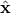, is tangent to the reference surface and rotates with the element. This embedded corotational coordinate system serves as a local coordinate system and is constructed as follows:

For the quadrilateral element the local coordinate 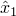 is coincident with the line connecting the midpoints of sides, 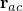, as shown in [Figure 3.6.6&#8211;1](03s06a84.md).

Figure 3.6.6&#8211;1 Local coordinate system for small-strain quadrilateral and triangular shell elements.

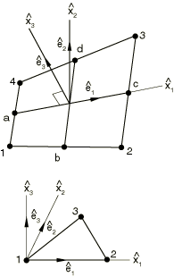The &#8211;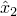 plane is defined to pass through this line normal to the cross product 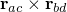.

For the triangular element the local coordinate  is coincident with the side connecting nodes 1 and 2 as shown in [Figure 3.6.6&#8211;1](03s06a84.md). The &#8211; plane coincides with the plane of the element.For notational purposes the corotational coordinate system is defined by a triad 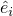, and any vector or tensor whose components are expressed in this system will bear a superposed "hat."

Although the corotational coordinate system described here is used in the actual element computations, this system is transparent to the user. All reported stresses, strains, and other tensorial quantities for these shell elements are defined with respect to the coordinate system described in "Finite-strain shell element formulation,"  Section 3.6.5.
### Velocity strain formulation

The velocity of any point in the shell reference surface is given in terms of the discrete nodal velocity with the bilinear isoparametric shape functions 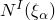 as

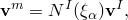

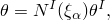where  and  are the nodal translation and rotation velocity, respectively. The functions  are 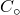 continuous, and 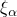 are nonorthogonal, nondistance measuring parametric coordinates. Here Greek subscripts range from 1 to 2, and uppercase Roman superscripts denote the nodes of an element. A standard summation convention is used for repeated superscripts and subscripts except where noted otherwise.

In the Mindlin-Reissner theory of plates and shells, the velocity of any point in the shell is defined by the velocity of the reference surface, 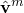, and the angular velocity vector, 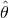, as

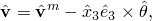where  denotes the vector cross product and 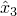 is the distance in the normal direction through the thickness of the shell element. The corotational components of the velocity strain (rate of deformation) are given by

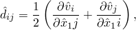which allows us to write each velocity strain component in terms of the nodal translational and rotational velocities:

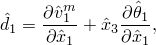

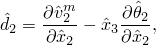

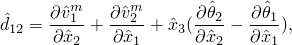

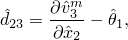

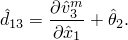
### Small-strain element S4RS

The S4RS element is based on [Belytschko et al. (1984)](07s01a01-References.md). By using one-point quadrature at the center of the element---i.e., at =0---we obtain the gradient operator

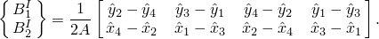

The velocity strain can then be expressed as

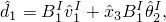

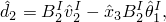

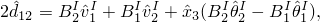

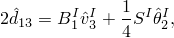

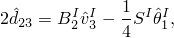where

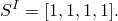

The local nodal forces and moments are computed in terms of the section force and moment resultants by

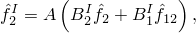

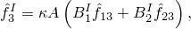

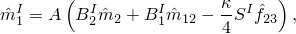

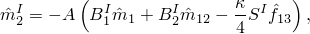

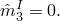The section force and moment resultants are given by

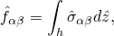

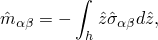where *A* is the area of the element, *h* is the thickness, and 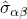 are the Cauchy stresses computed in the corotational system from the velocity strain and the applicable constitutive model. Although  is the shear factor in classical Mindlin-Reissner plate theory, it is used here as a penalty parameter to enforce the Kirchhoff normality condition as the shell becomes thin.
### Small-strain element S4RSW

The major objective in the development of the S4RS element was to obtain a convergent, stable element with the minimum number of computations. Because of the emphasis on speed, a few simplifications were made in formulating the equations for the S4RS element. Although the S4RS element performs very well in most practical applications, it has two known shortcomings:

It can perform poorly when warped, and in particular, it does not solve the twisted beam problem correctly.

It does not pass the bending patch test in the thin plate limit.In the S4RSW element additional terms are added to the strain-displacement equations to eliminate the first shortcoming, and a shear projection is used in the calculation of the transverse shear to address the second shortcoming. The components of velocity strain in the S4RSW element are given in [Belytschko et al. (1992)](07s01a01-References.md) as

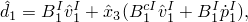

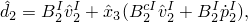

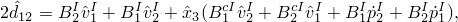where 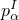 is the pseudonormal at node *I* and 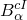 is given by

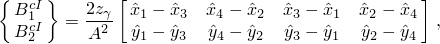where

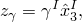

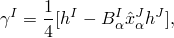

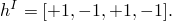The pseudonormal  represents a nodal normal local to a particular element found by taking the vector cross product of the adjacent element sides.

The components of the transverse shear velocity strain are given by

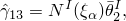

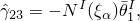where nodal rotational components 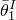 and 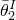 are based on a projection and a transformation. Consider three adjacent local element nodes *K*, *I*, and *J* as shown in [Figure 3.6.6&#8211;2](03s06a84.md). Outward facing vectors  and  are constructed perpendicular to element sides  and , respectively. In addition, they are tangent to the reference surface at the midsides.

Figure 3.6.6&#8211;2 Vector and edge definition for shear projection in the element S4RSW.

The angular velocity  about outward facing vector  is then given by a nodal projection

where  is the rotational velocity at node *I* about ,  is the rotational velocity at node *J* about , and  is the length of side *I*. Finally, the nodal rotational components  and  required for the transverse shear velocity strain are given by the transformation

Evaluating the resulting forms for the transverse shear at the centroidal quadrature point gives

where

and

The local nodal forces and moments are then given in terms of the section resultant forces and moments by

### Small-strain element S3RS

The triangular shell element formulation is similar to that of the S4RS element and is based on [Kennedy et al. (1986)](07s01a01-References.md). This element is not subject to zero energy modes inherent in quadrilateral element formulations.

The velocity strain is computed as in the S4RS element except that the gradient operator is given by

The local nodal forces and moments for the triangular shell can be expressed in terms of section resultant forces and moments as

The -components of the nodal forces are obtained by successively solving the following equations:

which represent the equations of moment equilibrium about the -axis, moment equilibrium about the -axis, and force equilibrium in the -direction.
### Hourglass control

Since the one-point quadrature is used, several spurious modes, often known as hourglass modes, are possible for the quadrilateral elements. To suppress the hourglass modes, a consistent spurious mode control as described by [Belytschko et al. (1984)](07s01a01-References.md) is used. The hourglass shape vector  is defined as

The hourglass strain rates are obtained by

where the superscripts *B* and *M* denote hourglass modes associated with bending and in-plane (membrane) response, respectively. The corresponding generalized hourglass stresses for the element S4RS are given by

where *h* is the thickness of the shell and *E* and *G* are Young's modulus and shear modulus, respectively. The default hourglass control parameters are ==0.050 and =0.005. The scaling factors , , and  (by default ===1) are used to change the corresponding default hourglass control parameters by the user. For the S4RSW element the generalized hourglass stresses  and  are the same as those in the element S4RS, but the generalized hourglass stress  is modified to

The nodal hourglass forces and moments corresponding to the generalized hourglass stresses are

These hourglass forces and moments are added directly to the local nodal forces and moments described previously.
### Reference

### Reference

"Choosing a shell element,"  Section 29.6.2 of the Abaqus Analysis User's Guide