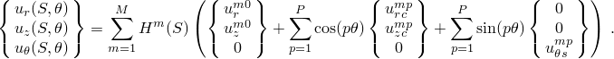
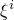
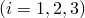

# 3.6.7 Axisymmetric shell element allowing asymmetric loading

### 3.6.7 Axisymmetric shell element allowing asymmetric loading

**Product: **Abaqus/Standard

The Abaqus/Standard element library includes a family of nonlinear thin shell elements with axisymmetric reference geometry that allow asymmetric loading and deformation (SAXA1N and SAXA2N). This section provides their theoretical formulation. These elements encompass a broad range of practical applications from the bending/ovalization of variable diameter pipes to the bending of circular plates. The theoretical formulation of these elements is similar to the general finite-strain shell element described in "Finite-strain shell element formulation,"  Section 3.6.5. Furthermore, this formulation is the shell counterpart to the continuum axisymmetric bending elements described in "Axisymmetric elements allowing nonlinear bending,"  Section 3.2.9.

As with the continuum axisymmetric bending formulation, the restriction is made that a plane of symmetry exists in the *r*&#8211;*z* plane at . Hence in-plane bending of the model is permitted, while deformations such as torsion about the axis of symmetry are precluded. The symmetries of the undeformed configuration and of the deformation are exploited through the assumption of particular displacement and rotation interpolations around the circumference of the shell. Specifically, Fourier series expansions are used in the  or circumferential direction that preserve the plane of symmetry.
### Geometric description

Let  be coordinate functions parametrizing the reference surface of the shell and let  be the coordinate function in the thickness direction, where *h* is the shell's initial thickness. (For a detailed account of the geometric description of the finite-strain shell formulation, see "Finite-strain shell element formulation,"  Section 3.6.5.) Then points in the reference or undeformed configuration are identified by the normal coordinates mapping

where  is the three-dimensional position of a material point,  is the shell reference surface mapping, and  is the unit normal to the shell reference surface. The fact that  is a unit vector assumes that the reference configuration is (locally) of constant thickness. Owing to the axisymmetric reference configuration,  can be given relative to a global Cartesian coordinate system as

where  is the radius,  is the axial position, and  are the cylindrical coordinates. (Note that the usual convention for cylindrical coordinates  has been changed, which is consistent with the axisymmetric shell elements and the axisymmetric elements allowing nonlinear bending.) By definition the normal field to the shell reference surface is , which by direct computation yields

where  and . Relative to the cylindrical coordinate system, .

The basic kinematic assumption is that for any deformed configuration, the position of a point in the body can be identified by

where  is the deformed position of the material point,  is the deformed shell reference surface mapping,  is the deformed unit director field, and  is the thickness change parameter. Of critical importance for any shell formulation is the treatment of the rotation field; that is, the treatment of the director field . The geometric description and the incremental update procedure for the director field are given in detail below.

Under the kinematic assumption above, the deformed configuration of the shell is completely determined by the reference surface mapping , the deformed director field  and the thickness parameter .

We define the following displacement quantities. Since  is an element of a (linear) vector space, we can define the reference surface displacement vector  by the difference between the deformed reference surface and the undeformed reference surface; i.e.,

The director field, however, is a unit vector field that is not a member of a linear vector space. The orientation of the director field is defined in terms of a rotation vector  as

Here  is the skew-symmetric matrix with axial vector , defined by the properties

and  is an orthogonal transformation given by the closed-form expression

Alternatively, quaternion algebra can be used to specify the orientation of the deformed director field . In this case the orthogonal matrix  is replaced by the quaternion parameter , where

The orientation of the unit director field then follows as

Similarly, the orthogonal transformation  can be extracted from the quaternion parameter as

### Interpolations

Displacement and rotation components are given relative to the cylindrical coordinate system  with orthonormal basis vectors  that are fixed in the reference or undeformed configuration. A general interpolation scheme for  and  using a Fourier expansion in the  variable is

Here  are the polynomial interpolation functions along the generator lines of the axisymmetric reference configuration; , , , , ,  are the solution amplitude values (Fourier coefficients); *M* is the number of terms used in the interpolation along the generator lines; and *P* is the number of Fourier interpolation terms used around the circumference of the reference shell. Note that an axisymmetric deformation is obtained for the choice .

The symmetry requirement in the *r*&#8211;*z* plane at , , eliminates many of the above Fourier coefficients. For the displacement vector the only admissible terms are

For the rotation components, symmetry requirements switch the role of the *r* and *z* components with the  components:

For practical reasons the values of , , and  are often required at specific locations around the circumference of the shell. Therefore, displacement and rotation components , , and  are used instead of the Fourier coefficients , , and . Furthermore, a negative sign is introduced in the interpolation for  for the following reason: The Abaqus convention for axisymmetric shell elements is that the axial tangent direction is drawn between nodes in ascending node number (the shell local 1-direction). The normal to the shell is then obtained by a 90 counter-clockwise rotation of the tangent (the shell local 3-direction). However, a positive rotation of the normal field (about the shell local 2-direction) is counterclockwise. This convention implies a left-handed shell local coordinate system. For the axisymmetric shell bending elements, a right-handed shell local coordinate system is required at the integration points; thus, the direction of positive rotation is reversed there.

Rearranging the Fourier series expansions and making the substitution , the interpolations for the displacement components are

Similarly, replacing  and  with  and  respectively, the interpolation for the rotation components becomes

In the above interpolations, , , and  are physical displacement and rotation components at  and  are trigonometric interpolation functions with the property that  defined by:

: , ,

: , , ,

: , , , ,

: , , , , ,

As with the continuum axisymmetric bending element,  is the highest-order interpolation offered with respect to . The element becomes significantly more expensive as higher-order interpolations are used, and it is assumed that the general-purpose finite-strain shell is less expensive than using this element with .
### Virtual work

The virtual work expression from the three-dimensional theory is

where *V* is the current volume of the deformed body,  are the curvilinear components of the Cauchy stress tensor,  are the components of the Lagrange strain tensor, and  are the variational or linearized strain measure components. By definition the Lagrange strain tensor components are given by

Note that in the statement of virtual work, no choice has thus far been made regarding the curvilinear coordinate functions  . Furthermore, the current volume measure  is given by the parametric relationship

We now introduce the kinematic assumption [Equation 3.6.7&#8211;1](03s06a85.md) into the definition of  to find

where differentiation is now with respect to the parametric coordinates, so that  and . Define the following shell strain measure components and kinematic relationships:

In the above,  are the components of the second fundamental form of the undeformed reference surface.

Substituting the above definitions into the virtual work expression, we find (after some manipulation) that the volume integral reduces to the following integral over the deformed reference surface

where  and the current reference surface Jacobian determinant is . In the above virtual work expression, the  term in  has been neglected. This term is ---where *h* is the thickness and *R* is some characteristic radius of curvature---and is negligible in light of the kinematic assumption [Equation 3.6.7&#8211;1](03s06a85.md). The shell stress resultant components are defined by the following integrals through the thickness of the shell:

For thin shells the Kirchhoff-Love approximation, which states that the deformed director field  is (approximately) the normal field to the deformed reference surface, is introduced along with the plane stress assumption . Consistent with these approximations, we neglect all  terms and terms proportional to the gradient of the thickness parameter. Accordingly, we set

We can now summarize the virtual work expression for thin (Kirchhoff-Love) shells:

where the shell resultant components are defined in terms of the Cauchy stress tensor components by the integrals

In the expression for ,  is interpreted as a constraint stress that enforces that the director field remain normal to the reference surface. Two other contributions to the virtual work expression  and , where  are  and, thus, neglected.
### Orthonormal surface coordinate system and coordinate transformation

It is desirable to define stress resultant quantities relative to an orthonormal basis in the deformed configuration. To do this, we define a normal coordinate system , where  and  are tangent to the deformed reference surface and  is the unit normal field.

Define the following notation. Let   be the components of  relative to the basis ; that is

Furthermore, let the inverse of the matrix of components  be given by , such that

Note that the basis vectors  and  induce distance measuring coordinates  and  such that

It follows from [Equation 3.6.7&#8211;5](03s06a85.md) that the orthonormal tangent vectors are given by

For the material calculations, it is important to express both the strain and stress quantities relative to the local orthonormal frame . Accordingly, let  and  be the membrane and bending stress resultant components relative to this local orthonormal basis. Thus, we can write

where we recall that . Then the stress resultant contributions to the virtual work expression can be transformed as follows. First, the membrane contribution:

Recall, however, that by the definition of the coordinates , . Thus,

Similarly, the bending contribution is:

Let  be the two-dimensional alternator, such that  and . Then  and

Since the second term in the brackets is proportional to the bending curvature, we neglect this term relative to the first, yielding

### Strain displacement operators

We now write the virtual work expression [Equation 3.6.7&#8211;4](03s06a85.md) in matrix operator notation. Define the following stress resultant component vectors:

Define the matrix strain displacement operators as follows:

where  is the column of zeros . Then the virtual work expression [Equation 3.6.7&#8211;4](03s06a85.md) is equivalently stated

### Corotational coordinate system

Thus far  and  are any two orthonormal vectors in the tangent plane to the reference surface. We can uniquely choose these two vectors by requiring the matrix components of the incremental reference surface deformation gradient , where

to be symmetric; i.e., . Note that by definition . This symmetry condition defines a corotational orthonormal basis in the deformed configuration. This orthonormal basis is calculated as follows.

Obtain the Abaqus convention pair of orthonormal surface vectors . We then rotate these vectors in the tangent plane to the reference surface about the normal vector  by the angle , where  is determined by the symmetry condition . Thus, we define

It follows by definition that

Therefore, define the quantity

The symmetry condition requires that

From this it can be determined that

and  are then determined by [Equation 3.6.7&#8211;6](03s06a85.md).

Having determined the updated vectors , we can calculate the quantities required for coordinate transformation. First the incremental deformation gradient components and the Jacobian matrix components:

Note that due to the symmetry of the incremental deformation gradient components, there is no ambiguity in writing . We can now calculate the inverse components

### Consistent linearization

The iterative solution procedure requires the calculation of the consistent tangent stiffness. This stiffness has two parts, one resulting from the material model and the other resulting from the changing geometry. We denote the second variational quantities with . Returning to [Equation 3.6.7&#8211;4](03s06a85.md), the virtual work expression can be written as

where ,  is the Jacobian determinant of the reference configuration parametrization given by , and components are relative to the corotated frame with . We assume constitutive behavior such that

Thus, the variation of the virtual work expression yields

The first term in the integrand forms the material stiffness, while the second two terms form the geometric stiffness. The second variation of the strain measure components are calculated in "Finite-strain shell element formulation,"  Section 3.6.5. The second variation of the membrane strain is

The second variation of the bending strain is zero; i.e.,

### Incremental degrees of freedom: interpolations and configuration updates

At the beginning of an increment we have the configuration at iteration *k*, denoted . In the incremental solution procedure we solve for the incremental displacement field and the incremental rotation field in components relative to the reference cylindrical coordinate system:

We use these incremental fields to update the configuration to iteration .

1. *Reference surface update*: The displacement increments are interpolated using the same interpolation scheme as the total displacement vector in [Equation 3.6.7&#8211;2](03s06a85.md):

The reference surface position map is updated from the displacement increment by

2. *Rotation field update*: The incremental rotation field is updated with the same interpolation scheme as the total rotation field in [Equation 3.6.7&#8211;3](03s06a85.md):

This incremental rotation vector corresponds to a finite rotation, characterized by quaternion parameters as

The total rotation quaternion parameter can be updated by the update formula

Similarly, the deformed unit director field can be updated from the incremental rotation field as

Here we have used the notation  to denote the rotation of the vector  by the quaternion . The curvatures are calculated from the gradient of the director field, which is updated by

where

For completeness, we record the values of . First, along the generator lines we have

For the circumferential derivative we must account for the derivative of the basis vectors in the -direction:  and . Hence, . Introducing the interpolation function, we have

where  are computed from the definitions of the interpolation functions  as given above and  and  are given by the interpolation for the incremental rotation field as given in the Rotation Field Update.
### Strain increment and stress resultant update

Following the formulation of the finite-strain shell element formulation in "Finite-strain shell element formulation,"  Section 3.6.5, the three-dimensional (finite) strain increment is calculated as

Here the increment in the membrane strain components  is given by the Hughes-Winget second-order approximation to the logarithmic membrane strain increment

and the increment in the bending strain components  is given by the expression

where

As an example of the stress update procedure, consider the simple case of a Saint Venant-Kirchhoff material model. In this case,

where  are the plane stress elastic coefficients given by

Note that , and the components  are relative to the current orthonormal basis .
### Pressure loads and load stiffness

For geometrically linear problems, equivalent nodal loads due to applied surface pressure are readily calculated since the geometry is axisymmetric. For geometrically nonlinear problems, however, asymmetric deformations must be taken into consideration.

The equivalent nodal loads associated with surface pressure *p* can be obtained by considering the virtual work contribution to the external loading

where *S* is the parametric surface coordinate in the *R*&#8211;*Z* plane and the reference surface position is

with  and . Recall that the current position of a point can be expressed in terms of the axial interpolator  and the circumferential interpolators  by

The terms in [Equation 3.6.7&#8211;7](03s06a85.md) can be worked out as follows:

and, hence,

The variations  are written , where the components have interpolations similar to those in [Equation 3.6.7&#8211;7](03s06a85.md). Therefore, the virtual work contribution becomes

With the introduction of the interpolation functions, we obtain the equivalent nodal forces:

For geometrically linear analysis, the equivalent nodal forces reduce to the standard axisymmetric expressions

The linearization of the pressure loading term leads to the following pressure load stiffness matrix:

with

In the case of hydrostatic pressure (*p* dependent on *z*), additional terms must be included in the pressure load stiffness. These terms appear due to the variation of the pressure magnitude and are readily obtained from the expression

With use of the interpolation functions and denoting the additional contributions with an over-bar, we obtain the additional load stiffness contributions:

### Penalty constraints: transverse shear and drill rotation

It is necessary to enforce rotation constraints at selected points on the element surface to prevent singular modes of deformation. One axial transverse shear constraint is enforced on the  rotation field between each pair of nodes within each nodal plane. One circumferential transverse shear constraint and one drill rotation constraint on the rotation fields  and  are enforced between each pair of nodes on a circumferential line of nodes. In each instance the rotation field is constrained to follow the nodal displacements. To summarize, for element SAXAMN:

Axial transverse shear: 

Circumferential transverse shear: 

Drill rotation: constraints are enforced, where  is the order of integration in the axial direction and  is the number of Fourier modes.Transverse shear

The transverse shear strain is the measure of the amount the director field  has rotated relative to the normal to the shell surface. We define the transverse shear strain as

with no sum on *c* and force this quantity to be zero with a penalty constraint. Note that  is a unit vector tangent to the shell surface defined by the displacement field along a parametric coordinate line. Recall that  and . Hence,  is the axial transverse shear strain and  is the circumferential transverse shear strain.

For convenience, record the variation of the unit vector :

with no sum on *c*. Equivalently, the definition of  can be used to write

The linearized transverse shear strain is calculated as

Since by definition , it follows that

with no sum on *c*.

For completeness, the second variation of the transverse shear strain is

where terms proportional to  have been neglected and the coupling between  and  has been symmetrized.Drill rotation

Mathematically, the equations governing the deformation of the shell are invariant with respect to drill rotations; that is, a rotation of the director field with axis of rotation parallel to the director. It is necessary then to assign a kinematic definition to this rotation. We define the drill strain as the difference between the rotation of the circumferential tangent vector as measured by the displacement field and that measured by the rotation field. Accordingly, we define the drill strain by

Here,  is the rotated reference axial tangent vector and  is the deformed (unit) circumferential tangent vector, defined by

In the above  is a linear approximation to the axial tangent vector in the reference configuration given by , where  and  are the position vectors to two adjacent nodes in an axial plane. The drill rotation constraint then requires that the component of rotation about the normal to the surface match the in-plane rotation of the surface as measured by the displacement field.

The linearized drill strain calculation is similar to the transverse shear linearized strain calculation. Without repeating the calculation,

Similarly, the second variation of the drill strain

where terms proportional to  have been neglected and the coupling between  and  has been symmetrized.
### Zero radius: collapsed edge

For the case when the reference radius of any point on the shell surface goes to zero, all of the offset nodes collapse to the same point and the edge constraints along that circumferential edge become redundant. It is, therefore, necessary to treat the zero radius case separately.

For the zero radius case all redundant degrees of freedom are constrained to follow the average motion of the nodes at 0 and  180. The edge constraints are broken into two parts: First, a circumferential transverse shear strain is defined that requires that the rotation in the radial direction follow the circumferential rotations at the first and last nodal plane:

Introducing the interpolations, the linearized strain is

Note that . Second, a drill rotation strain is defined that requires that the rotation about the *Z*-axis be zero:

This leads to a linearized strain given by

Note that .
### Mass matrix

At each material point the displacement components in the three directions (radial, axial, circumferential) are dependent only on the corresponding nodal displacement components. Hence, the mass matrix does not involve any coupling between the radial, axial, and circumferential degrees of freedom, and we can write the mass matrix in the form of three separate expressions:

Similarly, we can write the terms associated with the rotational degrees of freedom as:

Here the superscripts *m* and *n* refer to a particular node in the *r*&#8211;*z* plane, and the superscripts *p* and *q* refer to a particular position along the circumference. The interpolation functions , , and  are the product of interpolation functions  in the *r*&#8211;*z* plane and interpolation functions in the -direction:

The area integral used to form the mass matrix can be split then into an integral along the length of the element in the *r*&#8211;*z* plane and an integral around the circumference. For the *r*&#8211;*r* component of the mass matrix this yields

and for the  component of the mass matrix this yields:

The matrix can be written in a convenient form by defining the primitive mass matrix as

or for the rotational components as

These primitive mass matrices are the same mass matrices that are used for the regular axisymmetric shell elements. We can also define the circumferential distribution matrices

The various components of the mass matrix then take the form

The circumferential distribution matrices can be evaluated for various values of the number of terms *P* in the Fourier series. After some calculations the following results are obtained:

:

:

:

:

### Reference

### Reference

"Axisymmetric shell elements with nonlinear, asymmetric deformation,"  Section 29.6.10 of the Abaqus Analysis User's Guide