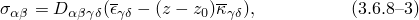

# 3.6.8 Transverse shear stiffness in composite shells and offsets from the midsurface

### 3.6.8 Transverse shear stiffness in composite shells and offsets from the midsurface

**Products: **Abaqus/Standard  Abaqus/Explicit
### Transverse shear stiffness

Abaqus supports element types S3R, S3RS, S4, S4R, S4RS, S4RSW, SC6R, SC8R, and S8R for the analysis of laminated composite shells. These elements are based on first-order transverse shear flexible theory in which the transverse shear strain is assumed to be constant through the thickness of the shell. This assumption necessitates the use of shear correction factors. The development of these factors also provides a basis for estimating interlaminar shear stresses in a composite section. This section describes the development of the transverse shear stiffness for element types S3R, S4, S4R, SC6R, SC8R, and S8R.Finite-strain shells

The transverse shear stiffness correction factors are easily shown to be  for isotropic plates. We want to establish the equivalent factors for laminated plates and sandwich constructions. For this purpose we calculate the distribution of transverse shear stress through the thickness of the shell, for the case of unidirectional bending and assuming linear elastic response. Then the shear strain energy, expressed in terms of section forces and strains, is equated to the strain energy of this distribution of transverse shear stresses.

This method, outlined below, provides an approximate method for calculating interlaminar shear stresses and supplies reasonable estimates of transverse shear stiffness. In this calculation Abaqus assumes that the shell section directions are the principal bending directions (bending about one principal direction does not require a restraining moment about the other direction). For composite shells with orthotropic layers that are not symmetric about the shell midsurface, the shell section directions may not be the principal bending directions. In such cases the transverse shear stiffness and interlaminar shear stresses are less accurate approximations and will change if different shell section directions are used.

Consider a plate in the  plane. Assume only bending and shear in the *x*-direction, without gradients in the *y*-direction. Then the membrane forces in the shell are zero: , and  for all response variables. In this case equilibrium within the section in the *x*-direction is

Moment equilibrium about the *y*-axis gives

where  is the transverse shear force per unit width in the plate and  is the bending moment per unit width for bending about the *y*-axis.

For the bending behavior we assume the strain varies linearly across the section:

where  is the membrane strain of the reference surface  and  is the curvature of that surface.

If the response of the shell is linear elastic, any in-plane component of stress at a point through the shell section is given by

 where the plane stress elastic stiffness, , is defined from the elasticity and orientation of the material at the particular layer of the shell. Greek subscripts take the range .

Integrating through the thickness and inverting the resultant section stiffness provides the 6  6 section flexibility matrix, :

We have already assumed that . We now also assume that ; that is, that it is possible to have no bending in the *y*-direction without any restraining moments associated with the *y*-direction. This is clearly not the case for an unbalanced composite section, but we still use it as a simplifying assumption to obtain the shear correction factors. Thus,

where  is the fourth column of . Combining this result with the elastic stiffness at a point through the shell thickness provides the in-plane stress components in terms of  as

where

 and

Combining the gradient of this equation in the *x*-direction with the equilibrium equations [Equation 3.6.8&#8211;1](03s06a86-Transverse-shear-stiffness-in-composite-.md) and [Equation 3.6.8&#8211;2](03s06a86-Transverse-shear-stiffness-in-composite-.md) yields a description of the variation of the transverse shear stress through the thickness of the plate:

In calculating  we have assumed that the elasticity and thickness of the composite section do not vary (or vary slowly) with position along the shell.

A laminated composite shell section consists of *N* layers  with different values of (,) at layer 1, (,) at layer 2,  (,) at layer *N*. Layer *i* extends from  to  and its thickness is . Integrating [Equation 3.6.8&#8211;6](03s06a86-Transverse-shear-stiffness-in-composite-.md) through the shell, using the boundary conditions  at ,  at  and  at , gives the transverse shear stress in layer *i* as

 where

 and

The subscript  is used instead of  in this case because the result is associated with pure bending in the *x*-direction.

The variation of  through the shell thickness is obtained using a similar procedure, based on pure bending in the *y*-direction.

These results provide the estimates of interlaminar shear stresses.

We define the shear flexibility of the section by matching the shear strain energy obtained by integrating the elastic strain energy density associated with transverse shear stress distribution obtained above:

where  is the shear flexibility of the section and  is the continuum transverse shear flexibility within layer *i*. Here we introduce the assumption that the transverse shear flexibility within a layer is not coupled to the in-plane flexibility. This is usually the case for shell constructions.

Substituting the relations for  and  into the above equation and integrating defines the shear flexibility of the section as

The transverse shear stiffness of the section is then available as . Notice that  will be nonzero if any layer is anisotropic or orthotropic in a local system (since then  will be nonzero).Small-strain shells

When the shell resultant forces at each increment are computed for pre-integrated sections, the transverse shear forces for small-strain shell elements S3RS, S4RS, and S4RSW are computed using the transverse shear stiffness derived for finite-strain shells. For numerically integrated sections the transverse shear behavior is based on a simplified stiffness for improved computational performance. For single or multilayer isotropic sections and single layer orthotropic sections, the transverse shear force converges to the proper thin and thick shell transverse shear solution and the transverse shear stress is assumed to have a constant distribution. The transverse shear stiffness is approximate for multilayer orthotropic sections, where the transverse shear stress distribution is assumed piecewise constant. Convergence to the proper transverse shear behavior for this case may not be obtained as shells become thick and principal material directions deviate from the principal section directions.
### Offset: reference surface versus midsurface

In Abaqus the geometry of the shell is defined by kinematic variables that exist at the nodes on the shell reference surface. The kinematics of the shell theory consist of measuring membrane strain on the reference surface and bending strain from the derivatives of the unit normal vector on the reference surface. The default reference surface is the shell midsurface. However, many situations arise in which it is more convenient to define the reference surface as offset from the midsurface. In this case we assume that the in-plane strain at any material point varies linearly across the section:

where  and  represent the two orthogonal axes on the reference surface,  is the membrane strain of the reference surface,  is the distance to the reference surface measured from the midsurface, and  is the curvature of that surface. The positive values of  are in the positive normal direction. When , the top surface of the shell is the reference surface, where *t* is the shell thickness. The bottom surface of the shell becomes the reference surface when . When , the midsurface represents the reference surface.

If the response of the shell is linear elastic, any in-plane component of stress at a point through the shell section, , is given by

where the plane stress elastic stiffness, , is defined from the elasticity and orientation of the material at the particular layer of the shell. Greek subscripts take the range .

The section force and moment resultants per unit length can then be defined as

Integrating the above equations through the thickness leads to the resultant section stiffness, :

### Reference

### Reference

"Shell section behavior,"  Section 29.6.4 of the Abaqus Analysis User's Guide