# 3.6.9 Rotary inertia for 5 degree of freedom shell elements

### 3.6.9 Rotary inertia for 5 degree of freedom shell elements

**Product: **Abaqus/Standard

Some of the shell elements in Abaqus/Standard (S4R5, S8R5, S9R5, and STRI65) use two variables at a node to define the change in the shell normal at the node, 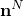, during an increment. At some nodes in these elements and in other elements we use the three components of the rotation triplet as the rotation degrees of freedom. To provide inertia for all of these nodal variables, at a node *N* with two "rotation" variables we define

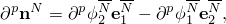where 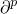 denotes any time derivative or variation of the following quantity and the 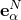 are the basis vectors used to define the rotational variables at the node during this increment. Barred superscripts are not summed.

This expression neglects any rotation of the basis system that occurs during the increment. This is an approximation in large-displacement analysis: it is adopted for the sake of simplicity, based on the argument that we are not attempting to model the rotary inertia accurately.

At a node at which we use the three global rotation components we define

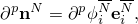where in this case the  are the global Cartesian basis vectors. This definition is artificial and serves simply to associate a reasonable measure of inertia with the rotational degrees of freedom.

The first-order elements in Abaqus use a lumped mass matrix. In this case  is diagonal, so that the rotary inertia contribution at node *N* is

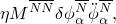where  sums over the number of rotation components used at the node (2 or 3).

For a consistent mass element the rotary inertia contribution is

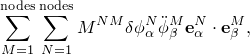where  and  sum over the number of rotation components used at each node (2 or 3).

The time integration algorithms require initial conditions for each increment. For implicit integration these are the velocities and accelerations of the variables at the start of the increment, 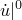 and 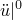.

At a node where three global rotation components are used, these initial values are directly available from the solution to the previous increment. At a node where only two variables define the rotation, we convert variables from the basis of one increment to that of the next through the approximation

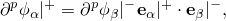where 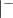 indicates a variable associated with the previous increment and 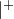 indicates a variable associated with the current increment. The justifications for this approximation are that it is simple, the incremental rotation will not be large anyway, and we are not trying to model the rotary inertia effect with high accuracy.
### Reference

### Reference

"Choosing a shell element,"  Section 29.6.2 of the Abaqus Analysis User's Guide