# 3.7.2 Rebar modeling in three dimensions

### 3.7.2 Rebar modeling in three dimensions

**Products: **Abaqus/Standard  Abaqus/Explicit

Let 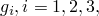 be the isoparametric coordinates of the basic finite element in which the rebar are placed. Let 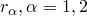, be isoparametric coordinates on the surface of reinforcement, with 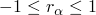. Let *t* be a material coordinate along the rebar direction. See [Figure 3.7.2&#8211;1](03s07a89-Rebar-modeling-in-three-dimensions.md).

Figure 3.7.2&#8211;1 Rebar in a solid, three-dimensional element.

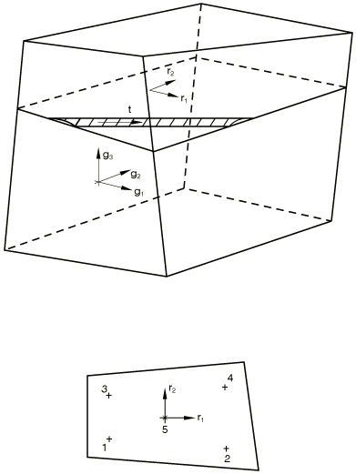

The rebar is integrated using  or 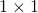 Gauss points, depending on the order of the underlying element. The volume of integration at a Gauss point is

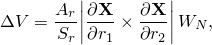where 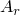 is the cross-sectional area of each rebar,  is the rebar spacing, 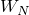 is the Gauss weighting associated with the integration point,  is the position of the Gauss point, and

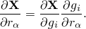In these expressions all quantities are taken in the reference configuration, and so Abaqus ignores changes in rebar cross-sectional area due to straining of the rebar and changes in the rebar spacing due to straining of the finite element in which the rebar is placed.

The strain in the rebar is

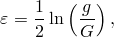where

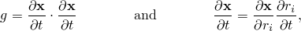and *G* is the value of *g* in the original configuration.

For convenience we define *s*, a material coordinate that is distance measuring along the rebar in the current configuration:

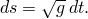The first variation of strain is

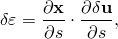and the second variation of strain is

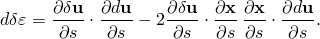
### Reference

### Reference

"Defining rebar as an element property,"  Section 2.2.4 of the Abaqus Analysis User's Guide