# 3.9.1 Elbow elements

### 3.9.1 Elbow elements

**Product: **Abaqus/Standard

The design of piping systems relies heavily on the use of elbows (pipe bends) to provide flexibility in response to thermal strains. For this reason the elbows themselves are the critical components in the design, and it is essential to predict their response accurately to qualify a pipeline structurally. This is especially true in accident conditions, where inelastic behavior---plasticity or viscoplasticity---dominates the response. It is well known that piping elbows achieve their flexibility through a shell-type behavior---responding to bending loads with significant ovalization of the pipe cross-section---in contrast to the beam response of straight pipes, where the cross-section does not deform to any significant extent until Brazier buckling occurs. Ovalization gives the elbows elastic flexibility that is 5&#8211;20 times that of the same size straight pipe in bending (for typical primary piping loop elbows in nuclear reactors). This flexibility is accompanied by stresses and strains that are typically 3&#8211;12 times those of a straight pipe under the same load---with of course---very high strain gradients around the pipe and through its thickness, caused by the ovalization of the cross-section. For the purpose of linear elastic analysis these effects present little difficulty because the flexibility factors and stress intensity factors have been accurately calculated and verified with experiment and are, thus, used directly in response prediction using three-dimensional beam theory (see [Dodge and Moore, 1972](07s01a01-References.md), for a survey of such work).

For nonlinear analysis or pipes of noncircular section, these solutions are not useful. Two possible approaches suggest themselves for the nonlinear case: nonlinear equivalents to the linear elastic flexibility and strain intensity factors can be sought or detailed analysis based on the shell-type behavior of the pipe bends can be undertaken. The concept of nonlinear equivalents to the linear elastic flexibility and stress intensity factors has been pursued by a number of workers (e.g., [Spence, 1972](07s01a01-References.md)), although the success of such methods does not yet warrant their use in design ([Scheller and Mallett, 1979](07s01a01-References.md)). Detailed inelastic analysis remains, therefore, as the obvious approach to qualifying piping systems that cannot be designed on an elastic basis. The main difficulty with such analysis is its cost in both engineering time and computer time. The structure is a shell exhibiting severe stress gradients, so that the numerical models required to provide detailed analysis of adequate accuracy are large and complicated. Many attempts have been made to provide such models. [Hibbitt (1974)](07s01a01-References.md) described the formulation of a shell-type finite element that uses piecewise cubic interpolation of displacement around the pipe and piecewise constant strain along the pipe. The latter simplification gives rise to undesirable displacement discontinuities along the pipe. Nevertheless, the approach has documented accuracy ([Sobel, 1977](07s01a01-References.md)) and has been used in design evaluation ([Chen and Weiner, 1978](07s01a01-References.md)). [Ohtsubo and Watanabe (1976)](07s01a01-References.md) develop shell elements of "ring" geometry, based on the virtual work statement for small strains of a thin walled torus section. They interpolate the normal and two tangential displacement components of the middle surface of the shell each by a complete Fourier series---truncated after M terms---around the pipe and a piecewise cubic along the pipe. Their model allows both ovalization and warping of the section, thus potentially describing the behavior of the pipe to high accuracy. Their results show that, with such an approach, for typical primary piping elbows four to six Fourier modes are needed around the pipe to obtain a convergent solution, with fewer modes necessary in less flexible elbows. However, their formulation is not well-suited to practical application in multi-elbow pipelines because strains result from rigid body motions of the elbows. This is due to the use of cylindrical shell theory with polynomial and Fourier interpolation of displacement components in a curvilinear coordinate system.

[Takeda et al. (1979)](07s01a01-References.md) have developed an extension of the Ohtsubo and Watanabe shell element, using both Fourier and piecewise cubic interpolation along the pipe. The element has been applied to some well-documented, nonlinear benchmark problems (e.g., [Kwata, 1978](07s01a01-References.md)) and shown to be accurate but relatively expensive. In [Kwata (1978)](07s01a01-References.md), Takeda et al. compare the element to the single point integration, bilinear interpolation shell element of [Hughes et al. (1977)](07s01a01-References.md) and conclude that the latter element is more economical for given accuracy. To a large extent this conclusion would appear to depend on the architecture of the computer code in which the element is implemented: unless the code architecture allows economic calculation of such elements, they will be very expensive. In [Kwata (1978)](07s01a01-References.md) the simple bilinear shell is shown to need about 40 elements (and hence 40 constitutive points) around the pipe to provide accurate stresses (the paper actually shows 20 elements around the half-pipe in a case of in-plane bending), thus introducing about 240 degrees of freedom per segment; while in [Ohtsubo and Wanatabe (1976)](07s01a01-References.md) six Fourier modes (and hence 12 degrees of freedom for in-plane modeling, 24 degrees of freedom for out-of-plane modeling, per segment) give the same level of accuracy---with again, about 40 constitutive calculation points. With the formulation in Abaqus, we also conclude that 32&#8211;48 constitutive calculation stations around the pipe are needed. The contrast in number of degrees of freedom per segment suggests that---in spite of the relative complexity of elements like that of Ohtsubo and Watanabe---given suitable code architecture designed to handle such elements efficiently, elements that take advantage of the particular geometry and behavior of elbows should be significantly cheaper than most simple shell elements such as that of [Hughes et al. (1977)](07s01a01-References.md).

The element of [Bathe and Almeida (1980)](07s01a01-References.md) is a direct finite element implementation of the classical von Karmann approach. Warping of the section is neglected, and in the plane of the cross-section only pure bending of the pipe wall is allowed. This latter restriction precludes the direct application of thermal loads to the element. In addition, it does not allow for the "circumferential membrane force correction" added by Gross to the von Karmann theory (see [Dodge and Moore, 1972](07s01a01-References.md)). As an additional simplification, the gradients of axial and shear strain through the thickness of the pipe wall are ignored. Around the pipe a Fourier series is used for the tangential displacement component of the pipe wall middle surface in the plane of the pipe section. In this element only the even numbered Fourier terms 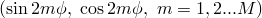 are used, as in von Karmann's analysis. This implies that these displacements are symmetric about the crown of the elbow (about 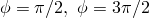 in [Figure 3.9.1&#8211;1](03s09a92-Elbow-elements.md)). This is satisfactory for cases where the pipe radius is small compared to the elbow torus radius but is likely to be inadequate when the pipe radius is of the same order as the torus radius. The interpolation along the pipe is a piecewise Lagrange cubic, in contrast to the Hermite cubic of [Takeda et al. (1979)](07s01a01-References.md), so that considerably more degrees of freedom are introduced per segment. The reason for this choice is not made obvious in [Bathe and Almeida (1980)](07s01a01-References.md). The authors restrict themselves to 3 Fourier modes and 24 integration stations (constitutive calculation points) around the pipe; the element would probably require some extension to allow more modes and constitutive calculation points around the pipe for application to more flexible elbows.

In Abaqus/Standard we build on the experience summarized above and provide a capability for detailed inelastic analysis of pipelines at reasonable cost. The achievement of such complex response prediction in a reasonable amount of computer time requires that the geometric modeling be as efficient as possible---that is, that the model be "tuned" to the characteristics of the specific structural geometry and response. Pipe bends behave as shells; however, they have the simplifying characteristic that the strain gradients along the pipe are usually mild compared to those around the pipe. The choices of geometric modeling used for the elbow elements in Abaqus use this simplification to minimize the computer costs associated with the nonlinear analysis of pipelines.
### Geometric definitions

We assume that the undeformed pipe is of circular or nearly circular section. Let 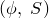 be the material coordinates of a point in the pipe wall middle surface, defined as follows (see [Figure 3.9.1&#8211;1](03s09a92-Elbow-elements.md)).

Figure 3.9.1&#8211;1 Elbow geometry.

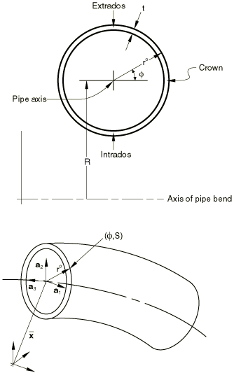In the undeformed configuration  measures the angular position of the point from the crown of the section such that  increases towards the extrados (on a straight segment the "crown" and "extrados" are arbitrarily defined as fixed positions around the pipe section) and *S* measures the distance along the pipe axis from some arbitrary origin. Let 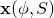 be the current and 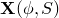 the reference positions of a point. Let 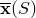 and  be the current and reference positions of a point on the pipe axis, and define 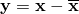 as the offset of a midwall point from the pipe axis. Let 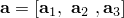 be a right-handed director set of orthogonal, unit vectors, with  approximately tangent to the pipe axis. 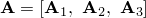 are the same directors in the reference configuration: we choose  so that the point  (the crown of an elbow section) lies on  and 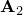 points to the extrados 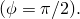 For simplicity we rewrite

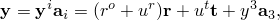where

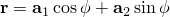and

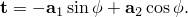Finally, we define a unit vector, , which will be made approximately outwardly normal to the pipe wall middle surface, as follows. Let

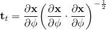be a unit vector pointing around the pipe section 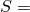constant, and let

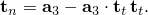Then write

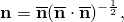where

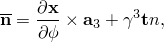with

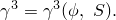This definition ensures that 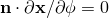: we will later introduce a penalty term to ensure that 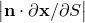 is small as well.
### Interpolation

The concept is that of a beam with deforming section, so that we first interpolate  and  as functions of *S* and then interpolate  and  as functions of *S* and .
### Pipe axis quantities

We assume the pipe axis position, , is a polynomial in *S*:

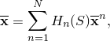where  are the usual polynomial interpolation functions of order 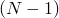. The same functions are used to interpolate a rotation triplet,

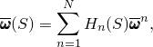which then gives

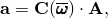where  is the rigid rotation matrix.
### Cross-sectional deformation quantities

Numerical experiments with standard shell models have shown that warping effects are important in the geometries and loadings of interest. We, therefore, introduce the Fourier/polynomial interpolation

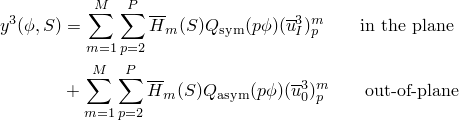where  are polynomials of the same or lower order as the 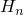 above

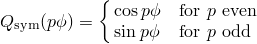

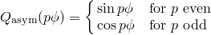

The number *P* gives the order of Fourier interpolation, and the terms "in-plane" and "out-of-plane" refer to symmetries that occur if the motion is symmetric about the plane of the pipe's initial curvature or antisymmetric about that plane.

To model ovalization we assume that

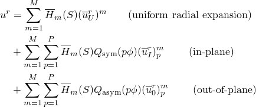and

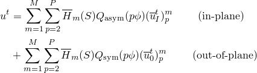and for the direction 

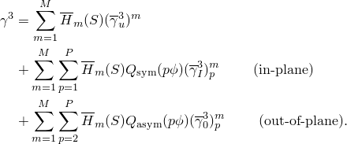

The 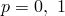 terms in  and  and the 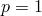 term in 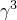 are omitted since these relative quantities should not include rigid body motion. The implementation of the formulation has been based on choosing linear polynomials for the 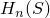 and 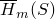 (referred to as element type ELBOW31) and quadratic polynomials for these functions (element type ELBOW32). Obviously element type ELBOW31 is the lowest order possible for such interpolation. However, we also provide an element in which the  are linear, while  and 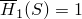; that is,  and  are constant within an element and, thus, discontinuous from element to element. This is the level of approximation used in routine linear design formula analyses ([Dodge and Moore, 1972](07s01a01-References.md)) and that has been used previously in nonlinear cases ([Hibbitt, 1974](07s01a01-References.md)). We refer to this as element type ELBOW31B. For the linear elements (ELBOW31, ELBOW31B) one-point integration is used in each element with respect to *S*; the quadratic element uses a two-point Gauss rule.

The choice of *P*---the number of terms taken in the Fourier series---has been based on numerical experiments. [Ohtsubo and Watanabe (1976)](07s01a01-References.md) documented a detailed numerical investigation of this choice for their original element, and their results should be relevant to our formulation. For most practical thin-walled piping system applications, we find that six modes are sufficient to predict strains within a few percent.
### Strains and constraint

The formulation is discrete Kirchhoff, using the Koiter-Sanders generalized section strains at each point of the pipe wall middle surface:

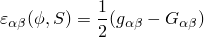and

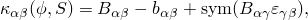where

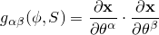is the metric of the pipe wall middle surface and

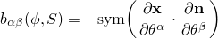is the curvature of the surface, where  is made normal to the surface and 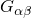 and  are the same measures in the reference configuration---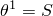 and 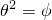---and Greek indices span the range (1, 2).

The strain components at any point through the pipe wall are then defined by the Kirchhoff assumption as

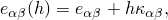where *h* is the material coordinate measuring position through the pipe wall: 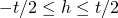. In applications numerical integration is used through the wall. The integration rule varies from case to case but is usually a five, seven or nine point Simpson rule for inelastic material response involving creep and plasticity.

The discrete Kirchhoff constraint is imposed by associating a penalty with the strain

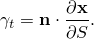The penalty is obtained from the transverse shear stiffness of the pipe wall, suitably modified for thin walls in the manner of [Hughes et al. (1977)](07s01a01-References.md).
### Some simplifying approximations

It seems reasonable to assume that the warping will be small, so that

Based on this, we write 

Since ,

where  is the unit matrix.

We choose

and we impose a penalty to make  small. Then in the computation of the curvatures, , we approximate , so that

This completes the basic definition of the element formulation. The formulation allows arbitrary rigid body motions to occur with no strain and uniform thermal expansion with constant strain. The detailed derivation of the strain variations, initial stress matrix, etc., follow directly from the definitions given above, although the forms are complicated. In the actual implementation the nonsymmetric terms in the initial stress matrix caused by our choice of definition of rotation------as well as nonsymmetric terms in some load stiffnesses, are neglected. A major implementation approximation is in the modeling of inertia terms in the form of a mass matrix defined by

where  is the mass density of the material.

This is a coarse approximation locally, but the intended applications concern analysis of pipelines, where you are mainly interested in inertia effects associated with locally low-mode response. [Table 3.9.1&#8211;1](03s09a92-Elbow-elements.md) shows a comparison of free vibration frequencies for a single 90 bend restrained against rigid body motion on its axis at one end and prevented from warping (but allowed to ovalize) at both ends.

Table 3.9.1&#8211;1 Free vibration frequencies for a 90 elbow.| Model | Free vibration frequencies, Hertz |
| --- | --- |
|   | Mode 1 | Mode 2 | Mode 3 | Mode 4 | Mode 5 |
| Standard shell elements | 79.3 | 83.0 | 193 | 195 | 473 |
| Element type ELBOW31B | 2 elements | P=4 | 73.5 | 79.0 | 171 | 172 | 474 |
| P=6 | 73.0 | 78.3 | 169.2 | 170.6 | 473 |
| 3 elements | P=4 | 75.6 | 81.7 | 168.7 | 169.3 | 184.7 |
| P=6 | 75.1 | 81.0 | 167.2 | 167.8 | 183 |
| Element type ELBOW31 | 2 elements | P=4 | 80.0 | 85.2 | 170.2 | 172 | 418.7 |
| P=6 | 79.2 | 84.4 | 164.7 | 165.5 | 415.5 |
| 3 elements | P=4 | 82.9 | 89.0 | 183.5 | 185 | 427.5 |
| P=6 | 82.0 | 88.1 | 178.1 | 179.6 | 415.3 | The agreement between the various models and the "standard shell element" is not very close, but we feel it is adequate for the intended use. More accurate modeling of inertia would incur a large penalty in computational cost.

| Dimensions: |
| --- |
| 0.9144 m (36 in) |
| 0.2921 m (11.5 in) |
| 0.0127m (0.5 in) |
| 90 bend |

| Material properties: |
| --- |
| Young's modulus: | 2.165  1011N/m2 (31.4  106lb/in2) |
| Poisson's ratio: | 0.3 |
| Density: | 7822.8 kg/m3 |
| (7.32  104 lb sec2/in4) |
| Boundary conditions: | One end restrained on its axis against rigid body motion; both ends restrained against warping. |
### Reference

### Reference

"Pipes and pipebends with deforming cross-sections: elbow elements,"  Section 29.5.1 of the Abaqus Analysis User's Guide