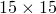

# 3.9.2 Frame elements with lumped plasticity

### 3.9.2 Frame elements with lumped plasticity

**Product: **Abaqus/Standard

Frame elements are designed for the analysis of initially straight, slender beams. The elements are implemented for large displacements and large rotations but small strains. The elastic response of the frame elements follows Euler-Bernoulli beam theory. Plasticity is included in the element's response through a lumped plasticity model with kinematic hardening, which permits yielding only at the ends of the beam. The hardening data are given as a relationship between the generalized force and generalized displacement. Hence, the plastic response of the element is length dependent. The elastic-plastic frame elements are designed to represent plastic hinge formation in frame-like structures, where a single frame element can be used as a member between the structure's nodes.
### Degrees of freedom on the element

Frame elements are formulated in terms of the solution variables at user-defined end nodes and extra internal degrees of freedom associated with an internal node. The three-dimensional version of the element is discussed here. The two-dimensional version is found by appropriate reduction of the three-dimensional degrees of freedom. The element has three nodes (two user-defined and one internal), 12 external degrees of freedom, and three internal degrees of freedom. Each of the two end nodes has six external degrees of freedom: three displacements and three rotations. An internal node (at the center of the element) has three displacement degrees of freedom only, as shown in [Figure 3.9.2&#8211;1](03s09a93-Frame-elements-with-lumped-plasticity.md).

Figure 3.9.2&#8211;1 Frame element in space.

The element is formulated in a local system with the *x*-direction representing the axial direction and the *y*- and *z*-directions representing the directions transverse to the frame element axis. In this local coordinate system the element's degrees of freedom can be written

### The elastic formulation

The elastic response of the element is governed by Euler-Bernoulli beam theory. The displacement interpolation for the deflections transverse to the frame element axis (the *y*- and *z*-directions) uses fourth-order polynomials, allowing for quadratic variation of the curvature along the beam axis. Let  be the isoparametric coordinate along the length of the beam. Then,

The transverse displacement interpolations incorporate exact solutions to force and moment loading at the ends and constant distributed loads along the beam axis (such as gravity loading). The displacement interpolation function along the frame element axis (the *x*-direction) is a second-order polynomial, allowing for linear variation of the axial strain along the frame element axis:

The twist rotation degree of freedom interpolation along the beam axis (rotation about the *x*-axis) is linear, allowing for constant twist strain:

The generalized strains, following Euler-Bernoulli beam theory, are

where  is the axial strain,  and  are the beam curvatures, and  is the twist strain. The 15 undetermined constants in the interpolation equations for the displacements are determined by introducing the nodal degrees of freedom; that is,

The interpolations in terms of the nodal degrees of freedom are described below in the section discussing the large-displacement formulation.

The strain-displacement relationship is written in matrix form as

where  is a 4  15 matrix and

The elastic stiffness matrix is integrated numerically and used to calculate 15 nodal forces and moments---12 forces/moments (also called generalized forces) associated with the two end nodes,

and three forces associated with the internal node,

The vector of forces and moments for the frame element can be written as

The elastic stiffness is, therefore, a  matrix relating the force vector, , and the nodal displacement vector, :

Material properties of frame elements can, in general, be temperature dependent. Let us define the elastic strain vector as

where  denotes the total strain and  denotes the thermal expansion strain, where only the axial strain is nonzero and is given by

where

is the thermal expansion coefficient,

is the current temperature at the frame element section,

is the reference temperature for , and

is the user-defined initial temperature at this point ("Initial conditions in Abaqus/Standard and Abaqus/Explicit,"  Section 34.2.1 of the Abaqus Analysis User's Guide).The temperature field is defined by the user at the element's ends and is assumed to be linear along the element axis but constant within the element cross-section. If the thermal expansion coefficient is temperature dependent, it is evaluated at the nodes. Thermal strains are calculated at the element's end nodes, and thermal strains at the integration points are interpolated from the nodal points using appropriate interpolation schemes: axial strains are interpolated linearly, curvatures are interpolated quadratically, and twist strain is constant along the frame element axis.

Initial generalized strains, , are calculated from the initial generalized forces given by the user, using the relationship

where  denotes the  material matrix evaluated at the nodal temperature :

and *A* is the cross-section area; *E* is Young's modulus; *G* is the shear modulus; , , and  are cross-section moments of inertia; and  is the torsional stiffness. The vector of generalized initial forces includes the following components:

Initial strains, when needed, are interpolated from the nodal values to the integration points using appropriate interpolators: linear for the axial component, quadratic for the bending components, and constant for the torsional component.

Abaqus integrates the elastic stiffness matrix numerically:

where temperature-dependent material properties are evaluated at the integration points, assuming a linear variation of temperature along the element axis.

For the simplest case of a temperature-independent material and a pipe cross-section, the elastic stiffness matrix can be integrated analytically to give:

Twisting moments at the end nodes:

Axial forces at the nodes:

Bending moments at the end nodes and transverse forces for all three nodes:

where  is the bending part of the elastic stiffness matrix and takes the following form:

### Lumped plasticity model

We assume that the displacement and rotation increments admit an additive decomposition into elastic and plastic parts. Hence,

The total forces and moments result from the elastic constitutive relation

Introduce the lumped plasticity concept such that plastic deformation can develop at the beam external (end) nodes only and develops through plastic rotations (hinges) and plastic axial displacement at one or both nodes. Further assume that the plastic deformation at the external nodes can be caused by the interaction of all three moments and the axial force. Therefore, the vector of plastic deformation at those end nodes has the following form:

The yield function , called here the plastic interaction surface, is written in terms of the nodal forces and moments. To calculate the increment of plastic deformation, the plastic interaction surface, , is checked at each of the two ends of the frame element during the loading history. In general, the plastic interaction surface is a function of the sectional forces, its plastic cross-sectional capacities, and the hardening parameters. The frame element is elastic if the following conditions are fulfilled at both frame ends:

The frame element is elastic-plastic if the plastic interaction surface is exceeded at one or both frame ends:

Assuming associated plasticity with the direction of the increment of plastic deformation along the outward normal to the plastic interaction surface, the following relationship holds:

where  denotes the magnitude of the plastic deformation at end *I* and  denotes the direction of the plastic flow at that end.
### The hardening model

The hardening model follows a nonlinear kinematic hardening rule generalized from the linear Ziegler hardening law and the relaxation term (the recall term), which introduces the nonlinearity. For details on the hardening model, see "Models for metals subjected to cyclic loading,"  Section 4.3.5. Now introduce the generalized backstress vector, , which defines the origin of the moving plastic interaction surface, and define it as

Thus, the plastic interaction surface can be expressed as a function of the generalized force ,  at the end *I*, where for each component *i*,

The nonlinear kinematic hardening evolution law for the increment of the backstress takes the form

where

 and  are sectional parameters for the *i*th plastic component, which must be calibrated from the test data defining the hardening response of the cross-section. The parameters  are the initial kinematic hardening moduli, and the parameters  determine the rate at which the kinematic hardening modulus decreases with increasing plastic deformation. The test data required for this implementation are the values of the sectional force and moment components as a function of generalized plastic displacements. This will be either the axial force versus plastic axial displacement or a moment versus plastic rotation of a hinge. The data can be given as pairs of values---generalized sectional force versus conjugate generalized plastic displacement---or by specifying a yield stress for the section. The curve fitting algorithm will determine the parameters  and  for each component *i*, since the hardening law is written separately for each sectional force component, , where the range of *i* depends on the number of forces and moments entering the plastic interaction surface. Integrating the hardening rule, [Equation 3.9.2&#8211;1](03s09a93-Frame-elements-with-lumped-plasticity.md), the following evolution law for the backstress is obtained:

where the backstress  indicates the value of the backstress at the beginning of the increment.
### Plastic interaction surface

Plastic interaction surfaces formulated in the generalized sectional variables depend on the cross-section profile. Frame elements with lumped plasticity are valid for tubular cross-sections only, and in the simplest form the interaction surface can be expressed as an ellipsoid in a space of four sectional components: axial force and three moments. Normalized with the ultimate forces and moments for each of the sectional components, the plastic interaction surface, , can be written for each end *I* of the frame element as

where , , , and  represent the cross-sectional capacities at initial yield: the axial force and three moments, respectively. Any other cross-sectional profile for which plastic interaction can be approximated well enough by the above ellipsoidal surface can be used within the lumped plasticity concept for frame elements. For two-dimensional problems modeled with frame elements the plastic interaction condition becomes an ellipsoid in the axial force and bending moment plane. By checking the plastic interaction condition at any time of the deformation at both frame element ends, it is determined that if

 and , the frame element stays elastic.

 and , the frame element is elastic-plastic. If the plastic condition at the end *J* is exceeded, an iterative procedure is needed to find the final deformation state at the end of the increment. Either end *I* stays elastic and end *J* becomes plastic, or both ends become plastic.

 and , the frame element is elastic-plastic. If the plastic condition is exceeded at one or both nodes, an iterative procedure is needed to find the final deformation state at the end of the increment. Depending upon the ratio of plastic deformation at both ends, one or both ends will become plastic.

The integration of the plasticity model for frame elements follows the same general rule as described in "Integration of plasticity models,"  Section 4.2.2.

To solve for the value of the deformation and sectional forces at the end of the increment for an arbitrary load increment, an iterative process is required. To set up an appropriate Newton loop, the following relationships are used, with some of them linearized:

Elastic equilibrium equation:

where *F* stands for the generalized force at the end of the increment.

The associated flow rule:

The hardening evolution law:

The backstress definition:

The plastic interaction surfaces at both frame ends:

### Large-displacement and large-rotation formulation

The frame elements admit large overall displacements and rotations; however, it is assumed that the strains are small. Accordingly, the nonlinear geometric formulation corresponds to Euler-Bernoulli beam theory superposed on a rotating reference frame. An Euler-Bernoulli displacement field, , is defined relative to this rotation reference configuration, which causes straining. The Euler-Bernoulli displacement field is defined as follows.

Let  and  be the average position and average rotation of the frame element in the deformed configuration:

The motion of the rotating reference system is defined by the rigid body motion, where the translational part of the motion is the displacement vector , since  initially corresponds to the element centroid. The rotation part of the motion is the rotation matrix created from the average rotation vector:

The average rotation defines the rotation of the element's local directions from the reference values  to the current values  through

To define the strain-inducing rotation contributions, we multiplicatively decompose the rotation at each node,

where  is the strain-inducing part of the nodal rotation. Since the strains are assumed small, define the Euler-Bernoulli rotations at node *I* as the axial vector , such that

 Using [Equation 3.9.2&#8211;8](03s09a93-Frame-elements-with-lumped-plasticity.md) in [Equation 3.9.2&#8211;7](03s09a93-Frame-elements-with-lumped-plasticity.md), we can solve for  by quaternion extraction. In components relative to the reference element coordinate directions

The Euler-Bernoulli displacement field is the difference between the position of the node relative to the element center and the reference position of the node relative to the reference center rotated to the current configuration by the average rotation:

or in components relative to the rotated local element coordinate directions

Once the equivalent Euler-Bernoulli displacements and rotations are determined from the nonlinear displacements and rotations, standard expressions following Euler-Bernoulli beam theory are used. The element interpolations are

 The strain increments, following Euler-Bernoulli beam theory, are

where  is the axial strain,  and  are the bending strains, and  is the twist strain.
### Additional data

The user can supply hardening data for sectional forces in the form of pairs of values relating the axial nodal force to the plastic extension and the bending and twisting moments to the plastic rotations. If both the hardening data and the yield stress value for the frame section are omitted, Abaqus assumes that the frame element will remain elastic.

The curve fitting algorithm is used for the evolution hardening equation. At least three pairs of data are required for Abaqus to fit the curve and solve for the constants  and  for each generalized force component, *i*, as shown in [Figure 3.9.2&#8211;2](03s09a93-Frame-elements-with-lumped-plasticity.md).

The parameters  are scaled according to the following formula:

where  denotes the component *i* of the plastic direction at the beginning of plastic deformation. For the plastic interaction surface in the form of [Equation 3.9.2&#8211;2](03s09a93-Frame-elements-with-lumped-plasticity.md), the scaling factor is equal to .

Figure 3.9.2&#8211;2 Hardening model for a frame element.

### Reference

### Reference

"Frame elements,"  Section 29.4 of the Abaqus Analysis User's Guide