# 3.9.3 Buckling strut response for frame elements

### 3.9.3 Buckling strut response for frame elements

**Product: **Abaqus/Standard

Frame elements admit an optional force response in which axial force only is supported by the element. Furthermore, the axial force is constant along the element; all transverse forces and all moments in the element are zero. The axial forces in the element may be linear elastic or may admit a buckling strut response where the force versus axial strain is characterized by a buckling envelope with hysteresis, as described below. For details on the standard frame element response, see "Frame elements with lumped plasticity,"  Section 3.9.2.

In compression the buckling strut response models, in a simple way, the highly nonlinear buckling and postbuckling damage of slender members when loaded monotonically or cyclically. In tension the response is modeled by isotropic hardening plasticity. The buckling strut envelope is phenomenological, derived from experiments with pipe-like members. Since the description of the buckling envelope includes the outer pipe diameter and the pipe thickness, only pipe cross-section types are permitted with buckling strut response.

The buckling strut response is linear elastic until the compressive loading exceeds , the critical load to cause buckling. The value of  is determined with the ISO (International Organization for Standardization) equation, as described below.
### Buckling prediction and the ISO equation

The ISO equation is used to predict the onset of buckling in slender members with pipe-like cross-sections. All quantities with dimensions have dimensions of stress. We define *I*, which is a function of the axial compressive stress, , and the maximum bending stresses about the local *1* and *2* axes, 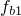 and 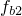, by the expression

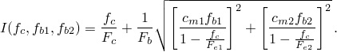Here,  is a characteristic axial compressive stress,  is a characteristic bending stress, 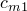 and 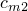 are reduction factors corresponding to the cross-section directions *1* and *2*, and 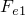 and  are the Euler buckling stresses corresponding to the *1*- and *2*-directions. The ISO equation states that buckling does not occur as long as

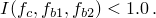To define the terms in *I*, we use the following notation:

is the yield stress,

*E*

is Young's modulus of elasticity,

*A*

is the cross-sectional area,

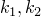

are the effective length factors in the 1- and 2-directions (user-defined),

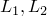

are the unbraced lengths for the 1- and 2-directions (user-defined),

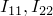

are the bending moments of inertia about the local cross-section directions,

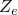

is the elastic section modulus,

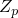

is the plastic section modulus,

*r*

is the radius of gyration.For pipe sections if *D* is the outside diameter and *t* is the pipe wall thickness,

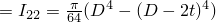,

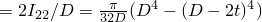,

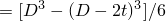,

*r*

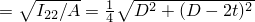.The terms in the ISO equation are calculated as follows:

is the axial compressive stress, 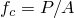 with *P* the axial force in the element.

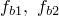

are the maximum bending stresses about the 1 or 2 cross-section axis,

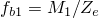, 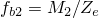 with  and 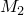

the bending moments about the 1 and 2 direction.

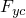

is the characteristic local buckling stress,

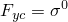 for 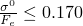,

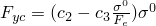 for 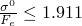, where 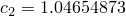 and

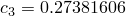,

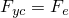 for 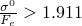,

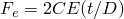,

 is a critical buckling coefficient.

is the characteristic axial compressive stress,

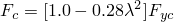 for 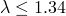,

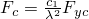 for 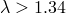, where 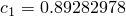,

with 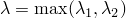,

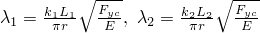.

is the characteristic bending stress (for pipe sections 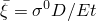),

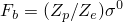 for 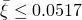,

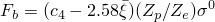 for 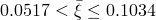,

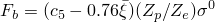 for 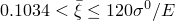,

where 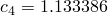 and 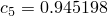.

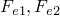

are Euler buckling stresses corresponding to the 1 or 2 directions,

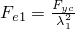 and 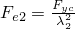.

are reduction factors corresponding to the cross-section directions 1 and 2, respectively. These factors are user-defined as functions of the end moments, compression stress, and Euler buckling stresses. The default value for each factor is .

If switching between standard frame element response and buckling strut response is permitted, the one-time-only switch to buckling strut response occurs when . The ISO equation provides the value of critical load, , which is defined as the value of axial force  in the element when the ISO equation is satisfied. To prevent switching in cases where negligible axial force exists with large bending moments, an additional inequality is used. This additional check, called the strength equation, takes the following form:

For a frame element to switch to buckling strut behavior, both the ISO equation and the strength equation must be satisfied,  and . If buckling strut response is requested for the element from the beginning of the analysis, bending moments cannot be supported by the element. In this case the ISO equation becomes the simplified statement that no buckling occurs for

### Marshall strut envelope

The Marshall strut envelope defines the postbuckling damaged elasticity model and the hysteretic loop response. To define the Marshall strut envelope, the value of  and the following seven constants are needed:

is the coefficient defining  (),

is the isotropic hardening slope coefficient (0.02),

is the coefficient defining , (),

is the coefficient defining , (),

is the force coefficient (0.28),

is the slope coefficient (0.02), and

is the force coefficient (min(1.0, )).

The values in parentheses are the default values supplied by Abaqus, and the value of  is found from the ISO equation as explained above.

The Marshall envelope governs the compressive and tensile response of the strut as shown in [Figure 3.9.3&#8211;1](03s09a94.md). The dotted lines in the interior of the envelope indicate the damaged-elastic modulus defining the loading-unloading force versus strain path.

Figure 3.9.3&#8211;1 Marshall strut theory buckling envelope.

### References

### References

"Frame elements,"  Section 29.4.1 of the Abaqus Analysis User's Guide

"Frame section behavior,"  Section 29.4.2 of the Abaqus Analysis User's Guide