# 3.9.4 Tube support elements

### 3.9.4 Tube support elements

**Product: **Abaqus/Standard

These elements are provided for the specific case of modeling the interaction between a tube and a support that is not always in contact with the tube during dynamic events. The tube is assumed to have a circular section and can interact with one of two tube support geometries: a circular hole and an "egg-crate" support. Two interface elements of this type are provided, one for each geometry, as shown in [Figure 3.9.4&#8211;1](03s09a95-Tube-support-elements.md) and [Figure 3.9.4&#8211;2](03s09a95-Tube-support-elements.md). As indicated in [Figure 3.9.4&#8211;2](03s09a95-Tube-support-elements.md), one cylindrical geometry interface is needed to model the interaction of the tube with a circular hole, while [Figure 3.9.4&#8211;1](03s09a95-Tube-support-elements.md) shows that several unidirectional geometry elements are needed to model the interaction with an egg-crate---one element perpendicular to each pair of egg-crate faces.

Figure 3.9.4&#8211;1 ITSUNI elements for tube/"egg-crate" support interaction.

Figure 3.9.4&#8211;2 ITSCYL element for tube/drilled hole support interaction.

The interface elements themselves consist of a spring and friction link and a dashpot, as shown in [Figure 3.9.4&#8211;3](03s09a95-Tube-support-elements.md). The spring is assumed to behave as shown in [Figure 3.9.4&#8211;4](03s09a95-Tube-support-elements.md): when there is no contact between the tube and the support, no force is transmitted by the spring; when the tube is in contact with the support, the force increases as the tube wall is deformed. This force can be modeled as a linear or a nonlinear function of the relative displacement between the axis of the tube and the center of the hole in the support.

Figure 3.9.4&#8211;3 Tube support element behavior.

Figure 3.9.4&#8211;4 Nonlinear spring behavior in ITS elements to model clearance and tube flattening.

The frictional part of the spring and friction link uses the Coulomb friction model in Abaqus: that model is described in "Coulomb friction,"  Section 5.2.3.

The dashpot is provided to model fluid effects in the annulus between the tube and the support plate. Its behavior can be linear or nonlinear. The model assumes that shear forces created by the fluid are negligible, so that the only shear forces transmitted by one of these interface elements are the frictional forces caused by direct contact between the tube and the support.

A major simplification in these elements that saves considerable computational effort in dynamic applications is the assumption that impacts between the tube and its support plates involve no instantaneous transfer of momentum or energy loss: the standard impact algorithm of Abaqus/Standard used with gap and other interface elements (and described in "Intermittent contact/impact,"  Section 2.4.2) is not needed. This simplification derives from the assumption that these elements will be used in conjunction with beam element models of the tube, so the tube section is defined by the position and orientation of its axis and local deformation of the cross-section of the tube is neglected. In reality, when the tube hits a support, initially only a small part of the tube wall loses momentum so that there is---instantaneously---only a small loss of kinetic energy. This instantaneous energy loss is neglected when these elements are used. The subsequent flattening of the tube wall is modeled by the spring link in the element, acting between the node on the tube axis and the node representing the center of the hole. Thus, the modeling of this local flattening behavior as an equivalent spring provides the simplification that instantaneous impact calculations are not needed. In cases where this approach is not reasonable, gap elements can be used instead of these special interface elements, at the cost of more computational effort.

The remainder of this section discusses the kinematic definitions used in these elements and their contributions to the overall equilibrium equations and to the Jacobian (stiffness) matrix needed in the Newton solution of those equations.
### Geometry and kinematics

Each tube support element has two nodes. One node represents the axis of the tube, the other is the center of the hole in the support plate (or midway between a pair of parallel sides of an "egg-crate").

Let  be a unit vector along the axis of the tube, and let  be a unit vector along the axis of the interface element (that is, perpendicular to the parallel sides of the support in the "unidirectional" interface that is used with egg-crate supports, and parallel to the line joining the two nodes of the element in the "cylindrical" interface that is used with circular holes). It is assumed that  is in the cross-section of the tube and, hence, orthogonal to . We define a third basis vector as

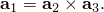

Let  be the current position of node *N* of the element at any point in time (here *N* is 1 or 2).

Relative displacements in the element are measured from the position when the tube and the hole in the support plate are exactly aligned; that is, when the nodes of the element are at the same location. They are defined as follows:

axial to the interface element,

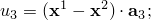

axial to the tube,

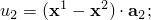and

tangential, in the plane of the tube's cross-section,

for the unidirectional case:

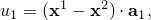

and, for the cylindrical case:

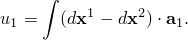

The basis vector---, along the axis of the tube and of the hole in the support plate---is assumed to be fixed. In the unidirectional element the 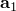 and  vectors are also fixed. In the cylindrical interface  is parallel to the line joining the nodes of the element, so

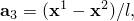where

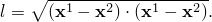Therefore,

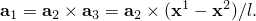

Thus, for this element

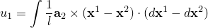and

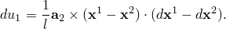

For simplicity we replace the integral with the backward difference approximation

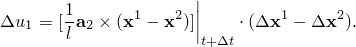
### Forces in the element

The element generates an axial force---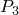, parallel to ---and two shear forces---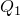, parallel to 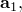 and 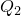, parallel to . In addition, because the nodes of the element are at the center of the tube and at the center of the hole in the support, while the interaction forces between the tube and its support are transmitted at the point of contact of the tube with the support, these forces also cause moments at the nodes of the element. It is assumed that the moments caused by  and by  are not significant and can be neglected. The only moments considered are 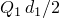 at node 1, the center of the tube, and 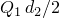 at node 2, the center of the hole. Here  is the outside diameter of the tube and 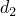 is the diameter of the hole for the cylindrical interface or is the distance between the parallel support plates for the uniaxial interface (see [Figure 3.9.4&#8211;5](03s09a95-Tube-support-elements.md)).

Figure 3.9.4&#8211;5 Contact forces in the cross-section.

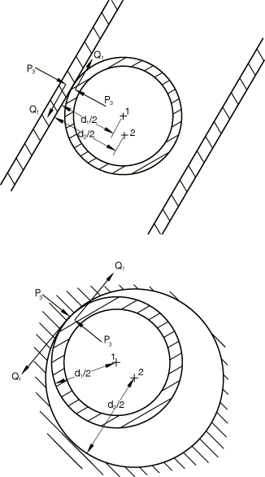

The virtual work contribution of the element is, then,

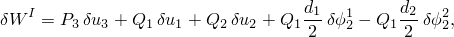where 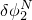 is the virtual rate of rotation about the -axis at node *N*.

From this expression the contribution of the element to the Jacobian (stiffness) matrix of the equilibrium equations is immediately available as

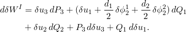

The "initial stress" terms,

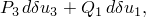are only nonzero for the cylindrical interface, for which

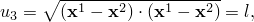so that

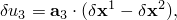and so

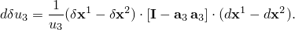Also, for this element,

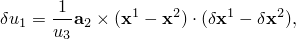and so

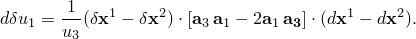This term is not symmetric.

The "initial stress" terms for the cylindrical interface are, therefore,

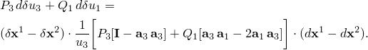

The other terms in the stiffness matrix are associated with changes in the forces in the element, 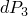, 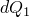, and 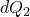. We assume  is made up of a spring force that is a function of  and a dashpot force that is a function of 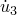:

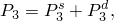

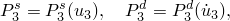so that

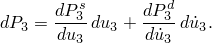

For the implicit integration operator used for nonlinear dynamic analysis in Abaqus/Standard,

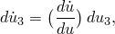where

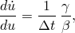where  is the time increment and  and  are the parameters of the integration operator.

Thus,

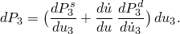

The values of  and  come from the friction theory and are defined from 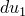, 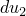, and 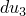 by that theory (see "Coulomb friction,"  Section 5.2.3).

In summary,

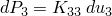and

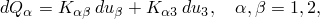so the stiffness contribution of the element is

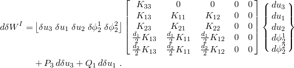

This matrix is not symmetric if , , or  is nonzero. Without friction they are zero, and the terms in 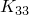 and  are the only nonzero terms. With relatively small friction coefficients in dynamic applications the terms  and---if the tube diameter is not very large---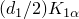, 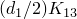, 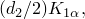 and  can be neglected and, thus, a symmetric approximation to the Jacobian matrix used without serious degradation of the convergence rate of the Newton solution of the equilibrium equations.
### Reference

### Reference

"Tube support elements,"  Section 32.8.1 of the Abaqus Analysis User's Guide