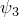

# 3.9.6 Flexible joint element

### 3.9.6 Flexible joint element

**Product: **Abaqus/Standard

The JOINTC elements in Abaqus/Standard provide for flexible joints between two nodes. This section defines the kinematic variables used in these elements.
### Kinematics

A JOINTC element consists of two nodes, referred to here as nodes 1 and 2. Each node has six degrees of freedom: displacements  and rotations . A local orientation is defined for the element by the user. In a large-displacement analysis that local system rotates with the first node of the element.

Figure 3.9.6&#8211;1 JOINTC geometry.

We define the local system by its unit, orthogonal base vectors, , for . Then at any time in the analysis

where  is the rotation matrix defined by the rotation at the first node of the element.

The relative displacements in the element are then

with first variations

where  is a linearized rotation field (see "Rotation variables,"  Section 1.3.1), and second variations

The relative rotation about the local *3*-axis is defined as

with  and  defined by cyclic permutation of the local direction indices.

These rotation measures define only relative angular rotations for small relative rotations. They are simple to compute, increase monotonically for relative rotations up to 180, and are taken as suitable for use in the elements for these reasons.

The first variation of  is

and its second variation is

The relative translational velocities in the element are taken as

and the relative angular velocity about the local *3*-axis is taken as

### Virtual work

The virtual work contribution of the element is

We assume that the behavior of the joint is defined by

The contribution to the operator matrix for the Newton solution is

where  is defined by the dynamic time integration operator.
### Reference

### Reference

"Flexible joint elements,"  Section 32.3 of the Abaqus Analysis User's Guide