# 3.9.7 Rotary inertia element

### 3.9.7 Rotary inertia element

**Products: **Abaqus/Standard  Abaqus/Explicit

The MASS and ROTARYI elements allow the inertia of a rigid body to be introduced at a node. In this section the formulation used with these elements is defined.

It is assumed that the node at which the mass and rotary inertia are introduced is the center of mass of the body. We refer to the node as the rigid body reference node, *C*. Let the local principal axes of inertia of the body be , . Let  be the vector between *C* and some point in the rigid body with current coordinates , so that

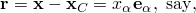where 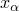 are local coordinates in the rigid body. The mass of the rigid body is the integral of the mass density 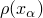 over the body

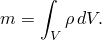Since *C* is assumed to be the center of mass of the body,

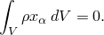Since the  are the principal axes of the body,

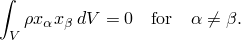Let , , and  be the second moments of inertia of the body about its principal axes , , and ; then

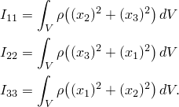The rotary inertia tensor is written

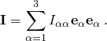

For a rigid body the velocity of any point in the body is given by

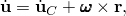 where 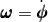 is the angular velocity of the body. Taking a second time derivative, the acceleration is

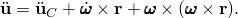

The local or strong form of the equilibrium equations represents the balance of linear momentum and balance of angular momentum; these two equilibrium equations are

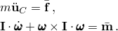The variational or weak form of equilibrium is

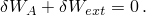The internal or d'Alembert force contribution is

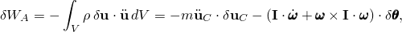where 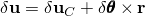 is the variation of the position of a point in the body. Here 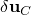 is the variation of the position of the rigid body reference node, and 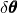 is the variation of the rotation of the rigid body reference node. The external loading contribution is

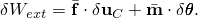Introducing component expressions relative to the principal axes of inertia, the rotational contribution to the weak form becomes

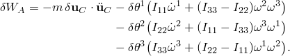

When the inertia of a rigid body is used with implicit time integration, the Jacobian contribution of 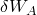 is required: this is

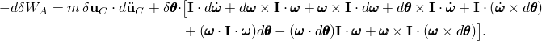
### Reference

### Reference

"Rotary inertia,"  Section 30.2.1 of the Abaqus Analysis User's Guide