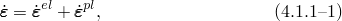
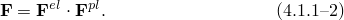
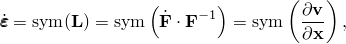
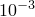
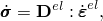
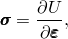
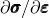

# 4.1.1 Mechanical constitutive models

### 4.1.1 Mechanical constitutive models

**Products: **Abaqus/Standard  Abaqus/Explicit

A wide variety of materials is encountered in stress analysis problems, and for any one of these materials a range of constitutive models is available to describe the material's behavior. For example, a component made from a standard structural steel can be modeled as an isotropic, linear elastic, material with no temperature dependence. This simple model would probably suffice for routine design, so long as the component is not in any critical situation. However, if the component might be subjected to a severe overload, it is important to determine how it might deform under that load and if it has sufficient ductility to withstand the overload without catastrophic failure. The first of these questions might be answered by modeling the material as a rate-independent elastic, perfectly plastic material, or---if the ultimate stress in a tension test of a specimen of the material is very much above the initial yield stress---isotropic work hardening might be included in the plasticity model. A nonlinear analysis (with or without consideration of geometric nonlinearity, depending on whether the analyst judges that the structure might buckle or undergo large geometry changes during the event) is then done to determine the response. But the severe overload might be applied suddenly, thus causing rapid straining of the material. In such circumstances the inelastic response of metals usually exhibits rate dependence: the flow stress increases as the strain rate increases. A "viscoplastic" (rate-dependent) material model might, therefore, be required. (Arguing that it is conservative to ignore this effect because it is a strengthening effect is not necessarily acceptable---the strengthening of one part of a structure might cause load to be shed to another part, which proves to be weaker in the event.) So far the analyst can manage with relatively simple (but nonlinear) constitutive models. But if the failure is associated with localization---tearing of a sheet of material or plastic buckling---a more sophisticated material model might be required because such localizations depend on details of the constitutive behavior that are usually ignored because of their complexity (see, for example, [Needleman, 1977](07s01a01-References.md)). Or if the concern is not gross overload, but gradual failure of the component because of creep at high temperature or because of low-cycle fatigue, or perhaps a combination of these effects, then the response of the material during several cycles of loading, in each of which a small amount of inelastic deformation might occur, must be predicted: a circumstance in which we need to model much more of the detail of the material's response.

So far the discussion has considered a conventional structural material. We can broadly classify the materials of interest as those that exhibit almost purely elastic response, possibly with some energy dissipation during rapid loading by viscoelastic response (the elastomers, such as rubber or solid propellant); materials that yield and exhibit considerable ductility beyond yield (such as mild steel and other commonly used metals, ice at low strain rates, and clay); materials that flow by rearrangement of particles that interact generally through some dominantly frictional mechanism (such as sand); and brittle materials (rocks, concrete, ceramics). The constitutive library provided in Abaqus contains a range of linear and nonlinear material models for all of these categories of materials. In general the library has been developed to provide those models that are most usually required for practical applications. There are several distinct models in the library; and for the more commonly encountered materials (metals, in particular), several ways of modeling the material are provided, each suitable to a particular type of analysis application. But the library is far from comprehensive: the range of physical material behavior is far too broad for this ever to be possible. The analyst must review the material definitions provided in Abaqus in the context of each particular application. If there is no model in the library that is useful for a particular case, Abaqus/Standard contains a user subroutine---UMAT---and, similarly, Abaqus/Explicit contains a user subroutine---VUMAT. In these routines the user can code a material model (or call other routines that perform that task). This "user subroutine" capability is a powerful resource for the sophisticated analyst who is able to cope with the demands of programming a complex material model.

Theoretical aspects of the material models that are provided in Abaqus are described in this chapter, which is intended as a definition of the details of the material models that are provided: it also provides useful guidance to analysts who might have to code their own models in UMAT or VUMAT.

From a numerical viewpoint the implementation of a constitutive model involves the integration of the state of the material at an integration point over a time increment during a nonlinear analysis. (The implementation of constitutive models in Abaqus assumes that the material behavior is entirely defined by local effects, so each spatial integration point can be treated independently.) Since Abaqus/Standard is most commonly used with implicit time integration, the implementation must also provide an accurate "material stiffness matrix" for use in forming the Jacobian of the nonlinear equilibrium equations; this is not necessary for Abaqus/Explicit.

The mechanical constitutive models that are provided in Abaqus often consider elastic and inelastic response. The inelastic response is most commonly modeled with plasticity models. Several plasticity models are described in this chapter. Some of the constitutive models in Abaqus also use damage mechanics concepts, the distinction being that in plasticity theory the elasticity is not affected by the inelastic deformation (the Young's modulus of a metal specimen is not changed by loading it beyond yield, until the specimen is very close to failure), while damage models include the degradation of the elasticity caused by severe loading (such as the loss of elastic stiffness suffered by a concrete specimen after it has been subjected to large uniaxial compressive loading).

In the inelastic response models that are provided in Abaqus, the elastic and inelastic responses are distinguished by separating the deformation into recoverable (elastic) and nonrecoverable (inelastic) parts. This separation is based on the assumption that there is an additive relationship between strain rates:

where  is the total strain rate,  is the rate of change of the elastic strain, and  is the rate of change of inelastic strain.

A more general assumption is that the total deformation, , is made up of inelastic deformation followed by purely elastic deformation (with the rigid body rotation added in at any stage in the process):

In "The additive strain rate decomposition,"  Section 1.4.4, the circumstances are discussed under which [Equation 4.1.1&#8211;1](04s01a100.md) is a legitimate approximation to [Equation 4.1.1&#8211;2](04s01a100.md). We conclude that, if

the total strain rate measure used in [Equation 4.1.1&#8211;1](04s01a100.md) is the rate of deformation:

where  is the velocity and  is the current spatial position of a material point; and

the elastic strains are small, then the approximation is consistent. Abaqus uses the rate of deformation as the strain rate measure in finite-strain problems for this reason. (The distinction between different strain measures matters only when the strains are not negligible compared to unity; that is, in finite-strain problems.) The elastic strains always remain small for many materials of practical interest; for example, the yield stress of a metal is typically three orders of magnitude smaller than its elastic modulus, implying elastic strains of order . However, some materials (polymers, for example) can undergo large elastic straining and also flow inelastically, in which case the additive strain rate decomposition is no longer a consistent approximation.

Various elastic response models are provided in Abaqus. The simplest of these is linear elasticity:

where  is a matrix that may depend on temperature but does not depend on the deformation (except when such dependency is introduced in damage models). This elasticity model is intended to be used for small-strain problems or to model the elasticity in an elastic-plastic model in which the elastic strains are always small.

An extension of the elastic type of behavior is the hypoelastic model:

where now  may depend on the deformation. In this case the elasticity may be nonlinear, but the implementation in Abaqus still assumes that the elastic strains will always be small. In porous and granular media, the elastic properties are strongly dependent on the volume strain; porous elastic behavior is described in "Porous elasticity,"  Section 4.4.1.

The most general type of nonlinear elastic behavior is the hyperelastic model, in which we assume that there is a strain energy density potential---*U*---from which the stresses are defined (to within a hydrostatic stress value if the material is fully incompressible) by

where  and  are any work conjugate stress and strain measures. This form of elasticity model is generally used to model elastomers: materials whose long-term response to large deformations is fully recoverable (elastic). The hyperelasticity modeling provided in Abaqus is described in "Large-strain elasticity,"  Section 4.6. The hyperelasticity models cannot be used with the plastic deformation models in the program, but can be combined with viscoelastic behavior, as described in "Finite-strain viscoelasticity,"  Section 4.8.2.

The plasticity models offered in Abaqus are discussed in general terms in "Plasticity overview,"  Section 4.2. Both rate-independent and rate-dependent models, with and without yield surfaces, are offered. Models are included in the program that are intended for applications to metals ("Metal plasticity,"  Section 4.3) as well as some nonmetallic materials such as soils, polymers, and crushable foams ("Plasticity for non-metals,"  Section 4.4). The jointed material model ("Constitutive model for jointed materials,"  Section 4.5.4) and the concrete model ("An inelastic constitutive model for concrete,"  Section 4.5.1) also include plasticity modeling.

The constitutive routines in Abaqus exist in a library that can be accessed by any of the solid or structural elements. This access is made independently at each "constitutive calculation point." These points are the numerical integration points in the elements. Thus, the constitutive routines are concerned only with a single calculation point. The element provides an estimate of the kinematic solution to the problem at the point under consideration. These kinematic data are passed to the constitutive routines as the deformation gradient------or, more typically, as the strain and rotation increments--- and . The constitutive routines obtain the state at the point under consideration at the start of the increment from the "material point data base." The state variables include the stress and any state variables used in the constitutive models---plastic strains, for example. The constitutive routines also look up the constitutive definition. Their function then is to update the state to the end of the increment and, if the procedure uses implicit time integration and if Newton's method is being used to solve the equations, to define the material contribution to the Jacobian matrix, . For material models that are defined in rate form and, therefore, require integration (such as incremental plasticity models), this Jacobian contribution depends on the model and also on the integration method used for the model. Its derivation is, therefore, discussed in some detail in the sections that define such models.
### Reference

### Reference

"Material library: overview,"  Section 21.1.1 of the Abaqus Analysis User's Guide