# 4.2.1 Plasticity models: general discussion

### 4.2.1 Plasticity models: general discussion

**Products: **Abaqus/Standard  Abaqus/Explicit

Incremental plasticity theory is based on a few fundamental postulates, which means that all of the elastic-plastic response models provided in Abaqus (except the deformation theory model in Abaqus/Standard, which is primarily provided for fracture mechanics applications) have the same general form. The basic equations of the models are defined in their general form in this section.

Plasticity models are written as rate-independent models or as rate-dependent models. A rate-independent model is one in which the constitutive response does not depend on the rate of deformation---the response of many metals at low temperatures relative to their melting temperature and at low strain rates is effectively rate independent. In a rate-dependent model the response does depend on the rate at which the material is strained. Examples of such models are the simple metal "creep" models provided in Abaqus/Standard and the rate-dependent plasticity model that is used to describe the behavior of metals at higher strain rates. Because these models have similar forms, their numerical treatment is based on the same technique.

A basic assumption of elastic-plastic models is that the deformation can be divided into an elastic part and an inelastic (plastic) part. In its most general form this statement is written as

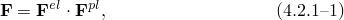where  is the total deformation gradient,  is the fully recoverable part of the deformation at the point under consideration (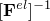 is the deformation that would occur if, after the deformation , inelastic response were somehow prevented but at the same time the stress at the point reduced to zero), and  is defined by 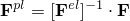. The rigid body rotation at the point can be included in the definition of either  or  or can be considered separately before or after either part of the decomposition: this makes no difference except in the convenience of the basis for writing the parts of the deformation.

This decomposition can be used directly to formulate the plasticity model. Historically, an additive strain rate decomposition,

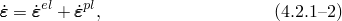has been used in its place. Here  is the total (mechanical) strain rate,  is the elastic strain rate, and  is the plastic strain rate.

It is shown in "The additive strain rate decomposition,"  Section 1.4.4, that [Equation 4.2.1&#8211;2](04s02a101.md) is a consistent approximation to [Equation 4.2.1&#8211;1](04s02a101.md) when the elastic strains are infinitesimal (negligible compared to unity) and when the strain rate measure used in [Equation 4.2.1&#8211;2](04s02a101.md) is the rate of deformation:

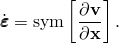[Equation 4.2.1&#8211;2](04s02a101.md), with the rate of deformation used as the definition of total strain rate, is used in all of the plasticity models that are implemented in Abaqus. Rice's argument implies that the elastic response must always be small in problems in which these models are used. In practice this is the case: plasticity models are provided for metals, soils, polymers, crushable foams, and concrete; and in each of these materials it is very unlikely that the elastic strain would ever be larger than a few percent (and even this would be quite unusual in a metal). Thus, the use of [Equation 4.2.1&#8211;2](04s02a101.md) does not appear to be objectionable for the models in question, at least from a formal point of view. However, the user who needs to develop user subroutine UMAT or VUMAT for a different material model in which the elastic strains and the inelastic strains may both be large should consider using [Equation 4.2.1&#8211;1](04s02a101.md) directly.

The elastic part of the response is assumed to be derivable from an elastic strain energy density potential, so the stress is defined by

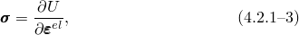where *U* is the strain energy density potential. Since we assume that, in the absence of plastic straining, the variation of elastic strain is the same as the variation in the rate of deformation, conjugacy arguments define the stress measure  as the "true" (Cauchy) stress. All stress output in Abaqus is given in this form.

In some materials the elastic response is essentially incompressible. But this is not usually the case for the materials whose inelastic deformation is considered with the models provided in Abaqus, so [Equation 4.2.1&#8211;3](04s02a101.md) can be taken to define the stress completely. However, the inelastic response is often assumed to be approximately incompressible (in metals, for example, or in soils undergoing large plastic flows), so the user must be careful to ensure that the elements chosen can accommodate incompressible response without exhibiting "locking" problems when the model is three-dimensional, plane strain, or axisymmetric. This requires the use of hybrid or fully or selectively reduced-integration elements.

For several of the plasticity models provided in Abaqus the elasticity is linear, so the strain energy density potential has a very simple form. For the soils model the volumetric elastic strain is proportional to the logarithm of the equivalent pressure stress. For the concrete model damaged elasticity is used to account for the crack opening after the concrete has cracked: in that case the elasticity model is more complex.

The rate-independent plasticity models in Abaqus and one of the rate-dependent models all have a region of purely elastic response. The yield function, *f*, defines the limit to this region of purely elastic response and is written so that

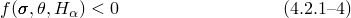for purely elastic response. Here  is the temperature, and  are a set of hardening parameters. The subscript  is introduced simply to indicate that there may be several hardening parameters, : the range of  is not specified until we define a particular plasticity model. The hardening parameters are state variables that are introduced to allow the models to describe some of the complexity of the inelastic response of real materials. In the simplest plasticity model ("perfect plasticity") the yield surface acts as a limit surface and there are no hardening parameters at all: no part of the model evolves during the deformation. Complex plasticity models usually include a large number of hardening parameters. The models provided in Abaqus are generally not the most complex models and use only a few such parameters (only one is used in the isotropic hardening metal model and in the Cam-clay model; six are used in the simple kinematic hardening model).

In the concrete and the jointed material plasticity models in Abaqus the yield behavior is modeled with several independent inelastic flow systems. For this case [Equation 4.2.1&#8211;4](04s02a101.md) is generalized to

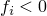for purely elastic response in system *i*, where 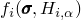 is one of the yield functions and 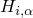 are the hardening parameters for the *i*th system. For generality in this discussion we assume the model uses such a system of independent yield functions. In the simpler systems with a single yield function *i* can only take the value 1.

Stress states that cause the yield function to have a positive value cannot occur in rate-independent plasticity models, although this is possible in a rate-dependent model. Thus, in the rate-independent models we have the yield constraints

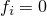during inelastic flow.

When the material is flowing inelastically the inelastic part of the deformation is defined by the flow rule, which we can write as

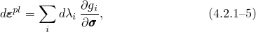where 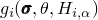 is the flow potential for the *i*th system and 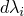 is the rate of change of time, 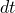, for a rate-dependent model or is a scalar measuring the amount of the plastic flow rate on the *i*th system, whose value is determined by the requirement to satisfy the consistency condition 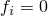, for plastic flow of a rate-independent model. The summation is over only the actively yielding systems: 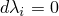 for those systems for which .

The form in which the flow rule is written above assumes that there is a single flow potential, , in the *i*th system. More general plasticity models might have several active flow potentials at a point. This is, for instance, the case in the concrete and jointed material models built into Abaqus.

For some rate-independent plasticity models the direction of flow is the same as the direction of the outward normal to the yield surface:

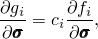where  is a scalar. Such models are called "associated flow" plasticity models. Associated flow models are useful for materials in which dislocation motion provides the fundamental mechanisms of plastic flow when there are no sudden changes in the direction of the plastic strain rate at a point. They are generally not accurate for materials in which the inelastic deformation is primarily caused by frictional mechanisms. The metal plasticity models in Abaqus (except cast iron) and the Cam-clay soil model use associated flow. The cast iron, granular/polymer, crushable foam, Mohr-Coulomb, Drucker-Prager/Cap, and jointed material models provide nonassociated flow with respect to volumetric straining and equivalent pressure stress. The concrete model uses associated flow.

The rate form of the flow rule is essential to incremental plasticity theory, because it allows the history dependence of the response to be modeled.

The final ingredient in plasticity models is the set of evolution equations for the hardening parameters. We write these equations as

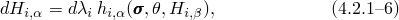where 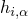 is the (rate form) hardening law for . In complex plasticity models---for example, models used to describe the cyclic behavior of metals used for high temperature applications---these evolution laws have complicated forms, since such complexity is required to match the experimentally observed behavior. The plasticity models offered in Abaqus use simple evolution equations: isotropic hardening, Prager-Ziegler kinematic hardening, and the location of the center of the yield surface along the equivalent pressure stress axis in the Cam-clay model. The independence of the yield systems designated by the subscript *i* is implicit in the assumption in [Equation 4.2.1&#8211;6](04s02a101.md) above that the evolution of the  depends only on other hardening parameters, 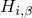, in the same (*i*th) system.

[Equation 4.2.1&#8211;1](04s02a101.md) to [Equation 4.2.1&#8211;6](04s02a101.md) define the general structure of all of the plasticity models in Abaqus. Since the flow rule and the hardening evolution rules are written in rate form, they must be integrated. The general technique of integration is discussed in "Integration of plasticity models,"  Section 4.2.2. The sections immediately following that discussion describe the details of the specific plasticity models that are provided in Abaqus.
### Reference

### Reference

"Inelastic behavior,"  Section 23.1.1 of the Abaqus Analysis User's Guide