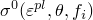
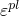
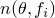
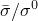

# 4.3.1 Metal plasticity models

### 4.3.1 Metal plasticity models

**Products: **Abaqus/Standard  Abaqus/Explicit

Abaqus offers several models for metal plasticity analysis. The main options are a choice between rate-independent and rate-dependent plasticity, a choice between the Mises yield surface for isotropic materials and Hill's yield surface for anisotropic materials, and for rate-independent modeling a choice between isotropic and kinematic hardening. Special plasticity theories are the cast iron model ("Cast iron plasticity,"  Section 4.3.7), the ORNL model for types 304 and 316 stainless steel in nuclear applications ("ORNL constitutive theory,"  Section 4.3.8), and deformation plasticity for fracture mechanics applications ("Deformation plasticity,"  Section 4.3.9).

Rate-independent plasticity is used mostly in modeling the response of metals and some other materials at low temperature (typically below half the melting temperature on an absolute scale) and low strain rates. The rate-independent metal plasticity model uses associated flow.

Two types of rate-dependent models are offered. In the first type a rate-dependent yield strength is introduced in the material model. This is intended for relatively high strain rate applications, such as dynamic events or metal forming process simulations. This type of rate dependence can be introduced in different ways. One way is to use an overstress power law,

where  is the equivalent plastic strain rate;  is the yield stress at nonzero plastic strain rate;  is the static yield stress (which may depend on the plastic strain------via isotropic hardening, on the temperature------and on other field variables, ); and ,  are material parameters that can be functions of temperature and, possibly, of other predefined state variables. Another way is to define a yield stress ratio, , as a function of the equivalent plastic strain rate, . Both of these options assume that the shapes of the hardening curves at different strain rates are identical. If the shapes of the hardening curves at different strain rates are different, the static and rate-dependent stress-strain relations can be specified directly. The yield stress at a given strain rate is interpolated directly from these relations. Finally, the user can describe general rate-dependent isotropic hardening with user subroutine UHARD. See [Symonds (1967)](07s01a01-References.md), [Lindholm and Besseny (1969)](07s01a01-References.md), and [Eleiche (1972)](07s01a01-References.md) for collections of material response measurements or bibliographies of such measurements at high strain dependents.

For high temperature "creep" problems Abaqus/Standard offers some simple built-in creep laws. But for many practical problems the user must write the uniaxial creep behavior into user subroutine CREEP because of the complexity of the experimentally measured material response. Creep response under cyclic loading shows significant Bauschinger effects, which cannot be modeled except by introducing sophisticated hardening models. The only capability in Abaqus for such cases is the "ORNL" option. This option uses simple rules to model the Bauschinger effect and is intended primarily as a design evaluation model for the high temperature response of stainless steel. It does not model the material's response in detail. User subroutine UMAT must be used if that hardening model is not adequate.

Isotropic hardening means that the yield function is written

where  is the equivalent (uniaxial) stress,  is the work equivalent plastic strain, defined by

and  is temperature.

Isotropic hardening is generally considered to be a suitable model for problems in which the plastic straining goes well beyond the incipient yield state where the Bauschinger effect is noticeable ([Rice, 1975](07s01a01-References.md)). Therefore, this hardening theory is used for such applications as dynamic problems involving finite strains and manufacturing processes---any process involving large plastic strain and in which the plastic strain does not continuously reverse direction sharply.

Some cases, such as low-cycle fatigue situations, involve relatively low amplitude strain cycling. In these cases it becomes important to model the Bauschinger effect. Kinematic hardening is the simplest theory that does this. Abaqus offers a linear kinematic and a nonlinear isotropic/kinematic hardening model for such cases. These models are described in "Models for metals subjected to cyclic loading,"  Section 4.3.5.
### Reference

### Reference

"Metal plasticity,"  Section 23.2 of the Abaqus Analysis User's Guide