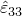
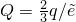

# 4.3.2 Isotropic elasto-plasticity

### 4.3.2 Isotropic elasto-plasticity

**Products: **Abaqus/Standard  Abaqus/Explicit

This material model is very commonly used for metal plasticity calculations, either as a rate-dependent or as a rate-independent model, and has a particularly simple form. Because of this simplicity the algebraic equations associated with integrating the model are easily developed in terms of a single variable, and the material stiffness matrix can be written explicitly. This results in particularly efficient code. In this section these equations are developed.

For simplicity of notation all quantities not explicitly associated with a time point are assumed to be evaluated at the end of the increment.

The Mises yield function with associated flow means that there is no volumetric plastic strain; since the elastic bulk modulus is quite large, the volume change will be small. Thus, we can define the volume strain as

and, hence, the deviatoric strain is

### Material model definition

The strain rate decomposition is

Using the standard definition of corotational measures, this can be written in integrated form as

The elasticity is linear and isotropic and, therefore, can be written in terms of two temperature-dependent material parameters. For the purpose of this development it is most appropriate to choose these parameters as the bulk modulus, *K*, and the shear modulus, *G*. These are computed readily from the user's input of Young's modulus, *E*, and Poisson's ratio, , as

and

The elasticity can be written in volumetric and deviatoric components as follows.

Volumetric:

where

is the equivalent pressure stress.

Deviatoric:

where  is the deviatoric stress,

The flow rule is

where

and  is the (scalar) equivalent plastic strain rate.

The plasticity requires that the material satisfy a uniaxial-stress plastic-strain strain-rate relationship. If the material is rate independent, this is the yield condition:

where  is the yield stress and is defined by the user as a function of equivalent plastic strain () and temperature ().

If the material is rate dependent, the relationship is the uniaxial flow rate definition:

where *h* is a known function. For example, the rate-dependent material model offers an overstress power law model of the form

where  and  are user-defined temperature-dependent material parameters and  is the static yield stress.

Integrating this relationship by the backward Euler method gives

This equation can be inverted (numerically, if necessary) to give *q* as a function of  at the end of the increment.

Thus, both the rate-independent model and the integrated rate-dependent model give the general uniaxial form

where  for the rate-independent model and  is obtained by inversion of [Equation 4.3.2&#8211;6](04s03a104.md) for the rate-dependent model.

[Equation 4.3.2&#8211;1](04s03a104.md) to [Equation 4.3.2&#8211;7](04s03a104.md) define the material behavior. In any increment when plastic flow is occurring (which is determined by evaluating *q* based on purely elastic response and finding that its value exceeds ), these equations must be integrated and solved for the state at the end of the increment. As in the general discussion in "Metal plasticity models,"  Section 4.3.1, the integration is done by applying the backward Euler method to the flow rule ([Equation 4.3.2&#8211;4](04s03a104.md)), giving

Combining this with the deviatoric elasticity ([Equation 4.3.2&#8211;3](04s03a104.md)) and the integrated strain rate decomposition ([Equation 4.3.2&#8211;1](04s03a104.md)) gives

Using the integrated flow rule ([Equation 4.3.2&#8211;8](04s03a104.md)), together with the Mises definition of the flow direction,  (in [Equation 4.3.2&#8211;4](04s03a104.md)), this becomes

For simplicity of notation we write

so that this equation is

Taking the inner product of this equation with itself gives

where

The Mises equivalent stress, *q*, must satisfy the uniaxial form defined in [Equation 4.3.2&#8211;7](04s03a104.md), so that from [Equation 4.3.2&#8211;11](04s03a104.md),

This is a nonlinear equation for  in the general case when  depends on the equivalent plastic strain (that is, when the material is rate-dependent, or when there is nonzero work hardening). (It is linear in  for rate-independent perfect plasticity.) We solve it by Newton's method:

and we iterate until convergence is achieved.

Once  is known, the solution is fully defined: using [Equation 4.3.2&#8211;5](04s03a104.md),

and so, from [Equation 4.3.2&#8211;10](04s03a104.md),

From [Equation 4.3.2&#8211;4](04s03a104.md),

and thus, from [Equation 4.3.2&#8211;6](04s03a104.md),

For cases where three direct strain components are provided by the kinematic solution (that is, all but plane stress and uniaxial stress cases), [Equation 4.3.2&#8211;2](04s03a104.md) defines

so that the solution is then fully defined.Plane stress

For plane stress  is not defined by the kinematics but by the plane stress constraint

This additional equation (or equivalently ) must be solved along with the yield condition and [Equation 4.3.2&#8211;9](04s03a104.md). The predicted third strain component

where

and

serves as an initial guess toward the final value of  that enables (with the correct plastic straining) the plane stress condition to be satisfied.Uniaxial stress

For cases with only one direct strain component defined by the kinematic solution (uniaxial deformation), we require

so that

### Material stiffness

For this simple plasticity model the material stiffness matrix can be derived without the need for matrix inversion (as was needed in the general case described in "Integration of plasticity models,"  Section 4.2.2), as follows.

Taking the variation of [Equation 4.3.2&#8211;10](04s03a104.md) with respect to all quantities at the end of the increment gives

Now, from [Equation 4.3.2&#8211;5](04s03a104.md),

and, from [Equation 4.3.2&#8211;11](04s03a104.md),

Combining these last two results,

where

From the definition of  (see [Equation 4.3.2&#8211;11](04s03a104.md)),

and, hence,

Combining these results with [Equation 4.3.2&#8211;14](04s03a104.md) gives

where ,  is the fourth-order unit tensor, and

For all cases where three direct strains are defined by the kinematic solution, the material stiffness is completed by

so since

and

we have

Plane stress

For the plane stress case the material stiffness matrix is found by imposing

on the general material stiffness matrix obtained for the plane strain case.Uniaxial stress

For the uniaxial stress case the material stiffness matrix is available directly from the variation of [Equation 4.3.2&#8211;13](04s03a104.md) as

### Reference

### Reference

"Classical metal plasticity,"  Section 23.2.1 of the Abaqus Analysis User's Guide