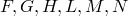
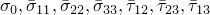
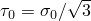

# 4.3.3 Stress potentials for anisotropic metal plasticity

### 4.3.3 Stress potentials for anisotropic metal plasticity

**Products: **Abaqus/Standard  Abaqus/Explicit

The metal plasticity models in Abaqus use the Mises stress potential for isotropic behavior and the Hill stress potentials for anisotropic behavior. Both of these potentials depend only on the deviatoric stress, so the plastic part of the response is incompressible. This means that, in cases where the plastic flow dominates the response (such as limit load calculations or metal forming problems), except for plane stress problems, the finite elements should be chosen so that they can accommodate the incompressible flow. Usually the reduced integration elements are used for this purpose: in Abaqus/Standard the "hybrid" elements can also be used, at higher cost. The fully integrated first-order continuum elements in Abaqus/Standard use selectively reduced integration, whereby the volumetric strain is calculated at the centroid of the element only. Those elements that are described in "Solid isoparametric quadrilaterals and hexahedra,"  Section 3.2.4, are also suitable for such problems.

The Mises stress potential is

where

in which  is the deviatoric stress:

The potential is a circle in the plane normal to the hydrostatic axis in principal stress space. For this function,

and

in which  is the fourth-order unit tensor.

Hill's stress function is a simple extension of the Mises function to allow anisotropic behavior. The function is

in terms of rectangular Cartesian stress components, where  are constants obtained by tests of the material in different orientations. They are defined as

where  are specified by the user and .  and  are the values of stress that make the potential equal to  if only one stress component is nonzero.

For this function

where

In addition,

where

### Reference

### Reference

"Anisotropic yield/creep,"  Section 23.2.6 of the Abaqus Analysis User's Guide