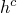
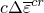
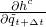
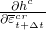

# 4.3.4 Rate-dependent metal plasticity (creep)

### 4.3.4 Rate-dependent metal plasticity (creep)

**Product: **Abaqus/Standard

The rate-dependent plasticity (creep) models provided in Abaqus/Standard are used to model inelastic straining of materials that are rate sensitive. High-temperature "creep" in structures is one important class of examples of the application of such a material model. Because such problems generally involve relatively small amounts of inelastic straining (otherwise the structure is not a suitable design), the explicit, forward Euler method is often satisfactory as an integrator for the flow rule. This method is only conditionally stable, but the stability limit is usually sufficiently large compared to the time history of interest in such cases that the explicit method is very economical. [Cormeau (1975)](07s01a01-References.md) has developed formulae for the stability limit for most common cases of stress induced creep, and these results are used to monitor stability. For this explicit approach the integration is trivial. Combining the integrated flow rule

with the integrated strain rate decomposition and the (linear) elasticity gives

All of the terms on the right-hand side of this set of equations are known when the constitutive integration is done, so these equations define  explicitly.

There also exist many problems involving rate-dependent plastic response in which the characteristic relaxation times for the material under the stress states to which it is subjected are very short compared to the time period of interest in the analysis, so the conditional stability of the explicit operator will only allow very short time increments. For such cases it can be more economical to use the backward Euler method because of its unconditional stability. Abaqus always uses the implicit method for high strain rate applications to avoid time increment restrictions being introduced by considerations of stability in the integration of the constitutive model. Abaqus will also use the implicit method in all geometrically nonlinear problems and in problems for which rate-independent plasticity is active simultaneously.

The backward Euler method is implicit; and because the plastic strain rate is usually a strong function of stress, some care must be taken to develop an effective algorithm to solve the nonlinear algebraic equations that result from the use of this operator. The problem has been posed formally in "Integration of plasticity models,"  Section 4.2.2. The main difficulty is to obtain a reasonable starting guess for . For this we proceed as follows.

For simplicity, we consider rate-dependent behavior only and the particular form of flow rule defined by

where  is the "equivalent swelling strain rate,"  is the "equivalent creep strain rate," and  is the gradient of the deviatoric stress potential,

where  is the Mises or Hill stress potential (defined in "Stress potentials for anisotropic metal plasticity,"  Section 4.3.3).

The "equivalent strain rates" are part of the stress potential for the plastic response and, therefore, are assumed to have evolution laws of the form

and

Backward Euler integration of the flow equation gives

where  is understood to be evaluated at time , and

and

 and  are usually defined in user subroutine CREEP.

The solution to the algebraic problem is obtained by first finding reasonable initial guesses for  and  and then solving the full problem.

The Mises and Hill equivalent stress definitions () both have the property that

We also have the simple relationship

The initial estimates for  and  are obtained by projecting the problem onto  and , where  is  defined at , the stress state that would arise at the end of the increment if there were no inelastic deformation during the increment. The projections are

and

where

and

[Equation 4.3.4&#8211;2](04s03a106.md) to [Equation 4.3.4&#8211;5](04s03a106.md) are a set of nonlinear equations that can be solved for  and . We solve these equations by Newton's method and then use this solution as the starting estimate for solving the complete problem. When the Mises stress potential is used and the problem is not plane stress, this starting estimate is the solution to the complete problem because the Mises stress potential is a circle in the deviatoric plane.
### User subroutine CREEP

Abaqus/Standard provides a very general capability for implementing viscoplastic models such as creep and swelling in which the strain rate potential can be written as a function of equivalent pressure stress, *p*; the Mises or Hill's equivalent deviatoric stress, ; and any number of solution-dependent state variables. The purpose of this section is to provide an overview of the operations that need to be performed in user subroutine CREEP. To illustrate the main ideas, the creep law is assumed to be of a strain hardening type and of the form

where *B* and *n* are material constants, and *f* is a nonlinear function of its argument. In user subroutine CREEP the user needs to define the creep strain increment based on the above creep law. Given that the creep law is in rate form, an integration scheme is needed to convert it to an incremental form defining the creep strain increment. This conversion can be accomplished by using either an explicit (forward Euler) or an implicit (backward Euler) integration scheme. In the explicit scheme the creep strain rate during any time increment is defined in terms of (known) quantities at the beginning of the increment. Thus, an explicit integration would lead to the following incremental form of the creep law:

In an implicit scheme the creep strain rate during any time increment is defined in terms of (unknown) quantities at the end of the increment. Thus, an implicit scheme would lead to the following incremental form of the creep law:

where  is a nonlinear function of its arguments. In the incremental forms above the subscripts *t* and  refer to the values of the corresponding quantities at the beginning and at the end of the increment, respectively.

Recognizing that  and also that  is a function of , the implicit integration scheme leads to a nonlinear equation in the creep strain increment  that is solved by Abaqus iteratively at each material point (these are local material point iterations and are not the same as the global equilibrium iterations). The user subroutine gets called at each integration point during each local iteration. The Newton-Raphson scheme used to solve the above nonlinear equation iteratively is given by

where the subscripts *i* and  are iteration counters, and  represents the correction to the creep strain increment. As illustrated by the two equations above, the Jacobian of the implicit scheme requires the partial derivative of the function  with respect to . For the example considered here the Jacobian may be further expressed as

There are additional terms if the function  also depends on the hydrostatic pressure. In an implicit scheme the user also needs to define the appropriate derivatives that enter the Jacobian of the nonlinear equation for . In the example above the user needs to define the quantities  and . The incremental creep strain and the Jacobian contributions require the values of the equivalent Mises or Hill's stress (and the pressure stress, if relevant) and the equivalent creep strain at both the beginning and the end of the increment, which are available in the user subroutine.

On the other hand, in the explicit scheme the creep strain increment is defined in terms of quantities known at the beginning of the increment and, hence, no local iterations are needed. However, as discussed in "Rate-dependent plasticity: creep and swelling,"  Section 23.2.4 of the Abaqus Analysis User's Guide, the explicit scheme has limitations related to stability.

Irrespective of the integration scheme used to integrate the rate form of the creep equation, user subroutine CREEP is called at each material point once at the beginning and once at the end of each increment. These calls are for the purpose of getting the creep strain increment based on the creep strain rate at the beginning and at the end of the increment, respectively. The difference between these two creep strain increment values measures the accuracy of the integration scheme and must be less than the value specified on the relevant analysis step option for the maximum difference.
### Reference

### Reference

"Rate-dependent plasticity: creep and swelling,"  Section 23.2.4 of the Abaqus Analysis User's Guide