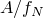

# 4.3.6 Porous metal plasticity

### 4.3.6 Porous metal plasticity

**Products: **Abaqus/Standard  Abaqus/Explicit

The porous metal plasticity model is intended for use with *mildly voided metals*. Even though the material that contains the voids (also known as the matrix material) is assumed to be plastically incompressible, the plastic behavior of the bulk material is pressure-dependent due to the presence of voids. The model is described in the following paragraphs, followed by a brief description of the material point calculations.
### Yield condition

For a metal containing a dilute concentration of voids, based on a rigid-plastic upper bound solution for spherically symmetric deformations of a single spherical void, [Gurson (1977)](07s01a01-References.md) proposed a yield condition of the form

where

is the deviatoric part of the macroscopic Cauchy stress tensor ;

is the Mises stress;

is the hydrostatic pressure; *f* is the volume fraction of the voids in the material; and  is the yield stress of the fully dense matrix material as a function of , the equivalent plastic strain in the matrix. [Tvergaard (1981)](07s01a01-References.md) introduced the constants , , and  (as coefficients of the void volume fraction and pressure terms) to make the predictions of the Gurson model agree with numerical studies of "ordered" voided materials in plane strain tensile fields; one can recover the original Gurson model by setting .

It should be noted that  implies that the material is fully dense, and the Gurson yield condition reduces to that of von Mises;  implies that the material is fully voided and has no stress carrying capacity. This is illustrated in [Figure 4.3.6&#8211;1](04s03a108.md), where the yield surfaces for different levels of porosity are shown in the *p*&#8211;*q* plane.

Figure 4.3.6&#8211;1 Schematic of the yield surface in the *p*&#8211;*q* plane.

[Figure 4.3.6&#8211;2](04s03a108.md) compares the behavior of a porous metal (which has an initial void volume fraction of ) in tension and compression against the perfectly plastic matrix material; the initial yield stress of the porous metal is .

Figure 4.3.6&#8211;2 Schematic of uniaxial behavior of a porous metal.

In compression the porous material "hardens" due to closing of the voids, and in tension it "softens" due to growth and nucleation of the voids.
### Flow rule

The plastic strains are derived from the yield potential; the presence of the first invariant of the stress tensor in the yield condition results in nondeviatoric plastic strains:

where  is the nonnegative plastic flow multiplier.
### Evolution of the plastic strains and f

The hardening of the (fully dense) matrix material is described through . The evolution of  is assumed to be governed by the equivalent plastic work expression; i.e.,

The change in volume fraction of the voids is due partly to the growth of existing voids and partly to the nucleation of voids. Growth of existing voids is based on the law of conservation of mass and is expressed as

Nucleation of voids can occur due to micro-cracking and/or decohesion of the particle-matrix interface. Abaqus assumes that the nucleation of new voids is plastic strain controlled (see [Chu and Needleman, 1980](07s01a01-References.md)), so that

where

The normal distribution of the nucleation strain has a mean value , a standard deviation , and nucleates voids with volume fraction . The total rate of change of *f* is given as

Voids are nucleated only in tension; Abaqus will not consider the nucleation term at a material point if the stress state is compressive.

The nucleation function , which is assumed to have a normal distribution, is shown in [Figure 4.3.6&#8211;3](04s03a108.md) for different values of the parameter . [Figure 4.3.6&#8211;4](04s03a108.md) shows the extent of softening in a uniaxial tension test of a porous material for different values of .

Figure 4.3.6&#8211;3 Nucleation function .

Figure 4.3.6&#8211;4 Softening (in uniaxial tension) as a function of .

### Integration of the elastoplastic equations

The integration of the elastoplastic equations for the porous plasticity model is carried out using the backward Euler scheme proposed by [Aravas (1987)](07s01a01-References.md). This method is briefly discussed in the following paragraphs; the user can refer to the paper for further details.

During the constitutive calculations in an increment, the stress and state variables are known at time *t* (beginning of the increment). Given a total incremental strain , the stress and state variables need to be updated at  (end of the increment) so that they satisfy the yield condition, flow rules, and evolution equation of the state variables. To do this, consider the elasticity equations

where

is the elastic predictor and

is the linear isotropic elasticity tensor with *G* and *K* being the shear and bulk modulus, respectively, and  and  being the fourth- and second-order identity tensors, respectively. Also, in the above, the additive decomposition of strain is used to write the total incremental strain as the sum of the elastic and plastic parts. All of the stress and state variables are evaluated at  unless indicated otherwise.

The yield condition, the flow rule, and the evolution of the state variables are rewritten as

and

where

In the above ,  are the state variables  and *f*, respectively. The plastic multiplier  is eliminated from the last two equations to give

[Equation 4.3.6&#8211;2](04s03a108.md) is used in the elasticity [Equation 4.3.6&#8211;1](04s03a108.md) to yield

 and  are coaxial; therefore,  is determined as

Once  is known, it is easily seen that consistent determination of the scalars  and  completes the solution. Therefore, the problem of integrating the pressure-dependent elastoplastic constitutive equations is reduced to solving the following two nonlinear equations for the scalars  and :

In the above equations *p*, *q*, and  are defined by

where [Equation 4.3.6&#8211;8](04s03a108.md) and [Equation 4.3.6&#8211;9](04s03a108.md) are obtained by projecting [Equation 4.3.6&#8211;4](04s03a108.md) onto  and , respectively, and [Equation 4.3.6&#8211;10](04s03a108.md) is an alternate form of [Equation 4.3.6&#8211;3](04s03a108.md). Solving the above system of equations for the unknowns  and  completes the integration algorithm for the porous plasticity model.

[Equation 4.3.6&#8211;6](04s03a108.md) and [Equation 4.3.6&#8211;7](04s03a108.md) are solved for  and  using Newton's method; *p* and *q* are updated using [Equation 4.3.6&#8211;8](04s03a108.md) and [Equation 4.3.6&#8211;9](04s03a108.md); the state variables are updated using [Equation 4.3.6&#8211;10](04s03a108.md).
### Computing the linearization moduli

In the implicit finite element method of solving large-deformation problems, the discretized equilibrium equations result in a set of nonlinear equations for the nodal unknowns at the end of the increment. Abaqus/Standard uses Newton's method to solve these equations, which requires the computation of *linearization moduli*

To compute  (also known as the Jacobian), we start with the elasticity equations ([Equation 4.3.6&#8211;4](04s03a108.md)), which can be rewritten as

where  is the deviatoric part of . From the above equation you find that

Once again [Equation 4.3.6&#8211;6](04s03a108.md) and [Equation 4.3.6&#8211;7](04s03a108.md) are used in computing the variations  and . After some lengthy algebraic calculations, a set of linear equations is obtained that can be solved for  and . These derivatives are substituted into [Equation 4.3.6&#8211;11](04s03a108.md) to obtain the linearization moduli. In general this linearization moduli is not symmetric. Further details of the derivation of the Jacobian can be found in [Aravas (1987)](07s01a01-References.md).
### Reference

### Reference

"Porous metal plasticity,"  Section 23.2.9 of the Abaqus Analysis User's Guide