# 4.3.7 Cast iron plasticity

### 4.3.7 Cast iron plasticity

**Products: **Abaqus/Standard  Abaqus/Explicit

The cast iron plasticity constitutive model is intended for modeling the elastoplastic behavior of gray cast iron. In tension gray cast iron is more brittle than most metals. This brittleness is attributed to the microstructure of the material, which consists of a distribution of graphite flakes in a steel matrix. In tension the graphite flakes act as stress concentrators, leading to an overall decrease in mechanical properties (such as yield strength). In compression, on the other hand, the graphite flakes serve to transmit stresses, and the overall response is governed by the response of the steel matrix alone. The above differences manifest themselves in the following macroscopic properties: (i) different yield strengths in tension and compression, with the yield stress in compression being a factor of three or more higher than the yield stress in tension; (ii) inelastic volume change in tension, but little or no inelastic volume change in compression; and (iii) different hardening behavior in tension and compression. It is commonly accepted (Hjelm, 1992, [1994](07s01a01-References.md)) that a Mises-type yield condition along with an associated flow rule models the material response sufficiently accurately under compressive loading conditions. This assumption is not true for tensile loading conditions: a pressure-dependent yield surface with nonassociated flow is required to model the brittle behavior in tension. The model is described in detail in the remainder of this section.
### Strain rate decomposition

An additive strain rate decomposition is assumed:

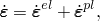where  is the total strain rate,  is the elastic part of the strain rate, and  is the inelastic (plastic) part of the strain rate.
### Elastic behavior

In compression the elastic behavior of gray cast iron is similar to that of many steels. It shows a well-defined elastic stiffness. In uniaxial tension the slope of the stress/strain curve decreases continuously, and it is difficult to estimate the elastic modulus from experimental results.

The model in Abaqus assumes that the elastic behavior of gray cast iron can be represented by linear isotropic elasticity, with the same stiffness in tension and compression.
### Yield condition

The model makes use of a composite yield surface to describe the different behavior in tension and compression. In tension yielding is assumed to be governed by the maximum principal stress, while in compression yielding is assumed to be pressure-independent and governed by the deviatoric stresses alone. In principal stress space the composite yield surface consists of the Rankine cube in tension and the Mises cylinder in compression.

The material is assumed to be isotropic; hence, the yield surface can be expressed as a function of three invariant measures of the stress tensor: the equivalent pressure stress,

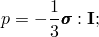the Mises equivalent stress,

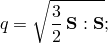and the third invariant of the deviatoric stress,

where  is the stress deviator, defined as

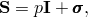 is the Cauchy stress tensor, and  is the second-order identity tensor. It is convenient to combine the invariants *q* and *r* to define a nondimensional quantity, , where

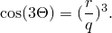In principal stress space the variable  identifies the meridional plane for a given stress state.

On any given meridional plane the yield surface consists of two distinct line segments given by

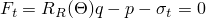and

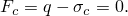In the expressions above 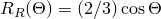; 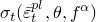 is the yield stress in uniaxial tension, which may depend on the equivalent plastic strain in uniaxial tension , temperature , and field variables 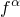 (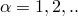); and 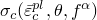 is the yield stress in uniaxial compression, which may depend on the equivalent plastic strain in uniaxial compression 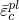, temperature , and field variables  (). The composite yield surface is illustrated in the meridional plane in [Figure 4.3.7&#8211;1](04s03a109.md), in the deviatoric plane in [Figure 4.3.7&#8211;2](04s03a109.md), and in the principal stress space in [Figure 4.3.7&#8211;3](04s03a109.md).

Figure 4.3.7&#8211;1 Schematic of the yield surface in the meridional plane.

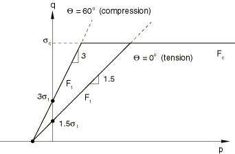

Figure 4.3.7&#8211;2 Schematic of the yield surface in the deviatoric plane.

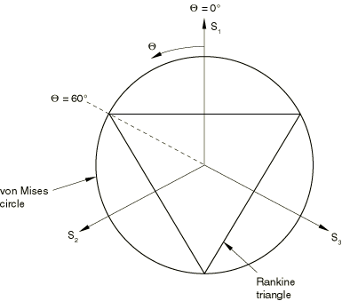

Figure 4.3.7&#8211;3 Schematic of the yield surface in the principal stress space.

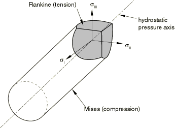
### Flow rule

For the purposes of discussing the flow and hardening behavior, it is useful to divide a meridional plane into two regions as shown in [Figure 4.3.7&#8211;4](04s03a109.md).

Figure 4.3.7&#8211;4 Schematic of the flow potentials in the meridional plane.

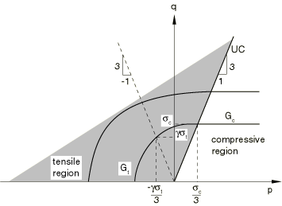The region to the left of the uniaxial compression line (labeled UC) is referred to as the "tensile region," and the region to the right of the uniaxial compression line is referred to as the "compressive region."

The plastic strains are defined to be normal to a family of self-similar flow potentials parametrized by the value of the potential *G*:

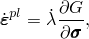where  is the nonnegative plastic multiplier. The flow potential, 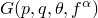, is assumed to be independent of the third stress invariant (independent of ). It consists of the Mises cylinder in compression with an ellipsoidal "cap" in tension. The transition between the two surfaces is smooth. The projection of the flow potential onto the deviatoric plane is a circle. On the meridional plane the potential *G* can take one of two values, 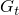 and , defined by the relations

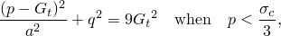

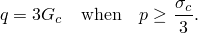 is the value of the potential in the tensile region, and  is the value of the potential in the compressive region. The potential in the tensile region is of the form of an ellipse, where *a* is the ratio of the horizontal (*p*) to the vertical (*q*) axis of the ellipse. The shape of the ellipse is controlled by *a*, which is chosen such that it passes through the two points (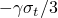,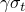) and (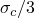, ), where  is a material parameter that controls plastic dilatation. The above requirement determines  to be equal to 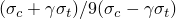. The value of the potential, *G*, depends on the current stress point (*p*, *q*). In the compressive region the flow potential consists of the Mises straight line. A consequence of the above choice of the flow potential is that plastic flow results in inelastic volume change in the tensile region and no inelastic volume change in the compressive region. [Figure 4.3.7&#8211;4](04s03a109.md) illustrates two potentials in the *p*&#8211;*q* plane.

It can be shown that for uniaxial tension, 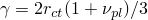, where 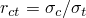 and 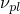 (referred to as the "plastic Poisson's ratio") is equal to the absolute value of the ratio of the transverse to the longitudinal plastic strain under uniaxial tension. The quantities , , and  are material properties that must be provided by the user. The plastic Poisson's ratio, , is expected to be less than 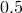 since experiments suggest that there is a permanent increase in the volume of gray cast iron when it is loaded in uniaxial tension beyond yield. In addition,  must be greater than 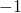 for the potential to be well-defined. For the gray cast iron described in the work of [Coffin (1950)](07s01a01-References.md), the value of  is approximately . This estimate is based on the reported value of the permanent volume change close to the ultimate tensile stress. The value of  may change with plastic deformation. However, the model in Abaqus assumes that it is constant with respect to plastic deformation. It can depend on temperature and field variables.

Since the flow potential is different from the yield surface (nonassociated flow), the material Jacobian matrix is unsymmetric.
### Hardening

Abaqus assumes that the graphite flakes do not influence the hardening behavior in the compressive region, where the matrix behavior (Mises plasticity) characterizes the overall response. In the tensile region the plastic strain consists of both a volumetric part (corresponding to opening up of the graphite flakes) and a deviatoric part (corresponding to inelastic shearing of the matrix). In the limiting case of pure hydrostatic tension it can be expected that the matrix material does not respond plastically; therefore, the entire plastic strain is volumetric, corresponding to the opening up of the graphite flakes. Thus, in the tensile region, we expect that the deviatoric part of the plastic strain decreases as the loading path approaches hydrostatic tension, eventually becoming zero at hydrostatic tension, while the volumetric part of the plastic strain decreases as the loading path approaches uniaxial compression and is zero for uniaxial compression and confining pressures higher than .

The hardening of the model is controlled by the evolution of  and 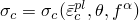. To develop the hardening model, we need to find expressions for the equivalent plastic strains,  and , as functions of the plastic strain tensor . To simplify the discussion, we assume that the temperature  and the field variables  () are constants, so that the yield stresses are taken to be functions of the corresponding equivalent strains only. Furthermore, it is convenient to decompose the plastic strain rate into volumetric and deviatoric components:

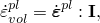

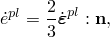where 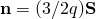 is the flow direction in the deviatoric plane. To find an expression relating  to , we use the equivalent plastic work expression

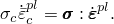Using the definition of the flow potential, it then follows (given that 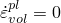 and 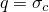 in compression) that

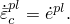This expression is used to update 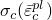 for all loading conditions, including tensile loading conditions. Next, we find an expression relating  to . Using the equivalent plastic work expression

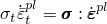and the definition of the flow potential, it follows that

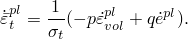This expression is used to update the yield stress 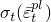 for all loading conditions, including compressive loading conditions.

Under predominantly compressive loading conditions, , 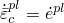, and 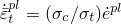. Thus, both  and  are updated based on the deviatoric plastic strain, 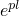, alone. This behavior is depicted in [Figure 4.3.7&#8211;5](04s03a109.md).

Figure 4.3.7&#8211;5 Hardening during compression loading.

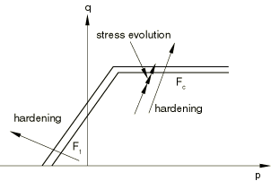At the other extreme, under hydrostatic tension (see [Figure 4.3.7&#8211;6](04s03a109.md)) 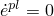.

Figure 4.3.7&#8211;6 Hardening due to hydrostatic tension (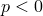 and 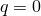).

Hence, , and . Consequently,  does not evolve, but  evolves based on . For all other loading paths in the tensile region, both  and  are nonzero. In such cases  is updated based on the deviatoric plastic strain, , alone, while  is updated based on both  and  (see [Figure 4.3.7&#8211;5](04s03a109.md)). Given the micromechanics of deformation of gray cast iron, the behavior seems reasonable, although there appears to be no experimental evidence confirming the above hardening behavior.

Since the matrix behavior of gray cast iron is similar to that of steel, it is reasonable to expect that under reversal of loading a combined kinematic and "quasi-isotropic" hardening scheme may be more appropriate to model, for example, the Bauschinger effect. Also, under compressive loading following tensile loading, we expect that some of the voids that had opened up at the graphite flakes may close. Thus, a cap in the yield surface may be appropriate under high confining pressures. However, only limited information is available in the literature. The model in Abaqus does not address these issues related to loading reversals and, therefore, should be used only for essentially monotonic loading conditions.
### Reference

### Reference

"Cast iron plasticity,"  Section 23.2.10 of the Abaqus Analysis User's Guide