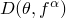
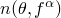
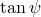

# 4.4.2 Models for granular or polymer behavior

### 4.4.2 Models for granular or polymer behavior

**Products: **Abaqus/Standard  Abaqus/Explicit

The behavior of granular and polymeric materials is complex. However, under essentially monotonic loading conditions rather simple constitutive models provide useful design information. These constitutive models are essentially pressure-dependent plasticity models that have historically been popular in the geotechnical engineering field. However, more recently they have also been found to be useful for the modeling of some polymeric and composite materials that exhibit significantly different yield behavior in tension and compression.

The models described here are extensions of the original Drucker-Prager model ([Drucker and Prager, 1952](07s01a01-References.md)). In the context of geotechnical materials the extensions of interest include the use of curved yield surfaces in the meridional plane, the use of noncircular yield surfaces in the deviatoric stress plane, and the use of nonassociated flow laws. In the context of polymeric and composite materials, the extensions of interest are mainly the use of nonassociated flow laws and the inclusion of rate-dependent effects. In both contexts the models have been extended to include creep.
### Available yield criteria

Three yield criteria are provided in this set of models. They offer differently shaped yield surfaces in the meridional plane (*p*&#8211;*q* plane): a linear form, a hyperbolic form, and a general exponent form (see [Figure 4.4.2&#8211;1](04s04a114.md)).

Figure 4.4.2&#8211;1 Yield criteria in the meridional plane.

The stress invariants used in the formulation are defined in "Conventions,"  Section 1.2.2 of the Abaqus Analysis User's Guide. The choice of model depends largely on the material, the experimental data available for calibration of the model parameters, and on the range of pressure stress values likely to be encountered.

The linear model (available in Abaqus/Standard and Abaqus/Explicit) provides a noncircular section in the deviatoric () plane, associated inelastic flow in the deviatoric plane, and separate dilation and friction angles. The smoothed surface used in the deviatoric plane differs from a true Mohr-Coulomb surface that exhibits vertices. This has restrictive implications, especially with respect to flow localization studies for granular materials, but this may not be of major significance in many routine design applications. Input data parameters define the shape of the yield and flow surfaces in the deviatoric plane as well as the friction and dilation angles, so that a range of simple theories is provided; for example, the original Drucker-Prager model ([Drucker and Prager, 1952](07s01a01-References.md)) is available within this model.

The hyperbolic and general exponent models (available in Abaqus/Standard only) use a von Mises (circular) section in the deviatoric stress plane with associated plastic flow. A hyperbolic flow potential is used in the meridional plane, which---in general---means nonassociated flow.
### Hardening, rate dependence, and creep

Perfect plasticity as well as isotropic hardening are offered with these models. Isotropic hardening is generally considered to be a suitable model for problems in which the plastic straining goes well beyond the incipient yield state where the Bauschinger effect is noticeable ([Rice, 1975](07s01a01-References.md)). This hardening theory is, therefore, used for processes involving large plastic strain and in which the plastic strain rate does not continuously reverse direction sharply; that is, the models are intended for problems involving essentially monotonic loading, as distinct from cyclic loading.

The isotropic hardening models can be used for rate-dependent as well as rate-independent behavior. The rate-dependent version is intended for relatively high strain rate applications.

Isotropic hardening means that the yield function is written as

where *f* is an isotropic function of a symmetric second-order tensor and  is the equivalent yield stress given by

where  is the shear stress; *K* is a material parameter;  is the equivalent plastic strain;  is the equivalent plastic strain rate;  is temperature; and  are other predefined field variables.

The equivalent plastic strain rate, , is defined for the linear Drucker-Prager model as

 where  is the engineering shear plastic strain rate and is defined for the hyperbolic and exponential Drucker-Prager models by the plastic work expression

The functional dependence  can include hardening as well as rate-dependent effects. If the shapes of the stress-strain curves are different at different strain rates, the test data are entered as tables of yield stress values versus equivalent plastic strain at different equivalent plastic strain rates: one table per strain rate. The yield stress at a given strain and strain rate is interpolated directly from these tables.

Alternatively, when it can be assumed that the shapes of the hardening curves at different strain rates are similar, the hardening and rate dependence are specified separately. In this case we assume that the rate dependence can be written in a separable form:

where  is the static yield stress for the Drucker-Prager hardening model and  scales this value at nonzero strain rate ( at ). The rate-dependent yield ratio *R* is defined either in a tabular form or using the standard power law form

where  and  are material parameters.

Creep models are most suitable for applications that exhibit time-dependent inelastic deformation at low deformation rates. Such inelastic deformation, which can coexist with rate-independent plastic deformation, is described later in this section. However, the existence of creep in an Abaqus material definition precludes the use of rate dependence as described above.
### Strain rate decomposition

An additive strain rate decomposition is assumed:

where  is the total strain rate,  is the elastic strain rate,  is the inelastic (plastic) strain rate, and  is the inelastic creep strain rate. The term  is omitted if the stress point is inside the yield surface, and the term  is omitted if creep has not been defined or is not active.
### Elastic behavior

The elastic behavior can be modeled as linear or with the porous elasticity model including tensile strength described in "Porous elasticity,"  Section 4.4.1. If creep has been defined, the elastic behavior must be modeled as linear.
### Linear Drucker-Prager model

In this model we define a deviatoric stress measure

where  is a material parameter. To ensure convexity of the yield surface, . This measure of deviatoric stress is used because it allows the matching of different stress values in tension and compression in the deviatoric plane, thereby providing flexibility in fitting experimental results when the material exhibits different yield values in triaxial tension and compression tests. This function is sketched in [Figure 4.4.2&#8211;2](04s04a114.md).

Figure 4.4.2&#8211;2 Typical yield surfaces for the linear model in the deviatoric plane.

It only provides a coarse match to Mohr-Coulomb behavior (where the yield is indepe7ndent of the intermediate principal stress). Since  in uniaxial tension,  in this case; since  in uniaxial compression,  in that case. When *K* = 1, the dependence on the third deviatoric stress invariant is removed; the Mises circle is recovered in the deviatoric plane: .

With this expression for the deviatoric stress measure, the yield surface is defined as

where

and  is the friction angle of the material in the meridional stress plane.

In the case of hardening defined in uniaxial compression, the linear yield criterion precludes friction angles  71.5 (3). This is not seen as a limitation since it is unlikely this will be the case for real materials.

The hardening parameter  measures the cohesion of the material and represents isotropic hardening, as illustrated in [Figure 4.4.2&#8211;3](04s04a114.md).

Figure 4.4.2&#8211;3 Schematic of hardening and flow for the linear model in the *p*&#8211;*t* plane.

The formulation treats  as constant with respect to stress, although it is straightforward to extend the theory to provide for the functional dependence of  on quantities such as *p*.

A method for converting Mohr-Coulomb data (, the angle of Coulomb friction, and *c*, the cohesion) to appropriate values of  and *d* is described in the Abaqus Analysis User's Guide.Flow rule

Potential flow in the linear model is assumed, so that

where

and

*G* is the flow potential, chosen in this model as

where  is the dilation angle in the *p*&#8211;*t* plane. A geometrical interpretation of  is shown in the *t*&#8211;*p* diagram of [Figure 4.4.2&#8211;3](04s04a114.md). In the case of hardening defined in uniaxial compression, this flow rule definition precludes dilation angles  71.5 (3). This is not seen as a limitation since it is unlikely this will be the case for real materials.

Comparison of [Equation 4.4.2&#8211;3](04s04a114.md) and [Equation 4.4.2&#8211;5](04s04a114.md) shows that the flow is associated in the deviatoric plane, because the yield surface and the flow potential both have the same functional dependence on *t*. However, the dilation angle, , and the material friction angle, , may be different, so the model may not be associated in the *p*&#8211;*t* plane. For  the material is nondilational; and if , the model is fully associated---the model is then of the type first introduced by [Drucker and Prager (1952)](07s01a01-References.md). For  and  the original Drucker-Prager model is recovered.
### Hyperbolic and general exponent models

The hyperbolic and general exponent models, which are only available in Abaqus/Standard, are written in terms of the first two stress invariants only. The hyperbolic yield criterion is a continuous combination of the maximum tensile stress condition of Rankine (tensile cutoff) and the linear Drucker-Prager condition at high confining stress. It is written as

where ,  is the initial hydrostatic tension strength of the material,  is the initial value of , and  is the friction angle measured at high confining pressure, as shown in [Figure 4.4.2&#8211;1](04s04a114.md)(b).  is the hardening parameter, which is obtained from test data:

The isotropic hardening assumed in this model treats  as constant with respect to stress and is depicted in [Figure 4.4.2&#8211;4](04s04a114.md). Calibration of this model is described in the Abaqus Analysis User's Guide.

Figure 4.4.2&#8211;4 Schematic diagram of hardening for the hyperbolic model in the *p*&#8211;*q* plane.

The general exponent form provides the most general yield criterion available in this class of models. The yield function is written as

where  and  are material parameters that are independent of plastic deformation and  is the hardening parameter that represents the hydrostatic tension strength of the material, as shown in [Figure 4.4.2&#8211;1](04s04a114.md)(c).  is related to test data as

The isotropic hardening assumed in this model treats *a* and *b* as constant with respect to stress and is depicted in [Figure 4.4.2&#8211;5](04s04a114.md).

Figure 4.4.2&#8211;5 Schematic diagram of hardening for the general exponent model in the *p*&#8211;*q* plane.

The material parameters *a*, *b*, and  can be given directly; or, if triaxial test data at different levels of confining pressure are available, Abaqus will determine the material parameters from the triaxial test data. A least squares fit, which minimizes the relative error in stress, is used to obtain the "best fit" values for *a*, *b*, and .Flow rule

Potential flow in the hyperbolic and general exponent models is assumed, so that

where *f* depends on how the hardening is defined (by uniaxial compression, uniaxial tension, or pure shear data) but can be written in general as

and

*G* is the flow potential, chosen in these models as a hyperbolic function:

where  is the dilation angle measured in the *p*&#8211;*q* plane at high confining pressure;  is the initial equivalent yield stress; and  is a parameter, referred to as the eccentricity, that defines the rate at which the function approaches the asymptote (the flow potential tends to a straight line as the eccentricity tends to zero). This flow potential, which is continuous and smooth, ensures that the flow direction is defined uniquely. The function asymptotically approaches the linear Drucker-Prager flow potential at high confining pressure stress and intersects the hydrostatic pressure axis at 90. A family of hyperbolic potentials in the meridional stress plane is shown in [Figure 4.4.2&#8211;6](04s04a114.md). The flow potential is a von Mises circle in the deviatoric stress plane (the -plane).

Figure 4.4.2&#8211;6 Family of hyperbolic flow potentials in the *p*&#8211;*q* plane.

In both models flow is associated in the deviatoric stress plane. In the general exponent model, flow is always nonassociated in the meridional *p*&#8211;*q* plane. In the hyperbolic model comparison of [Equation 4.4.2&#8211;6](04s04a114.md) and [Equation 4.4.2&#8211;9](04s04a114.md) shows that the flow is nonassociated in the *p*&#8211;*q* plane if the dilation angle, , and the material friction angle, , are different. The hyperbolic model provides associated flow in the *p*&#8211;*q* plane only when  and .
### Creep models

Classical "creep" behavior of materials that exhibit plastic behavior according to the extended Drucker-Prager models can be defined.

The creep behavior in such materials is intimately tied to the plasticity behavior (through the definition of the creep flow potential and test data), so it is necessary to define the Drucker-Prager plasticity and hardening behavior as well. The elastic part of the behavior must be linear.

The rate-independent part of the plastic behavior is limited to the linear Drucker-Prager model with a von Mises (circular) section in the deviatoric stress plane (*K*=1). The plastic potential is the hyperbolic flow potential described in conjunction with the hyperbolic and general exponent models ([Equation 4.4.2&#8211;9](04s04a114.md)).Creep behavior

We adopt the notion of creep isosurfaces (or equivalent creep surfaces) of stress points that share the same creep "intensity," as measured by an equivalent creep stress. When the material plastifies, the equivalent creep surface should coincide with the yield surface; therefore, we define the equivalent creep surfaces by homogeneously scaling down the yield surface. In the *p*&#8211;*q* plane that translates into parallels to the yield surface, as depicted in [Figure 4.4.2&#8211;7](04s04a114.md).

Figure 4.4.2&#8211;7 Equivalent creep stress defined as the shear stress.

Abaqus requires that creep properties be defined through the same type of test data used to define work hardening properties. The equivalent creep stress, , is determined as the intersection of the equivalent creep surface with the appropriate stress path. As a result,

where  is the material angle of friction.

[Figure 4.4.2&#8211;7](04s04a114.md) shows how the equivalent creep stress is determined when the material properties are defined via a shear test: a parallel to the yield surface is drawn, such that it passes by the material point; the intersection of such a line with the test stress path () produces .

This approach has the consequence that the creep strain rate is a function of both *q* and *p* and allows realistic material properties to be determined in cases in which, due to high hydrostatic pressures, *q* is very high. If one looks at the yield strength of this material to be a composite of cohesion strength and friction strength, this model corresponds to cohesion-determined creep. Thus, there is a cone in *p*&#8211;*q* space inside which there is no creep.

The built-in Abaqus creep laws or the uniaxial laws defined through user subroutine CREEP can be used. The integration of the creep strain rate is first attempted explicitly, as described in "Rate-dependent metal plasticity (creep),"  Section 4.3.4. If the stability limit is exceeded, a geometrically nonlinear analysis is being performed, or plasticity becomes active, the integration is done by the backward Euler method, as described in "Rate-dependent metal plasticity (creep),"  Section 4.3.4.Creep flow rule

The creep flow rule is derived from a creep potential, , in such a way that

where  is the equivalent creep strain rate, which must be work conjugate to the equivalent creep stress:

Since  is obviously work conjugate to ,  is defined by

The equivalent creep strain rate is then determined from the "uniaxial" creep law:

The creep strain rate is assumed to follow from the same hyperbolic potential as the plastic strain rate

where  is the dilation angle measured in the *p*&#8211;*q* plane at high confining pressure;  is the initial yield stress; and  is a parameter, referred to as the eccentricity, that defines the rate at which the function approaches the asymptote (the creep potential tends to a straight line as the eccentricity tends to zero). This creep potential, which is continuous and smooth, ensures that the creep flow direction is always uniquely defined. The function approaches the linear Drucker-Prager creep potential asymptotically at high confining pressure stress and intersects the hydrostatic pressure axis at 90. A family of hyperbolic potentials in the meridional stress plane is shown in [Figure 4.4.2&#8211;6](04s04a114.md). The creep potential is the von Mises circle in the deviatoric stress plane (the -plane).

[Equation 4.4.2&#8211;10](04s04a114.md) and [Equation 4.4.2&#8211;11](04s04a114.md) produce the complete flow rule

where

and

The expressions for  indicate that when creep properties are defined in terms of uniaxial compression data,  will become negative if

Thus, below this stress level, which for typical materials will be very low, the stress vector and the normal to the creep potential are pointing in opposite directions:

which is equivalent to

Therefore, if , there is a small zone just outside the "no creep" cone for which this is the case. Consequently, creep data obtained within this zone (such as data obtained in uniaxial compression) should show a creep strain rate in the opposite direction from the applied stress at very low stress levels, which will usually not be the case. To overcome this difficulty, Abaqus will modify the creep data entered such that . Thus, one would not expect correspondence between calculated creep strains and measured creep properties in a region defined by

where

The exact size of this region depends on the value of  and the type of test data entered. This modification is usually not significant since typical creep analyses have loads that are applied quickly, followed by long-term creep. Hence, the stress level for most of the analysis will usually be well beyond the modified zone.

An example of "slow" loading in which the approximation is visible is included in "Verification of creep integration,"  Section 3.2.6 of the Abaqus Benchmarks Guide. As is clear in the example, the effect of the approximation is small in spite of the fact that the load is ramped up over the step.

Although creep flow is associated in the deviatoric stress plane, the use of a creep potential different from the equivalent creep surface implies that creep flow is nonassociated.
### Reference

### Reference

"Extended Drucker-Prager models,"  Section 23.3.1 of the Abaqus Analysis User's Guide