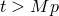
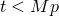
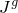

# 4.4.3 Critical state models

### 4.4.3 Critical state models

**Products: **Abaqus/Standard  Abaqus/Explicit

The inelastic constitutive theory provided in Abaqus/Standard for modeling cohesionless materials is based on the critical state plasticity theory developed by Roscoe and his colleagues at Cambridge ([Schofield et al., 1968](07s01a01-References.md), and [Parry, 1972](07s01a01-References.md)). The specific model implemented is an extension of the "modified Cam-clay" theory. The discussion is entirely in terms of effective stress: the soil may be saturated with a permeating fluid that carries a pressure stress and is assumed to flow according to Darcy's law. The continuum theory of this two phase material is described in "Continuity statement for the wetting liquid phase in a porous medium,"  Section 2.8.4.

The modified Cam-clay theory is a classical plasticity model. It uses a strain rate decomposition in which the rate of mechanical deformation of the soil is decomposed into an elastic and a plastic part; an elasticity theory; a yield surface; a flow rule; and a hardening rule. These various parts of the theory are defined in this section. The model is implemented numerically using backward Euler integration of the flow rule and hardening rule: this approach is used throughout Abaqus for plasticity models.

The basic ideas of the Cam-clay model are shown geometrically in [Figure 4.4.3&#8211;1](04s04a115.md) to [Figure 4.4.3&#8211;7](04s04a115.md). The main features of the model are the use of an elastic model (either linear elasticity or the porous elasticity model, which exhibits an increasing bulk elastic stiffness as the material undergoes compression) and for the inelastic part of the deformation a particular form of yield surface with associated flow and a hardening rule that allows the yield surface to grow or shrink.

A key feature of the model is the hardening/softening concept, which is developed around the introduction of a "critical state" surface: the locus of effective stress states where unrestricted, purely deviatoric, plastic flow of the soil skeleton occurs under constant effective stress. This critical state surface is assumed to be a cone in the space of principal effective stress ([Figure 4.4.3&#8211;1](04s04a115.md)), whose vertex is the origin (zero effective stress) and whose axis is the equivalent pressure stress, *p*.

Figure 4.4.3&#8211;1 Cam-clay yield and critical state surfaces in principal stress space.

The section of the surface in the -plane (the plane in principal stress space orthogonal to the equivalent pressure stress axis) is circular in the original form of the critical state model: in Abaqus this has been extended to the more general shape shown in [Figure 4.4.3&#8211;5](04s04a115.md). In the section of effective stress space defined by the equivalent pressure stress---*p*---and a measure of equivalent deviatoric stress---*t* (the definition of *t* is given later in this section)---the critical state surface appears as a straight line, passing through the origin, with slope *M* (see [Figure 4.4.3&#8211;2](04s04a115.md) and [Figure 4.4.3&#8211;3](04s04a115.md)). The modified Cam-clay yield surface has the same shape in the -plane as the critical state surface, but in the *p*&#8211;*t* plane it is assumed to be made up of two elliptic arcs: one arc passes through the origin with its tangent at right angles to the pressure stress axis and intersects the critical state line where its tangent is parallel to the pressure stress axis, while the other arc is a smooth continuation of the first arc through the critical state line and intersects the pressure stress axis at some nonzero value of pressure stress, again with its tangent at right angles to that axis (see [Figure 4.4.3&#8211;4](04s04a115.md)). Plastic flow is assumed to occur normal to this surface.

The hardening/softening assumption controls the size of the yield surface in effective stress space. The hardening/softening is assumed to depend only on the volumetric plastic strain component and is such that, when the volumetric plastic strain is compressive (that is, when the soil skeleton is compacted), the yield surface grows in size, while inelastic increase in the volume of the soil skeleton causes the yield surface to shrink. The choice of elliptical arcs for the yield surface in the () plane, together with the associated flow assumption, thus causes softening of the material for yielding states where  (to the left of the critical state line in [Figure 4.4.3&#8211;2](04s04a115.md), the "dry" side of critical state) and hardening of the material for yielding states where  (to the right of the critical state line in [Figure 4.4.3&#8211;3](04s04a115.md), the "wet" side of critical state).

Figure 4.4.3&#8211;2 Shear test response on the "dry" side of critical state ().

The resulting stress-strain behavior under states of constant effective pressure stress but increasing shear (deviatoric) strain is then as shown in [Figure 4.4.3&#8211;2](04s04a115.md) and [Figure 4.4.3&#8211;3](04s04a115.md): following initial yield (which is governed by the initially assumed yield surface size; that is, by the extent of initial overconsolidation) strain softening or strain hardening occurs until the stress state lies on the critical state surface when unrestricted deviatoric plastic flow (perfect plasticity) occurs. The terms "wet" and "dry" come from the idea of working a specimen of soil by hand. On the "wet" side of critical state the soil skeleton is too loosely compacted to support pressure stress---such stress, if applied (such as by squeezing the soil by hand) passes immediately into the pore water and thus causes this water to bleed out of the specimen and wet the hands. The opposite effect occurs when the soil is on the "dry" side of critical state.

The preceding discussion describes the concepts of the theory. These are now formalized, as they are implemented in Abaqus/Standard.
### The strain rate decomposition

The volume change is decomposed as

where *J* is the ratio of current volume to original volume,  is the ratio of current to original volume of the soil grain particles,  is the elastic (recoverable) part of the ratio of current to original volume of the soil volume, and  is the plastic (nonrecoverable) part of the ratio of current to original volume of the soil volume.

Figure 4.4.3&#8211;3 Shear test response on the "wet" side of critical state ().

Volumetric strains are defined as

Figure 4.4.3&#8211;4 Cam-clay yield surface in the *p*&#8211;*q* plane.

These definitions and [Equation 4.4.3&#8211;1](04s04a115.md) result in the usual additive strain rate decomposition for volumetric strain rates:

The model also assumes the deviatoric strain rates decompose in an additive manner, so that the total strain rates decompose as

where  is a unit matrix.
### Elastic behavior

The elastic behavior can be modeled as linear or by using the porous elasticity model, typically with a zero tensile strength, as described in "Porous elasticity,"  Section 4.4.1.
### Plastic behavior

The modified Cam-clay yield function is defined in terms of the equivalent effective pressure stress, *p*, and the Mises equivalent stress and third stress invariant, defined as

The surface is

In this equation  is a user-specified constant that can be a function of temperature  and other predefined field variables . This constant is used to modify the shape of the yield surface on the "wet" side of critical state, so the elliptic arc on the "wet" side of critical state has a different curvature from the elliptic arc used on the "dry" side:  on the "dry" side of critical state, while  in most cases on the "wet" side, as shown in [Figure 4.4.3&#8211;4](04s04a115.md).  defines the hardening of the plasticity model, and is the point on the *p*-axis at which the elliptic arcs of the yield surface intersect the critical state line, as indicated in  [Figure 4.4.3&#8211;4](04s04a115.md).  is the slope of the critical state line in the *p*&#8211;*t* plane (the ratio of *t* to *p* at critical state); and , where *g* is used to shape the yield surface in the  plane, and is defined as

where  is a user-defined constant. If , the yield surface does not depend on the third stress invariant, and the -plane section of the yield surface is a circle: this choice gives the original form of the Cam-clay model. The effect of different values of *K* on the shape of the yield surface in the -plane is shown in [Figure 4.4.3&#8211;5](04s04a115.md). To ensure convexity of the yield surface, .

Figure 4.4.3&#8211;5 Cam-clay surfaces in the deviatoric plane.

Associated flow is used with the modified Cam-clay plasticity model. The size of the yield surface is defined by *a*: the evolution of this variable, therefore, characterizes the hardening or softening of the material. It is observed experimentally that, during plastic deformation,

where  is a constant. Integrating this equation, and using [Equation 4.4.3&#8211;1](04s04a115.md), [Equation 4.4.1&#8211;2](04s04a113.md), and [Equation 4.4.1&#8211;4](04s04a113.md), we obtain

where  defines the position of *a* at the beginning of the analysis---the initial overconsolidation of the material. The value of  can be specified directly by the user or can be computed as

where  is the initial value of the equivalent pressure stress, and  is the intercept of the virgin consolidation line with the void ratio axis in a plot of void ratio versus equivalent pressure stress, shown in [Figure 4.4.3&#8211;6](04s04a115.md).

Figure 4.4.3&#8211;6 Assumed soil response in pure compression (exponential hardening/softening case).

The evolution of the yield surface can alternatively be defined as a piecewise linear function relating the yield stress in hydrostatic compression, , and the corresponding volumetric plastic strain  ([Figure 4.4.3&#8211;7](04s04a115.md)):

 The evolution parameter, *a*, is then given by

Note that the volumetric plastic strain axis has an arbitrary origin:  is the position on this axis corresponding to the initial state of the material, thus defining the initial hydrostatic pressure,  and, hence, the initial yield surface size, .

Figure 4.4.3&#8211;7 Piecewise linear hardening/softening curve.

Abaqus checks that the initial effective stress state lies inside or on the initial yield surface. At any material point where the yield function is violated,  is adjusted so that [Equation 4.4.3&#8211;3](04s04a115.md) is satisfied exactly (and, hence, the initial stress state lies on the yield surface).
### Reference

### Reference

"Critical state (clay) plasticity model,"  Section 23.3.4 of the Abaqus Analysis User's Guide