# 4.4.5 Mohr-Coulomb model

### 4.4.5 Mohr-Coulomb model

**Products: **Abaqus/Standard  Abaqus/Explicit

The Mohr-Coulomb failure or strength criterion has been widely used for geotechnical applications. Indeed, a large number of the routine design calculations in the geotechnical area are still performed using the Mohr-Coulomb criterion.

The Mohr-Coulomb criterion assumes that failure is controlled by the maximum shear stress and that this failure shear stress depends on the normal stress. This can be represented by plotting Mohr's circle for states of stress at failure in terms of the maximum and minimum principal stresses. The Mohr-Coulomb failure line is the best straight line that touch es these Mohr's circles ([Figure 4.4.5&#8211;1](04s04a117.md)). Thus, the Mohr-Coulomb criterion can be written as

where  is the shear stress,  is the normal stress (negative in compression), *c* is the cohesion of the material, and  is the material angle of friction.

Figure 4.4.5&#8211;1 Mohr-Coulomb failure criterion.

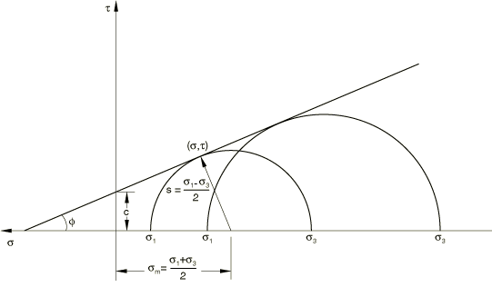From Mohr's circle,

Substituting for  and , the Mohr-Coulomb criterion can be rewritten as

where

is half of the difference between the maximum and minimum principal stresses (and is, therefore, the maximum shear stress) and

is the average of the maximum and minimum principal stresses (the normal stress). Thus, unlike the Drucker-Prager criterion, the Mohr-Coulomb criterion assumes that failure is independent of the value of the intermediate principal stress. The failure of typical geotechnical materials generally includes some small dependence on the intermediate principal stress, but the Mohr-Coulomb model is generally considered to be sufficiently accurate for most applications. This failure model has vertices in the deviatoric stress plane (see [Figure 4.4.5&#8211;2](04s04a117.md)).

Figure 4.4.5&#8211;2 Mohr-Coulomb model in the deviatoric plane.

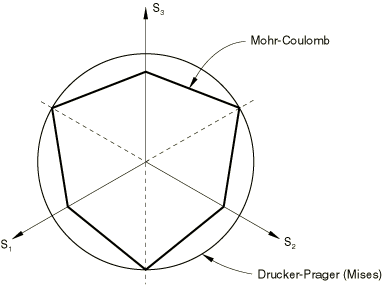

The constitutive model described here is an extension of the classical Mohr-Coulomb failure criterion. It is an elastoplastic model that uses a yield function of the Mohr-Coulomb form; this yield function includes isotropic cohesion hardening/softening. However, the model uses a flow potential that has a hyperbolic shape in the meridional stress plane and has no corners in the deviatoric stress space. This flow potential is then completely smooth and, therefore, provides a unique definition of the direction of plastic flow.
### Strain rate decomposition

An additive strain rate decomposition is assumed:

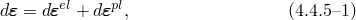where  is the total strain rate,  is the elastic strain rate, and  is the inelastic (plastic) strain rate.
### Elastic behavior

The elastic behavior is modeled as linear and isotropic.
### Yield behavior

The Mohr-Coulomb criterion written above in terms of the maximum and minimum principal stresses can be written for general states of stress in terms of three stress invariants. These invariants are the equivalent pressure stress,

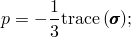the Mises equivalent stress,

where  is the stress deviator, defined as

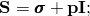and the third invariant of deviatoric stress,

The Mohr-Coulomb yield surface is then written as

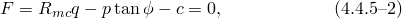where 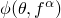 is the friction angle of the material in the meridional stress plane, where  is the temperature and  are other predefined field variables; 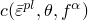 represents the evolution of the cohesion of the material in the form of isotropic hardening (or softening);  is the equivalent plastic strain, its rate defined by the plastic work expression

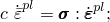and 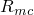 is the Mohr-Coulomb deviatoric stress measure defined as

where  is the deviatoric polar angle ([Chen and Han, 1988](07s01a01-References.md)) defined as

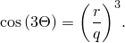The friction angle of the material, , also controls the shape of the yield surface in the deviatoric plane as shown in [Figure 4.4.5&#8211;3](04s04a117.md). The range of values the friction angle can have is 0 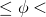 90. In the case of  0 the Mohr-Coulomb model reduces to the pressure-independent Tresca model with a perfectly hexagonal deviatoric section. In the case of  90 the Mohr-Coulomb model would reduce to the "tension cutoff" Rankine model with a triangular deviatoric section and  (this limiting case is not permitted within the Mohr-Coulomb model described here).

Figure 4.4.5&#8211;3 Mohr-Coulomb yield surface in meridional and deviatoric planes.

### Flow rule

Potential flow is assumed, so

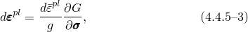where *g* can be written as

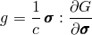and *G* is the flow potential, chosen as a hyperbolic function in the meridional stress plane and a smooth elliptic function in the deviatoric stress plane:

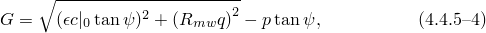where 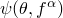 is the dilation angle measured in the *p*&#8211; plane at high confining pressure;  is the initial cohesion yield stress; and  is a parameter, referred to as the eccentricity, that defines the rate at which the function approaches the asymptote (the flow potential tends to a straight line as the eccentricity tends to zero). This flow potential, which is continuous and smooth in the meridional stress plane, ensures that the flow direction is defined uniquely in this plane. The function asymptotically approaches a linear flow potential at high confining pressure stress and intersects the hydrostatic pressure axis at 90. A family of hyperbolic potentials in the meridional stress plane is shown in [Figure 4.4.5&#8211;4](04s04a117.md).

Figure 4.4.5&#8211;4 Family of hyperbolic flow potentials in the meridional plane.

The flow potential is also continuous and smooth in the deviatoric stress plane (the -plane); we adopt the deviatoric elliptic function used by [Mentrey and Willam (1995)](07s01a01-References.md):

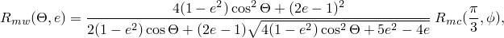where  is the deviatoric polar angle defined previously, 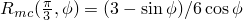, and *e* is a parameter that describes the "out-of-roundedness" of the deviatoric section in terms of the ratio between the shear stress along the extension meridian () and the shear stress along the compression meridian (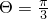). The elliptic function has the value 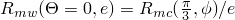 along the extension meridian and has the value 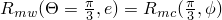 along the compression meridian; this ensures that the flow potential matches the yield surface at the triaxial compression and extension in the deviatoric plane provided that *e* is defined appropriately (see further discussion later). Although the elliptic function is defined only in the sector 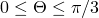, the polar radius 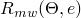 extends to all polar directions 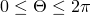 using the three-fold symmetry shown in [Figure 4.4.5&#8211;5](04s04a117.md).

Figure 4.4.5&#8211;5 Mentrey-Willam flow potential in the deviatoric plane.

By default, the out-of-roundedness parameter, *e*, is dependent on the friction angle ; it is calculated by matching the flow potential to the yield surface in both triaxial tension and compression in the deviatoric plane:

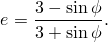Alternatively, *e* can also be considered to be an independent material parameter; in this case the user can provide its value directly. Convexity and smoothness of the elliptic function requires that . The upper limit,  (or  0), leads to , which describes the Mises circle in the deviatoric plane. The lower limit,  (or  90), leads to  and would describe the Rankine triangle in the deviatoric plane (this limiting case is not permitted within the Mohr-Coulomb model described here).

Flow in the meridional stress plane can be close to associated when the angle of friction, , and the angle of dilation, , are equal and the eccentricity parameter, , is very small; however, flow in this plane is, in general, nonassociated. Flow in the deviatoric stress plane is always nonassociated. Therefore, the use of this Mohr-Coulomb model generally requires the solution of nonsymmetric equations.
### Reference

### Reference

"Mohr-Coulomb plasticity,"  Section 23.3.3 of the Abaqus Analysis User's Guide