# 4.4.6 Models for crushable foams

### 4.4.6 Models for crushable foams

**Products: **Abaqus/Standard  Abaqus/Explicit

The constitutive models described here are available in Abaqus for the analysis of crushable foams typically used in energy absorption structures. Two phenomenological constitutive models are presented: the volumetric hardening model and the isotropic hardening model. Both models use a yield surface with an elliptical dependence of deviatoric stress on pressure stress in the meridional plane.

The volumetric hardening model is motivated by the experimental observation that foam structures usually experience a different response in compression and tension. In compression the ability of the material to deform volumetrically is enhanced by cell wall buckling processes as described by [Gibson et al. (1982)](07s01a01-References.md), [Gibson and Ashby (1982)](07s01a01-References.md), and [Maiti et al. (1984)](07s01a01-References.md). It is assumed that the foam cell deformation is not recoverable instantaneously and can, thus, be idealized as being plastic for short duration events. In tension, on the other hand, cell walls break readily; and as a result the tensile load bearing capacity of crushable foams may be considerably smaller than its compressive load bearing capacity.  Under monotonic loading, the volumetric hardening model assumes perfectly plastic behavior for pure shear and negative hydrostatic pressure stress states, while hardening takes place for positive hydrostatic pressure stress states.

The isotropic hardening model was originally developed for metallic foams by [Deshpande and Fleck (2000)](07s01a01-References.md). It assumes symmetric behavior in tension and compression, and the evolution of the yield surface is governed by an equivalent plastic strain, which has contributions from both the volumetric plastic strain and the deviatoric plastic strain.

The mechanical behavior of crushable foams is known to be sensitive to the rate of straining. This effect can be introduced by a piecewise linear law or by the overstress power law model.
### The strain rate decomposition

The volume change is decomposed as

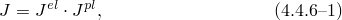 where *J* is the ratio of current volume to original volume,  is the elastic (recoverable) part of the ratio of current to original foam volume, and  is the plastic (nonrecoverable) part of the ratio of current to original foam volume.

Volumetric strains are defined as

These definitions and [Equation 4.4.6&#8211;1](04s04a118.md) result in the usual additive strain rate decomposition for volumetric strains:

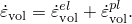

The model also assumes the deviatoric strain rates decompose additively, so that the total strain rates decompose as

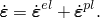
### Elastic behavior

The elastic behavior can be modeled only as linear elastic

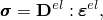where  represents the fourth-order elasticity tensor and  and  are the second-order stress and elastic strain tensors, respectively.
### Plastic behavior

The yield surface and the flow potential for the crushable foam models are defined in terms of the pressure stress

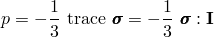and the Mises stress

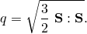The yield surface is defined as

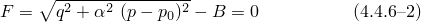and the flow potential is defined as

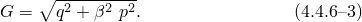*F* and *G* can each be represented as an ellipse in the *p*&#8211;*q* stress plane with  and  representing the shape of the yield ellipse and the ellipse for the flow potential, respectively;  is the center of the yield ellipse, and *B* is the length of the (vertical) *q*&#8211;axis of the yield ellipse. The flow potential is an ellipse centered in the origin. The yield surface and the flow potential are depicted in [Figure 4.4.6&#8211;1](04s04a118.md).

Figure 4.4.6&#8211;1 Typical yield surface and flow potential for the crushable foam model.

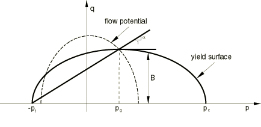

The parameters  and *B* of the yield ellipse ([Equation 4.4.6&#8211;2](04s04a118.md)) are related to the yield strength in hydrostatic compression, , and to the yield strength in hydrostatic tension, , by

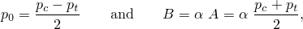where  and  are positive quantities and *A* is the length of the (horizontal) *p*-axis of the yield ellipse.

The shape factor, , remains as a constant during any plastic deformation process. The evolution of the yield ellipse is controlled by a plastic strain measure, 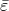, which is the volumetric compacting plastic strain, , for the volumetric hardening model, and the equivalent plastic strain,  (to be defined later), for the isotropic hardening model.

To define the hardening behavior, uniaxial compression test data are required. A piecewise linear hardening curve of uniaxial Cauchy stress versus axial (logarithmic) plastic strain must be entered in a tabular form.
### Crushable foam model with volumetric hardening

The volumetric hardening model assumes that the hydrostatic tension strength, , remains constant throughout any plastic deformation process. By contrast, the hydrostatic compression strength evolves as a result of compaction (increase in density) or dilation (reduction in density) of the material:

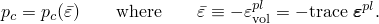Yield surface

The yield surface for the crushable foam model, depicted in [Figure 4.4.6&#8211;2](04s04a118.md),

Figure 4.4.6&#8211;2 Yield surfaces and flow potential for the volumetric hardening model.

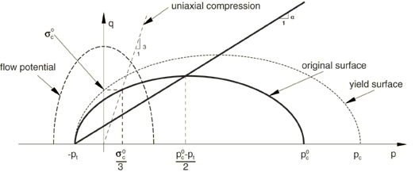is defined by

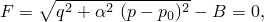where the parameter  represents the shape of the yield ellipse in the *p*&#8211;*q* stress plane and can be calculated from the initial yield strength in uniaxial compression, 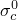, taken as a positive value; the initial yield strength in hydrostatic compression, ; and the yield strength in hydrostatic tension, ; as

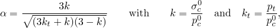where the yield stress ratios, 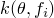 and 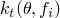, are provided by the user and can be functions of temperature and other field variables. For a valid yield surface the choice of yield stress ratios must be such that  and . The yield surface is the Mises circle in the deviatoric stress plane.Flow potential

The plastic strain rate for the volumetric hardening model is assumed to be

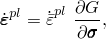where  is the equivalent plastic strain rate defined as

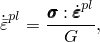and *G* is the flow potential, chosen in this model as

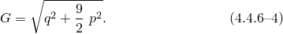 This potential is a particular case of [Equation 4.4.6&#8211;3](04s04a118.md) with 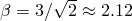. A geometrical representation of the flow potential in the *p*&#8211;*q* stress plane is shown in [Figure 4.4.6&#8211;2](04s04a118.md).

[Equation 4.4.6&#8211;4](04s04a118.md) gives a direction of flow that is identical to the stress direction for radial paths. This is motivated by simple laboratory experiments performed by [Bilkhu (1987)](07s01a01-References.md), which suggest that loading in any principal direction causes insignificant deformation in the other directions. As a result, the plastic flow is nonassociative. Therefore, the use of this foam model generally requires the solution of nonsymmetric equations.Hardening

The yield surface intersects the *p*-axis at  and . We assume that  remains fixed throughout any plastic deformation process. By contrast, the compressive strength, , evolves as a result of compaction (increase in density) or dilation (reduction in density) of the material. The evolution of the yield surface can be expressed through the evolution of the yield surface size on the hydrostatic stress axis, , as a function of the value of volumetric compacting plastic strain, . With  constant, this relation can be obtained from a user-provided uniaxial compression test data using

along with the fact that  in uniaxial compression (due to zero plastic Poisson's ratio). Thus, the user provides input to the hardening law by only specifying, in the usual tabular form, the value of the yield stress in uniaxial compression as a function of the absolute value of the axial plastic strain. The table must start with a zero plastic strain (corresponding to the virgin state of the material), and the tabular entries must be given in ascending magnitude of . If desired, the yield stress can also be a function of temperature and other predefined field variables.
### Crushable foam model with isotropic hardening

The isotropic hardening model was originally developed for metallic foams by [Deshpande and Fleck (2000)](07s01a01-References.md). The model assumes similar behaviors in tension and compression. The yield surface is an ellipse centered at the origin in the *p*&#8211;*q* stress plane and evolves in a self-similar manner governed by the equivalent plastic strain.Yield surface

The yield surface for the isotropic hardening model is defined as

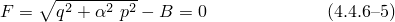with

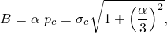where  represents the shape of the yield ellipse in the *p*&#8211;*q* stress plane, *B* defines the size of the yield ellipse,  is the yield strength in hydrostatic compression, and  is the absolute value of the yield strength in uniaxial compression. The yield surface is the Mises circle in the deviatoric stress plane, and an ellipse in the meridional plane as depicted in [Figure 4.4.6&#8211;3](04s04a118.md).

Figure 4.4.6&#8211;3 Yield surfaces and flow potential for the isotropic hardening model.

The parameter  can be calculated using the initial yield stress in uniaxial compression, , and the initial yield stress in hydrostatic compression, , as

The strength ratio *k* is provided by the user and must be in the range of 0 and 3. For many low-density foams the initial yield surface is close to a circle in the *p*&#8211;*q* stress plane, which indicates that the value of  is approximately one. The special case of 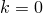 corresponds to the Mises yield surface.Flow potential

The flow potential for the isotropic hardening model is chosen as

where  represents the shape of the flow potential in the *p*&#8211;*q* stress plane and is related to the plastic Poisson's ratio, , by

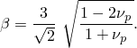The plastic Poisson's ratio, which is the ratio of the transverse to the longitudinal plastic strain under uniaxial compression, should be defined by the user; and it must be in the range of 1 and 0.5. The upper limit, 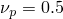, corresponds to an incompressible plastic flow.

The plastic strains are defined to be normal to a family of self-similar flow potentials parametrized by the value of the potential *G*

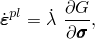where 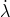 is the nonnegative plastic flow multiplier. The hardening of the foam is described through 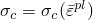, where  is the equivalent plastic strain. The evolution of  is assumed to be governed by the equivalent plastic work expression; i.e.,

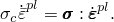The equivalent plastic strain is equal to the absolute value of the axial plastic strain in uniaxial tension or compression.

The plastic flow is associative when the value of  is the same as that of . In general, the plastic flow is nonassociated to allow for the independent calibrations of the shape of the yield surface and the plastic Poisson's ratio. For many low-density foams the plastic Poisson's ratio is nearly zero, which corresponds to a value of .Hardening

A simple uniaxial compression test is sufficient to define the evolution of the yield surface. The hardening law defines the value of the yield stress in uniaxial compression as a function of the absolute value of the axial plastic strain. The piecewise linear relationship is entered in tabular form. The table must start with a zero plastic strain (corresponding to the virgin state of the materials) and must be given in ascending magnitude of . If desired, the yield stress can also be a function of temperature and other predefined field variables.
### Reference

### Reference

"Crushable foam plasticity models,"  Section 23.3.5 of the Abaqus Analysis User's Guide