# 4.6.1 Hyperelastic material behavior

### 4.6.1 Hyperelastic material behavior

**Products: **Abaqus/Standard  Abaqus/Explicit

The constitutive behavior of a hyperelastic material is defined as a total stress&#8211;total strain relationship, rather than as the rate formulation that has been discussed in the context of history-dependent materials in previous sections of this chapter. Therefore, the basic development of the formulation for hyperelasticity is somewhat different. Furthermore, hyperelastic materials are often incompressible or very nearly so; hence, mixed ("hybrid") formulations can be used effectively. In this section the hyperelastic model provided in Abaqus is defined, and the mixed variational principles used in Abaqus/Standard to treat the fully incompressible case and the almost incompressible case are introduced.
### Definitions and basic kinematic results

We first introduce some definitions and basic kinematic results that will be used in this section. Some of these items have already been discussed in Chapter 1, "Introduction and Basic Equations": they are repeated here for convenience.

Writing the current position of a material point as  and the reference position of the same point as , the deformation gradient is

Then *J*, the total volume change at the point, is

For simplicity, we define

as the deformation gradient with the volume change eliminated.

We then introduce the deviatoric stretch matrix (the left Cauchy-Green strain tensor) of  as

so that we can define the first strain invariant as

where  is a unit matrix, and the second strain invariant as

The variations of , , , , and *J* will be required during the remainder of the development. We first define some variations of basic kinematic quantities that will be needed to write these results.

The gradient of the displacement variation with respect to current position is written as

The virtual rate of deformation is the symmetric part of :

which we decompose into the virtual rate of change of volume per current volume (the "virtual volumetric strain rate"),

and the virtual deviatoric strain rate,

The virtual rate of spin of the material is the antisymmetric part of :

The variations of , , , , and *J* are obtained directly from their definitions above in terms of these quantities as

where

where

and

The Cauchy ("true") stress components are defined from the strain energy potential as follows. From the virtual work principal the internal energy variation is

where  are the components of the Cauchy ("true") stress, *V* is the current volume, and  is the reference volume.

We decompose the stress into the equivalent pressure stress,

and the deviatoric stress,

so that the internal energy variation can be written

For isotropic, compressible materials the strain energy, *U*, is a function of , , and *J*:

so that

Hence, using [Equation 4.6.1&#8211;3](04s06a123.md), [Equation 4.6.1&#8211;4](04s06a123.md), and [Equation 4.6.1&#8211;5](04s06a123.md),

Since the variation of the strain energy potential is, by definition, the internal virtual work per reference volume, , we have

For a compressible material the strain variations are arbitrary, so this equation defines the stress components for such a material as

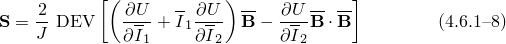and

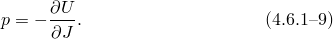

When the material response is almost incompressible, the pure displacement formulation, in which the strain invariants are computed from the kinematic variables of the finite element model, can behave poorly. One difficulty is that from a numerical point of view the stiffness matrix is almost singular because the effective bulk modulus of the material is so large compared to its effective shear modulus, thus causing difficulties with the solution of the discretized equilibrium equations. Similarly, in Abaqus/Explicit the high bulk modulus increases the dilatational wave speed, thus reducing the stable time increment substantially. Another problem is that, unless reduced-integration techniques are used, the stresses calculated at the numerical integration points show large oscillations in the pressure stress values, because---in general---the elements cannot respond accurately and still have small volume changes at all numerical integration points. To avoid such problems, Abaqus/Standard offers a "mixed" formulation for such cases. The concept is to introduce a variable, 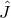, that is used in place of the volume change, *J*, in the definition of the strain energy potential. The internal energy integral, 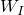, is augmented with the constraint that 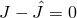, imposed by the use of a Lagrange multiplier, , and integrated over the volume:

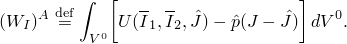Taking the variation of this definition,

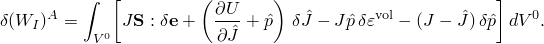Since 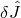 is an independent variation in this expression, the Lagrange multiplier is

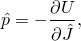and its variation is

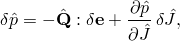where

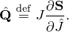These results allow us to write the augmented internal energy variation as

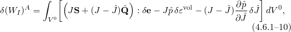which implies that continuity of the interpolation across elements is not required.

This augmented formulation can be used for any value of compressibility except fully incompressible behavior. For most element types  is interpolated independently in each element: Abaqus uses constant  in most first-order elements and linear variation of  with respect to position in second-order elements. The only element type where continuity of the  interpolation across elements is enforced is C3D4H: a first-order tetrahedron with a linear interpolation of  continuous across elements.

When the material is fully incompressible, *U* is a function of the first and second strain invariants--- and ---only, and we write the internal energy in the augmented form,

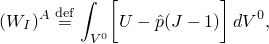where  is again a Lagrange multiplier introduced to impose the constraint 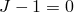 in such a way that the variation of 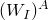 can be taken with respect to all kinematic variables, thus giving

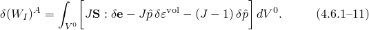The Lagrange multiplier  is interpolated in the same way as  is interpolated in the augmented formulation for almost incompressible behavior; that is,  is assumed to be constant in most first-order elements and to vary linearly with respect to position in second-order elements. The only exception is element type C3D4H, which is a first-order tetrahedron with a linear interpolation of  continuous across elements.
### Rate of change of the internal virtual work

The rate of change of the internal virtual work is required for use in the Newton method, which is generally used in Abaqus/Standard to solve the nonlinear equilibrium equations (after discretization by finite elements). It will also be used when we extend the elasticity model to viscoelastic behavior for small (linearized) vibrations about a predeformed state.

When the pure displacement formulation is used for the compressible case, the deviatoric stress components, , are defined by [Equation 4.6.1&#8211;8](04s06a123.md), from which we can show that

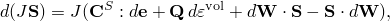where the "effective deviatoric elasticity" of the material, , is defined as

and the deviatoric stress rate-volumetric strain rate coupling term, , is

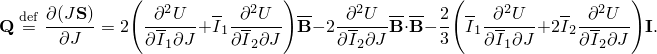

From [Equation 4.6.1&#8211;9](04s06a123.md) it can be shown that

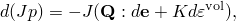where *K* is the effective bulk modulus of the material,

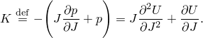Thus,

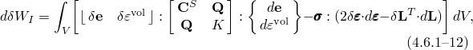since

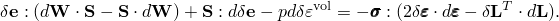

For the mixed formulation introduced for almost incompressible materials, the rate of change of the augmented variation of internal energy, [Equation 4.6.1&#8211;10](04s06a123.md), is

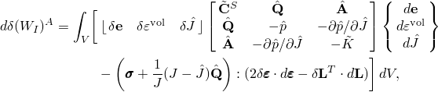where

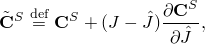

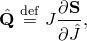

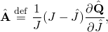and

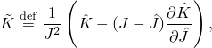in which

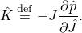

For the case of incompressible materials the rate of change of the augmented variation of internal energy is similarly obtained from [Equation 4.6.1&#8211;11](04s06a123.md) as

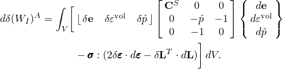
### Particular forms of the strain energy potential

Several particular forms of the strain energy potential are available in Abaqus. The incompressible or almost incompressible models make up:

the polynomial form and its particular cases---the reduced polynomial form, the neo-Hookean form, the Mooney-Rivlin form, and the Yeoh form;

the Ogden form;

the Arruda-Boyce form; and

the Van der Waals form.In addition, a hyperelastic model for highly compressible, elastic materials is offered.Polynomial form and particular cases

Given isotropy and additive decomposition of the deviatoric and volumetric strain energy contributions in the presence of incompressible or almost incompressible behavior, we can write the potential, in general, as

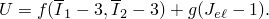Setting 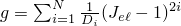 and expanding 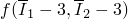 in a Taylor series, we arrive at

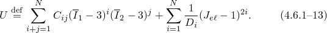This form is the polynomial representation of the strain energy in Abaqus. The parameter *N* can take values up to six; however, values of *N* greater than 2 are rarely used when both the first and second invariants are taken into account.  and  are temperature-dependent material parameters. The value of *N* and tables giving the  and  values as functions of temperature are specified by the user. The elastic volume strain, , follows from the total volume strain, *J*, and the thermal volume strain, 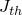, with the relation

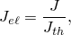and  follows from the linear thermal expansion, 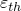, with

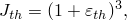where  follows from the temperature and the isotropic thermal expansion coefficient defined by the user.

The  values determine the compressibility of the material: if all the  are zero, the material is taken as fully incompressible. If 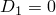, all  must be zero.

Regardless of the value of *N*, the initial shear modulus, 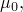 and the bulk modulus, 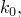 depend only on the polynomial coefficients of order :

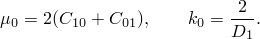

If , so that only the linear terms in the deviatoric strain energy are retained, the Mooney-Rivlin form is recovered:

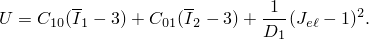The Mooney-Rivlin form can be viewed as an extension of the neo-Hookean form (discussed below) in that it adds a term that depends on the second invariant of the left Cauchy-Green tensor. In some cases this form will give a more accurate fit to the experimental data than the neo-Hookean form; in general, however, both models give similar accuracy since they use only linear functions of the invariants. These functions do not allow representation of the "upturn" at higher strain levels in the stress-strain curve.

Particular forms of the polynomial model can also be obtained by setting specific coefficients to zero. If all  with  are set to zero, the reduced polynomial form is obtained:

Following [Yeoh (1993)](07s01a01-References.md) the justification for reducing the general polynomial series expansion by omitting the dependence on the second invariant arises from the following observations. The sensitivity of the strain energy function to changes in the second invariant is generally much smaller than the sensitivity to changes in the first invariant. In addition, the -dependence is difficult to measure, so it might be preferable to neglect it rather than to calculate it based on potentially inaccurate measurements. Finally, it appears that omitting the dependence on the second invariant if data for only a particular mode of deformation are known might enhance the prediction for other deformation states. This conjecture is supported by investigating the so-called reduced stresses in the presence of almost incompressible behavior:

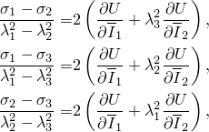where the , 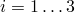 represent the principal Cauchy ("true") stresses. If the derivatives with respect to  are omitted and different stress states---uniaxial, biaxial, and planar---are considered, the reduced stresses have the same form regardless of the stress state.

Measurements of the -dependence of carbon-black reinforced rubber vulcanizates confirming these findings can be found in [Kawabata, Yamashita, et al. (1995)](07s01a01-References.md). The paper of [Kaliske and Rothert (1997)](07s01a01-References.md) also supports the notion that often the prediction of general deformation states based on a uniaxial measurement can be enhanced only by ignoring the -dependence.

In this context it is worth noting that the mathematical structure of the Arruda-Boyce model can be viewed as a fifth-order reduced polynomial, where the five coefficients 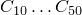 are implicit nonlinear functions of the two parameters  and  in the Arruda-Boyce form. However, the Arruda-Boyce model offers a physical interpretation of the parameters, which the general fifth-order reduced polynomial fails to provide.

The Yeoh form ([Yeoh, 1993](07s01a01-References.md)) can be viewed as a special case of the reduced polynomial with :

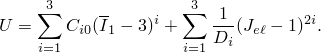Typically, if 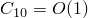, the second coefficient will be negative and one to two orders of magnitude smaller [i.e.,  is 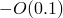 to 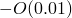], while the third coefficient 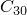 is again one to two orders of magnitude smaller but positive [i.e.,  is  to ]. These magnitudes will create the typical S-shape of the stress-strain behavior of rubber; at low strains  represents the initial shear modulus, which softens at moderate strains due to the effect of the negative second coefficient  and is followed by an upturn at large strains due to the positive third coefficient . Thus, the Yeoh model often provides an accurate fit over a large strain range.

If the reduced-polynomial strain-energy function is simplified further by setting , the neo-Hookean form is obtained:

This form is the simplest hyperelastic model and often serves as a prototype for elastomeric materials in the absence of accurate material data. It also has some theoretical relevance since the mathematical representation is analogous to that of an ideal gas: the neo-Hookean potential represents the Helmholtz free energy of a molecular network with Gaussian chain-length distribution (see [Treloar, 1975](07s01a01-References.md)).

The user can request that Abaqus calculate the  and  values from measurements of nominal stress and strain in simple experiments. The basis of this calculation is described in "Fitting of hyperelastic and hyperfoam constants,"  Section 4.6.2.Ogden form

The Ogden strain energy potential is expressed in terms of the principal stretches. In Abaqus the following formulation is used:

where

Hence, the first part of Ogden's strain energy function depends only on  and . Ogden's energy function cannot be written explicitly in terms of  and . It is, however, possible to obtain closed-form expressions for the derivatives of *U* with respect to  and .

The value of *N* and tables giving the  and  values as functions of temperature are specified by the user. If , , and , the Mooney-Rivlin model is obtained. If  and , Ogden's model degenerates to the neo-Hookean material model. In the Ogden form the initial shear modulus, , depends on all coefficients:

and the initial bulk modulus, , depends on  as before. The user can request that Abaqus calculate the  and  values from measurements of nominal stress and strain.Arruda-Boyce form

The hyperelastic Arruda-Boyce potential has the following form:

where

The deviatoric part of the strain energy density comes from [Arruda and Boyce (1993)](07s01a01-References.md). This model is also known as the eight-chain model, since it was developed starting out from a representative volume element where eight springs emanate from the center of a cube to its corners. The values of the coefficients  arise from a series expansion of the inverse Langevin function, which arises in the statistical treatment of non-Gaussian chains. The series expansion is truncated after the fifth term. The coefficient  is referred to as the locking stretch. Approximately at this stretch the slope of the stress-strain curve will rise significantly. The initial shear modulus, , is related to  with the expression

 A typical value of  is 7, for which .

The initial bulk modulus is obtained as . To the deviatoric part of the strain energy density we add a simplified representation of the volumetric strain energy density, which requires only one material parameter, so that all material parameters can be estimated easily even with limited knowledge of the material behavior. This volumetric representation has been used successfully by [Kaliske and Rothert (1997)](07s01a01-References.md) and provides sufficient accuracy for most engineering elastomeric materials.

The Arruda-Boyce potential depends on the first invariant only. The physical interpretation is that the eight chains are stretched equally under the action of a general deformation state. The first invariant, , directly represents this elongation.

When the Arruda-Boyce form is chosen, the user can specify the coefficients as functions of temperature; alternatively, Abaqus can perform a fit of the test data specified by the user to determine the coefficients.Van der Waals form

The hyperelastic Van der Waals potential, also known as the Kilian model, has the following form:

where

The name "Van der Waals" draws on the analogy in the thermodynamic interpretation of the equations of state for rubber and gas. While the neo-Hookean model can be compared with an ideal gas in that it starts out from a Gaussian network with no mutual interaction between the "quasi-particles" (Kilian, 1981), the Van der Waals strain energy potential is analogous to the equations of state of a real gas. This introduces two additional material parameters: the locking stretch, , and the global interaction parameter, *a*. (Similarly, the Van der Waals equation for a real gas introduces two parameters to account for excluded volume and modified exchange of momentum between the particles.)

The locking stretch, , accounts for finite extendability of the non-Gaussian chain network. In contrast to the Arruda-Boyce model the mathematical structure of the Van der Waals potential is such that the strain energy tends to infinity as the locking stretch, , is reached; more precisely, as . Thus, the Van der Waals potential cannot be used at stretches larger than the locking stretch.

The global interaction parameter, *a*, models the interaction between the chains; it is difficult to estimate. Kilian et al. (1986) point out that, given Mooney-Rivlin coefficients and a locking stretch , a suitable value for the global interaction parameter is

where  is the initial shear modulus at low strains and  is the second Mooney-Rivlin parameter. Given a positive initial shear modulus, , and locking stretch, , too large a positive interaction parameter, *a*, will lead to Drucker instability in the tensile range. Realistic values of the global interaction parameter, *a*, will contribute to the characteristic S-shape of tensile stress-strain curves of rubber in the middle strain range before the final upturn as the locking stretch is approached, without causing instability.

The parameter  represents a linear mixture parameter combining both invariants  and  into ; for , the Van der Waals potential will be dependent on the first invariant only. Admissible values for this parameter are .

When the Van der Waals potential is chosen, the user can specify the coefficients as functions of temperature; alternatively, the parameters can be fitted from user-defined test data. The data fitting procedure will not necessarily yield a value of  between zero and one. If during the curve fitting procedure the parameter  leaves the admissible range, the curve fitting procedure is aborted and restarted with a fixed value of . Alternatively, the curve fitting procedure can be used with a user-defined value of .Strain energy potential for highly compressible elastomers

While the previous forms are intended for incompressible or almost incompressible materials, the elastic foam energy function is designed for describing highly compressible elastomers ([Storkers, 1986](07s01a01-References.md)). This energy function has the form

where

The volumetric and the deviatoric contributions are coupled in this expression, which can be demonstrated clearly by writing the expression in the form

Series expansion of the last two terms in terms of  shows that the first-order terms vanish and that the coefficients of the second-order terms are equal to . Hence, a stable material is obtained if . For each term in the energy function, the coefficient  determines the degree of compressibility.  is related to the Poisson's ratio, , by the expressions

Thus, if  is the same for all terms, we have a single effective Poisson's ratio, . The value of *N* and tables giving the , , and  values as functions of temperature are specified by the user for the hyperfoam material model. The Poisson's ratio is valid for finite values of the logarithmic principal strains ;  in uniaxial tension. For  there is no Poisson's effect. The initial shear modulus, , again follows from

and the initial bulk modulus follows from

If Poisson's ratio is constant and known, Abaqus can calculate the  and  from measurements of nominal stress and stretch as before. If Poisson's ratio depends on the level of straining, Abaqus can also calculate the  from the nominal lateral strains.Subroutine UHYPER

Abaqus/Standard also allows other forms of strain energy potentials to be defined for isotropic materials via user subroutine UHYPER by programming the first and second derivatives of *U* with respect to , , and *J* in that subroutine.
### References

### References

"Hyperelastic behavior of rubberlike materials,"  Section 22.5.1 of the Abaqus Analysis User's Guide

"Hyperelastic behavior in elastomeric foams,"  Section 22.5.2 of the Abaqus Analysis User's Guide