# 4.7.1 Mullins effect

### 4.7.1 Mullins effect

**Products: **Abaqus/Standard  Abaqus/Explicit

The Mullins effect material model provided in Abaqus is intended for modeling the phenomenon of stress softening, commonly observed in filled rubber elastomers as a result of damage associated with straining. When an elastomeric test specimen is subjected to simple tension from its virgin state, unloaded, and then reloaded, the stress required on reloading is less than that on the initial loading for stretches up to the maximum stretch achieved during the initial loading. This stress-softening phenomenon is known as the Mullins effect ([Mullins, 1947](07s01a01-References.md)).
### Material behavior

The following sections describe the Mullins effect model in Abaqus in detail.Idealized material behavior

The Mullins effect is depicted qualitatively in [Figure 4.7.1&#8211;1](04s07a126.md).

Figure 4.7.1&#8211;1 Idealized response with Mullins effect.

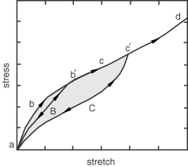This figure and the accompanying description are based on work by Ogden and Roxburgh ([Ogden and Roxburgh, 1999](07s01a01-References.md)), which forms the basis of the model implemented in Abaqus. Consider the primary loading path  of a previously unstressed material, with loading until an arbitrary point 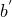. On unloading from , the path 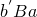 is followed. When the material is loaded again, the softened path is retraced as . If further loading is then applied, the path 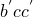 is followed, where  is a continuation of the primary loading path  (which is the path that would be followed if there was no unloading). If loading is now stopped at , the path  is followed on unloading and then retraced back to  on reloading. If no further loading beyond  is applied, the curve 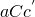 represents the subsequent material response, which is then elastic. For loading beyond , the primary path is again followed and the pattern described is repeated. This is an ideal representation of Mullins effect. More details regarding the actual behavior and how test data that display such behavior can be used to calibrate the Abaqus model for Mullins effect are discussed in "Mullins effect,"  Section 22.6.1 of the Abaqus Analysis User's Guide, and in "Analysis of a solid disc with Mullins effect and permanent set,"  Section 3.1.7 of the Abaqus Example Problems Guide.

The loading path   will henceforth be referred to as the "primary material response," and the constitutive behavior of the primary response can be defined using the standard energy potentials of the hyperelasticity models in Abaqus.

Stress softening is interpreted as being due to damage at the microscopic level. As the material is loaded, the damage occurs by the severing of bonds between filler particles and the rubber molecular chains. Different chain links break at different deformation levels, thereby leading to continuous damage with macroscopic deformation. An equivalent interpretation is that the energy required to cause the damage is not recoverable.Basic framework for the model

Hyperelastic materials are described in terms of a strain energy potential function, , which defines the strain energy stored in the material per unit reference volume (volume in the initial configuration). The quantity  may be the deformation gradient tensor or some other appropriate strain measure. To account for Mullins effect, Ogden and Roxburgh proposed a material description that is based on an energy function of the form , where  is a scalar variable. This scalar variable controls the material properties in the sense that it enables the material response to be governed by an energy function on unloading and subsequent submaximal reloading different from that on the primary (initial) loading path from a virgin state. Because of the interpretation and influence of , it is no longer appropriate to think of *U* as the stored elastic energy potential. In fact, part of the energy is stored as strain energy, while the rest is dissipated due to damage. The shaded area in [Figure 4.7.1&#8211;1](04s07a126.md) represents the energy dissipated by damage, while the unshaded portion represents the recoverable part of the strain energy. As pointed out by Ogden and Roxburgh, the inclusion of  results in the following additional equation, due to equilibrium:

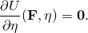 The above equation determines the evolution of  during the course of the deformation. During a deformation process, the variable  may be either active or inactive and may switch from inactive to active or vice versa such that it always varies continously. When it is not active, the material behaves as an elastic material with strain energy  , with  held constant. However, when  is active, it is determined implicitly in terms of  by the preceding equation. The material again behaves as an elastic material but with a different strain energy function 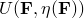. When the parameter  switches from being active to inactive and vice versa, the energy as well as the associated stresses remain continuous. When  is inactive, it is assumed to have a value of unity without any loss of generality.Primary hyperelastic behavior

In preparation for writing the constitutive equations for the Mullins effect, it is useful to separate the deviatoric and the volumetric parts of the total strain energy density of the primary material response as

In the above equation *U*, , and  are the total, deviatoric, and volumetric parts of the strain energy density, respectively. All the hyperelasticity models in Abaqus use strain energy potential functions that are already separated into deviatoric and volumetric parts. For example, the polynomial models use a strain energy potential of the form

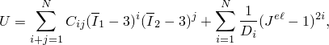where the symbols have the usual interpretations. The first term on the right represents the deviatoric part, and the second term represents the volumetric part of the elastic strain energy density function.Augmented strain energy density function

The Mullins effect is accounted for by using an augmented energy function of the form

where 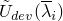 is the deviatoric part of the strain energy density of the primary material response, defined, for example, by the first term on the right-hand-side of the polynomial strain energy function given above; 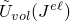 is the volumetric part of the strain energy density, defined, for example, by the second term on the right-hand-side of the polynomial strain energy function given above;   represent the deviatoric principal stretches; and  represents the elastic volume ratio. The function  is a continuous function of the damage variable  and is referred to as the "damage function." As the above expression suggests, the deviatoric part of the augmented energy function is related to the deviatoric part of the energy corresponding to the primary response by the scaling factor . The volumetric part of the augmented energy function is the same as that for the primary response. A consequence of the above form of the augmented energy function is that the Mullins effect is associated only with the deviatoric part of the deformation. When , it is required that , such that , and the augmented energy function reduces to the strain energy density function of the primary material response. As pointed out earlier, this situation corresponds to  being inactive and physically represents the energy of a material point that is on the primary curve. The value of  varies continuously as the deformation proceeds. The above form of the energy function is an extension of the form proposed by Ogden and Roxburgh to account for material compressibility.Stress computation

With the above modification to the energy function, the stresses, which are derived from the energy function in the usual manner, are given by

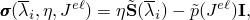where  is the deviatoric stress corresponding to the primary material response at the current deviatoric deformation level, , and  is the hydrostatic pressure of the primary material response at the current volumetric deformation level, . Thus, the deviatoric stress as a result of Mullins effect is obtained by simply scaling the deviatoric stress of the primary material response with the damage variable . For the above equation to predict stress softening, it is necessary that 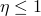 on the unloading (and submaximal reloading) path. It is also assumed that 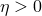, such that the deviatoric stresses remain positive until 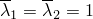 is reached. The pressure stress of the augmented response is the same as that of the primary response. The model predicts unloading-reloading along a single curve (that is different, in general, from the primary loading curve) from any given strain level, that passes through the origin of the stress-strain plot. It cannot capture permanent strains upon removal of load. The model also predicts that a purely volumetric deformation will not have any damage or Mullins effect associated with it.Damage function and damage variable

As a result of the assumed form of *U* and the evolution equation for , the function  satisfies

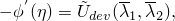which implicitly defines the damage parameter  in terms of the deformation as long as the function 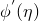 is a monotonic function of its argument. The value of  derived from the above equation will depend on the maximum values of the principal stretches 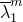 and 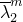 attained on a primary loading path and also on the specific forms of the functions  and  used. On the primary curve at any point where the unloading is initiated, , and the above equation specializes to

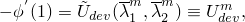which defines the notation . On the other hand, when the material is fully unloaded with  and  attains its minimum value, 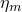:

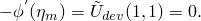From the preceding two equations it follows that both the function  and the quantity  depend on the point 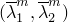 at which unloading is initiated.

When the material is in a fully unloaded state (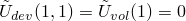 ), the augmented energy function has the residual value

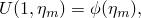which may be interpreted as the amount of energy dissipated by damage in the material. In a uniaxial test such as simple tension, this quantity denotes the area between the primary loading curve and the relevant unloading-reloading curve (the shaded area in [Figure 4.7.1&#8211;1](04s07a126.md) for deformation until ). Recalling that the function  depends, through 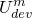, on the point at which unloading starts, the function  may be constructed, following Ogden and Roxburgh, using

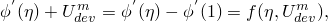where the function 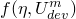 must satisfy 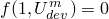 and 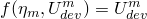. For a given , the above equation can be integrated to obtain  as

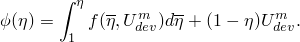On the primary path , and the above equation satisfies the requirement 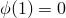. Abaqus uses the following specific choice for , which has the required properties

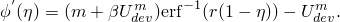 The quantities *r*, *m*, and  are material constants, and 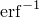 is the inverse of the error function, where the error function is defined as

The above choice of  reduces to the form proposed by Ogden and Roxburgh when .

On substituting the above form of   in the equation 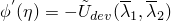, it can be shown that the damage variable  varies with the deformation according to

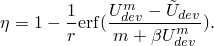The above equation defines the evolution of the damage variable  with deformation 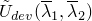, the maximum value of the deviatoric strain energy density experienced by the material point during its deformation history, , and material constants *r*, *m*, and . While the parameters *r* and  are dimensionless, the parameter *m* has the dimensions of energy.

When , corresponding to a point on the primary curve, . On the other hand,  attains its minimum value,  upon removal of deformation, when 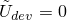. For all intermediate values of ,  varies monotonically between  and .
### Material tangent stiffness

The nonlinear solution procedure in Abaqus/Standard requires the material tangent stiffness or the material Jacobian. The derivation for the material tangent stiffness follows the procedure outlined in "Hyperelastic material behavior,"  Section 4.6.1. As a result of the Mullins effect, the expression for 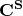 is modified. The remaining terms are identical. To determine the form of  , it may be noted that the deviatoric stress with Mullins effect can be expressed in terms of the deviatoric stress of the primary material response and the damage variable   as

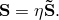From the above equation it follows that

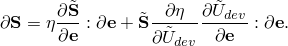After some manipulations, it can be shown that

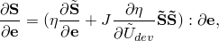 which determines .
### Damage dissipation

As pointed out in the earlier discussion, the quantity 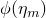 determines the energy dissipated due to damage. The equation for  can be integrated analytically through a change of variable of integration from  to 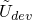 to yield the following expression for the function :

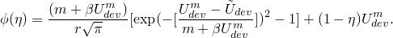The damage dissipation can be obtained from the above expression by substituting 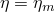 (with  obtained by setting  in the expression for ) and is given by

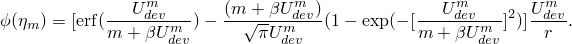The recoverable part of the strain energy, 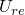, can then be obtained by subtracting the damage dissipation from the total augmented energy

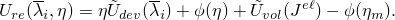 When the material is fully or almost incompressible, we may assume that 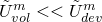, and the total energy corresponding to the maximum deformation along the primary curve is given by 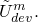 The discussion below pertains to the above limit. From the expression for the damage dissipation, , it may be noted that when , the ratio of dissipation to  is a constant that depends only on the material parameters *r* and . In particular, this ratio is independent of , suggesting that the ratio of the dissipation to the total energy is a constant that is independent of the level of deformation. For nonzero *m* the above is true only when , which correponds to relatively large levels of deformation. In that case when , the energy dissipation is zero. Thus, the value of *m* (both zero and nonzero) may be thought of as providing a scale of the strain energy level for the total deformation beyond which dissipation takes place. In particular, when , dissipation occurs at low strain levels.

The behavior described above is depicted in [Figure 4.7.1&#8211;2](04s07a126.md), which shows a plot of the normalized dissipation, , versus the ratio , for nonzero *m* and for fixed values of the parameters  and . For small values of the ratio  the dissipation tends to zero, while for larger values of the ratio, the normalized dissipation approaches a constant asymptotic value.

Figure 4.7.1&#8211;2 Normalized dissipation versus deformation.

### Reference

### Reference

"Mullins effect,"  Section 22.6.1 of the Abaqus Analysis User's Guide