# 4.8.1 Viscoelasticity

### 4.8.1 Viscoelasticity

**Products: **Abaqus/Standard  Abaqus/Explicit

The basic hereditary integral formulation for linear isotropic viscoelasticity is

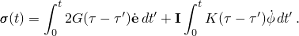Here  and  are the mechanical deviatoric and volumetric strains; *K* is the bulk modulus and *G* is the shear modulus, which are functions of the reduced time ; and 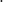 denotes differentiation with respect to 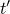.

The reduced time is related to the actual time through the integral differential equation

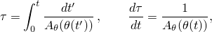where  is the temperature and 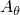 is the shift function. (Hence, if 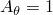, 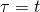.) A commonly used shift function is the Williams-Landel-Ferry (WLF) equation, which has the following form:

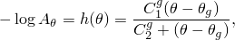where 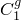 and 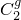 are constants and 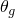 is the "glass" transition temperature. This is the temperature at which, in principle, the behavior of the material changes from glassy to rubbery. If 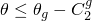, deformation changes will be elastic.  and  were once thought to be "universal" constants whose values were obtained at , but these constants have been shown to vary slightly from polymer to polymer.

Abaqus allows the WLF equation to be used with any convenient temperature, other than the glass transition temperature, as the reference temperature. The form of the equation remains the same, but the constants are different. Namely,

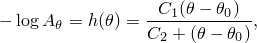where  is the reference temperature at which the relaxation data are given, and  and  are the calibration constants at the reference temperature. The "universal" constants  and  are related to  and  as follows:

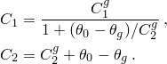Other forms of 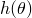 are also used, such as a power series in 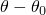. Abaqus allows a general definition of the shift function with user subroutine UTRS.

The relaxation functions 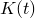 and 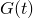 can be defined individually in terms of a series of exponentials known as the Prony series:

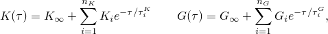where 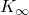 and 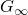 represent the long-term bulk and shear moduli. In general, the relaxation times 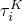 and 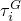 need not equal each other; however, Abaqus assumes that . On the other hand, the number of terms in bulk and shear, 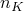 and 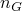, need not equal each other. In fact, in many practical cases it can be assumed that 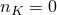. Hence, we now concentrate on the deviatoric behavior. The equations for the volumetric terms can be derived in an analogous way.

The deviatoric integral equation is

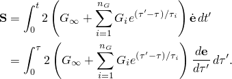We rewrite this equation in the form

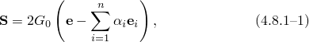where 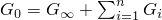 is the instantaneous shear modulus, 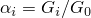 is the relative modulus of term *i*, and

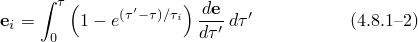is the viscous (creep) strain in each term of the series. For finite element analysis this equation must be integrated over a finite increment of time. To perform this integration, we will assume that during the increment  varies linearly with ; hence, 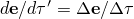. To use this relation, we break up [Equation 4.8.1&#8211;2](04s08a128.md) into two parts:

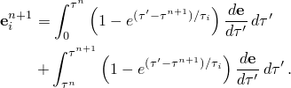Now observe that

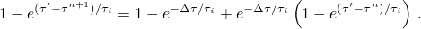Use of this expression and the approximation for 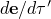 during the increment yields

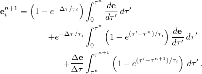The first and last integrals in this expression are readily evaluated, whereas from [Equation 4.8.1&#8211;2](04s08a128.md) follows that the second integral represents the viscous strain in the  term at the beginning of the increment. Hence, the change in the  viscous strain is

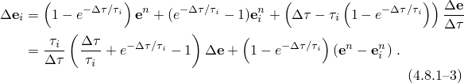If 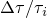 approaches zero, this expression can be approximated by

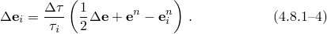The last form is used in the computations if 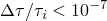.

Hence, in an increment, [Equation 4.8.1&#8211;3](04s08a128.md) or [Equation 4.8.1&#8211;4](04s08a128.md) is used to calculate the new value of the viscous strains. [Equation 4.8.1&#8211;1](04s08a128.md) is then used subsequently to obtain the new value of the stresses.

The tangent modulus is readily derived from these equations by differentiating the deviatoric stress increment, which is

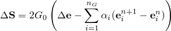with respect to the deviatoric strain increment . Since the equations are linear, the modulus depends only on the reduced time step:

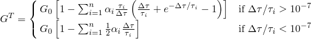

Finally, one needs a relation between the reduced time increment, 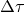, and the actual time increment, . To do this, we observe that  varies very nonlinearly with temperature; hence, any direct approximation of  is likely to lead to large errors. On the other hand,  will generally be a smoothly varying function of temperature that is well approximated by a linear function of temperature over an increment. If we further assume that incrementally the temperature  is a linear function of time *t*, one finds the relation

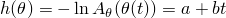or

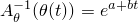with

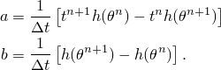This yields the relation

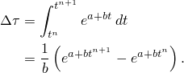This expression can also be written as

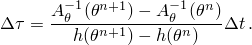
### Reduced states of stress

So far, we have discussed full triaxial stress states. If the stress state is reduced (i.e., plane stress or uniaxial stress), the equations derived here cannot be used directly because only the total stress state is reduced, not the individual terms in the series. Therefore, we use the following procedure.

For plane stress let the third component be the zero stress component. At the beginning of the increment we presumably know the volumetric elastic strain 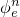, the volumetric viscous strain 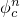, and the volumetric viscous strains  associated with the Prony series. The total volumetric strain can be obtained by adding together the elastic volumetric strain and the volumetric viscous strain

The deviatoric strain in the 3-direction follows from the relation , which yields:

The out-of-plane deviatoric stress at the end of the increment is

Substituting [Equation 4.8.1&#8211;3](04s08a128.md) for , letting , and collecting terms gives

The hydrostatic stress is derived similarly as

We can write these equations in the form

In the third direction the deviatoric stress minus the hydrostatic pressure is zero; hence,

Since , it follows that

from which  can be solved. One can then also calculate  and , and with [Equation 4.8.1&#8211;3](04s08a128.md) or [Equation 4.8.1&#8211;4](04s08a128.md) one can update the deviatoric viscous strains . The volumetric strains  are obtained with a relation similar to [Equation 4.8.1&#8211;3](04s08a128.md).

For uniaxial stress states a similar procedure is used. As before,  follows from [Equation 4.8.1&#8211;5](04s08a128.md) and  and  follow from :

[Equation 4.8.1&#8211;6](04s08a128.md) and [Equation 4.8.1&#8211;7](04s08a128.md) can be used to calculate  and , which again leads to [Equation 4.8.1&#8211;8](04s08a128.md). Applying [Equation 4.8.1&#8211;9](04s08a128.md) for 

After this, one can follow the same procedure as for plane stress.
### Automatic time stepping procedure

To create an automatic time stepping procedure in Abaqus/Standard, we want to compare viscous strain rates at the beginning and the end of the increment. The strain rates in the individual terms at the beginning of the increment can be obtained directly by taking the limit of the incremental strain:

A similar expression can be derived for the strain rate at the end of the increment:

If we use these expressions to calculate a difference in estimated total viscous strain increment, one finds

This expression is readily evaluated. A similar expression can be calculated for volumetric strain , and from these two quantities a suitable scalar measure can be constructed; for example,

Comparison with the user-specified strain increment tolerance allows construction of an automatic time stepping scheme.
### Reference

### Reference

"Time domain viscoelasticity,"  Section 22.7.1 of the Abaqus Analysis User's Guide