# 4.8.2 Finite-strain viscoelasticity

### 4.8.2 Finite-strain viscoelasticity

**Products: **Abaqus/Standard  Abaqus/Explicit
### Integral formulation

The finite-strain viscoelasticity theory implemented in Abaqus is a time domain generalization of either the hyperelastic or hyperfoam constitutive models. It is assumed that the instantaneous response of the material follows from the hyperelastic constitutive equations:

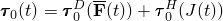for a compressible material and

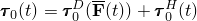for an incompressible material. In the above, 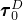 and 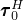 are, respectively, the deviatoric and the hydrostatic parts of the instantaneous Kirchhoff stress 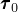.  is the "distortion gradient" related to the deformation gradient  by

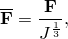where

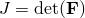is the volume change.

Using integration by parts and a variable transformation, the basic hereditary integral formulation for linear isotropic viscoelasticity can be written in the form

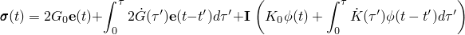or entirely in terms of stress quantities,

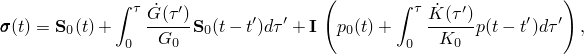where  is the reduced time, 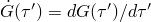, and 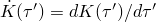.  and  are the instantaneous small-strain shear and bulk moduli, and  and  are the time-dependent small-strain shear and bulk relaxation moduli. Recall that the reduced time represents a shift in time with temperature and is related to the actual time through the differential equation

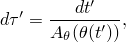where  is the temperature and  is the shift function.

Using the volumetric/deviatoric-split hereditary integral in the reference configuration for large strain (hyperelastic) materials, and then using a standard push-forward operator (see [Simo, 1987](07s01a01-References.md)), one obtains the following set of equations in the current configuration:

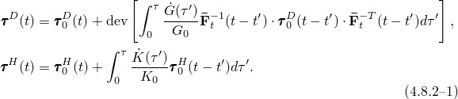where 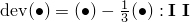 and 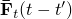 is the distortional deformation gradient of the state at 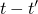 relative to the state at *t* . A transformation is performed on the stress relating the state at time  to the state at time *t*.
### Implementation

As in small-strain viscoelasticity, we represent the relaxation moduli in terms of the Prony series

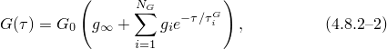

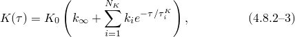where  and 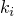 are the relative moduli of terms *i*. Note that 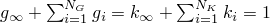. Abaqus assumes that the relaxation times 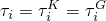 are the same so that from here on, we will sum on *N* terms for both bulk and shear behavior. In reality, the number of nonzero terms in bulk and shear, 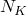 and 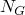, need not be equal, unless the instantaneous behavior is based on the hyperfoam model. In the latter case, the two deformation modes are closely related and are then assumed to relax equally and simultaneously.

Substituting [Equation 4.8.2&#8211;2](04s08a129.md) and [Equation 4.8.2&#8211;3](04s08a129.md) in [Equation 4.8.2&#8211;1](04s08a129.md), we obtain

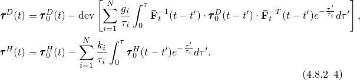

Next, we introduce the internal stresses, associated with each term of the series

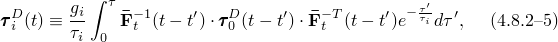

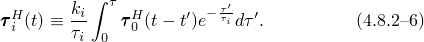These stresses are stored at each material point and are integrated forward in time. We will assume that the solution is known at time *t*, and we need to construct the solution at time .
### Integration of the hydrostatic stress

The internal hydrostatic stresses 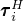 at time  follow from

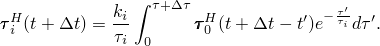With  and , it follows that

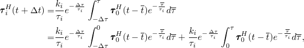which yields with [Equation 4.8.2&#8211;6](04s08a129.md)

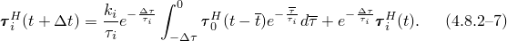

To integrate the first integral in [Equation 4.8.2&#8211;7](04s08a129.md), we assume that 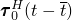 varies linearly with the reduced time 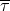 over the increment

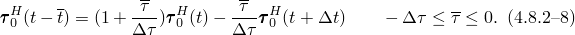Substituting into [Equation 4.8.2&#8211;7](04s08a129.md) yields

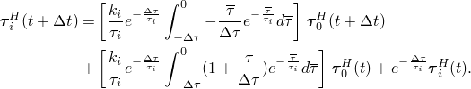

The integrals are readily evaluated, providing the solution at the end of the increment

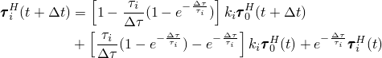or, in a slightly different form

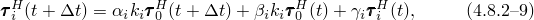with

Observe that for 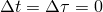, 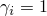 and 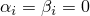. For 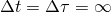, 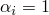 and 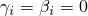.
### Integration of the deviatoric stress

The internal deviatoric stresses 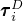 at time  follow from

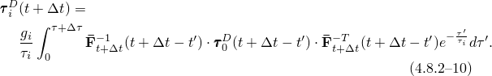

Observe that

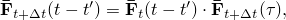and the inverse of this is

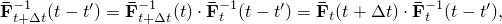which---when substituted into [Equation 4.8.2&#8211;10](04s08a129.md), with 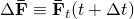 and 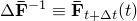---gives

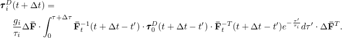With 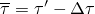 and , it follows:

Now introduce the variable

Note that

and

Then we can also introduce

Substitution of [Equation 4.8.2&#8211;5](04s08a129.md), [Equation 4.8.2&#8211;12](04s08a129.md), and [Equation 4.8.2&#8211;15](04s08a129.md) into [Equation 4.8.2&#8211;11](04s08a129.md) yields

To integrate the first integral in [Equation 4.8.2&#8211;16](04s08a129.md), we assume that  varies linearly with the reduced time  over the increment:

which with [Equation 4.8.2&#8211;14](04s08a129.md) becomes

[Equation 4.8.2&#8211;16](04s08a129.md) and [Equation 4.8.2&#8211;17](04s08a129.md) for the deviatoric stress have exactly the same form as [Equation 4.8.2&#8211;7](04s08a129.md) and [Equation 4.8.2&#8211;8](04s08a129.md) for the hydrostatic stress. Hence, after integration we obtain

with

[Equation 4.8.2&#8211;13](04s08a129.md), [Equation 4.8.2&#8211;15](04s08a129.md), and [Equation 4.8.2&#8211;18](04s08a129.md), thus, provide a straightforward integration scheme.

The total stress at the end of the increment becomes

which with [Equation 4.8.2&#8211;9](04s08a129.md) and [Equation 4.8.2&#8211;18](04s08a129.md) can also be written as

### Rate equation

To solve the system of nonlinear equations generated by the constitutive equations, we need to generate the corotational constitutive rate equations. From [Equation 4.8.2&#8211;20](04s08a129.md) it follows

where  is the corotational (Jaumann) stress rate. The rate form of the above equation is used to compute the Jacobian.
### Cauchy versus Kirchhoff stress

All equations have been worked out in terms of the Kirchhoff stress. However, the implementation in Abaqus uses the Cauchy stress. To transform to Cauchy stress, we use the relations

With , this allows us to write [Equation 4.8.2&#8211;9](04s08a129.md), [Equation 4.8.2&#8211;13](04s08a129.md), [Equation 4.8.2&#8211;15](04s08a129.md), [Equation 4.8.2&#8211;18](04s08a129.md), and [Equation 4.8.2&#8211;19](04s08a129.md) in the following form:

The virtual work and rate of virtual work equations are written with respect to the current volume. Therefore, the corotational stress rates are rates of Kirchhoff stress mapped into the current configuration and transformed in the same way as the stresses themselves.

This set of equations---combined with the expressions for , , and ---describe the full implementation of the hyper-viscoelasticity model in a displacement formulation.

The rate equations can be written in a form similar to "Hyperelastic material behavior,"  Section 4.6.1. Introduce

and

where  and  are the instantaneous moduli, corresponding to  and  of "Hyperelastic material behavior,"  Section 4.6.1. Thus, all rate equations can be obtained by substitution of  by  and  by .
### Reference

### Reference

"Time domain viscoelasticity,"  Section 22.7.1 of the Abaqus Analysis User's Guide