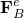
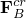
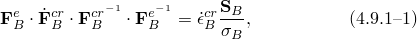
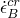
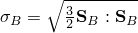

# 4.9.1 Hysteresis

### 4.9.1 Hysteresis

**Product: **Abaqus/Standard

The hysteretic, elastomeric material model provided in Abaqus/Standard ([Bergstrm and Boyce, 1997](07s01a01-References.md)) is intended for modeling large-strain, rate-dependent behavior of elastomers. A primary aspect of such behavior is a pronounced hysteresis in stress-strain curves under cyclic loading. The material model is intended to model response under many load cycles. It does not model the "Mullins effect," which refers to the significant softening that is observed in the material response of elastomers in the first few load cycles.

The model decomposes the mechanical response of elastomers into an equilibrium network, A, corresponding to the state that is approached in long-time stress relaxation tests, and a time-dependent network, B, that captures the nonlinear rate-dependent deviation from the equilibrium state. The time dependence of the second network is assumed to be governed by the reptational motion of molecules having the ability to change conformation significantly, thereby relaxing the overall stress state.

The total stress is assumed to be the sum of the stresses in the two networks. The deformation gradient, , is assumed to act on both networks and is decomposed into elastic and inelastic parts in network B according to the multiplicative decomposition

The material model is defined completely by specifying an isotropic, hyperelastic material model that characterizes the response of network A; a stress-scaling factor, *S*, that defines the ratio of the stress carried by network B to that carried by network A under identical elastic stretching; a positive exponent, *m*, generally greater than 1, characterizing the effective stress dependence of the effective creep strain rate in network B; an exponent *C*, restricted to lie in , characterizing the creep strain dependence of the effective creep strain rate in network B; a scaling constant *A* in the expression for the effective creep strain rate to maintain dimensional consistency in the equation; and a parameter *E* that helps regularize the creep strain rate in the vicinity of the undeformed state.

The mechanical response of network A under the imposed deformation gradient  is governed by standard isotropic hyperelasticity. The stress response of network B is dependent only on  and is governed by the same hyperelastic potential as network A, up to the stress-scaling factor, *S*. Given , the determination of  requires a constitutive specification for , which is provided through an evolution equation for  given by

where  is the effective creep strain rate in network B,  is the Cauchy stress deviator tensor in network B, and  is the effective stress in network B.  is governed by the expression

where  is the nominal creep strain in network B. , the chain stretch in network B, is defined as

where . The correlation of the microscopic chain stretch to the principal macroscopic stretch state through the above formula comes from [Arruda and Boyce (1993)](07s01a01-References.md).

The numerical implementation of the material response of network A is identical to that for hyperelastic models in Abaqus/Standard, documented in "Hyperelastic material behavior,"  Section 4.6.1.

The implementation of the mechanics of network B is based on an implicit exponential approximation to the flow rule, [Equation 4.9.1&#8211;1](04s09a131.md), which preserves the property of inelastic incompressibility of the flow rule exactly ([Weber and Anand, 1990](07s01a01-References.md)). The choice of the exponential integrator along with the isotropy of the stress-response function result in the principal directions of the right elastic stretch tensor being equal to those of the right stretch tensor for a "predictor" to the elastic deformation gradient. This predictor is a known quantity in the discrete integration that is dependent only on the deformation gradient at the end of the increment and the plastic deformation gradient at the end of the previous increment. The complete state at the end of the increment can be obtained from the calculation of the elastic stretches and the effective creep strain increment. All other quantities required for the state update are known. This material update formula is linearized exactly in closed form and leads to an unsymmetric tangent stiffness matrix caused by the nominal creep strain dependence of the constitutive equation for the effective creep strain increment.
### Reference

### Reference

"Hysteresis in elastomers,"  Section 22.8.1 of the Abaqus Analysis User's Guide