# 5.1.1 Small-sliding interaction between bodies

### 5.1.1 Small-sliding interaction between bodies

**Product: **Abaqus/Standard

In Abaqus/Standard a capability is included to model small-sliding contact of two bodies with respect to each other. With this formulation the contacting surfaces can undergo only relatively small sliding relative to each other, but arbitrary rotation of the bodies is permitted. Small-sliding contact is computationally less expensive than finite-sliding contact, which is described in "Finite-sliding interaction between deformable bodies,"  Section 5.1.2.

The small-sliding capability can be used to model the interaction between two deformable bodies or between a deformable body and a rigid body in two and three dimensions. With this approach one surface definition provides the "master" surface and the other surface definition provides the "slave" surface. A kinematic constraint that the slave surface nodes do not penetrate the master surface is then enforced. The contacting surfaces need not have matching meshes; however, the best accuracy is obtained when the meshes are initially matching. For initially nonmatching meshes, accuracy can be improved by judiciously specifying initial adjustments to ensure that all slave nodes that should initially be in contact are located on the master surface.

The small-sliding contact capability is implemented by means of four internal contact elements designed to handle the following kinematic constraints:

two-dimensional contact between a slave node and a deformable master surface,

two-dimensional contact between a slave node and a rigid master surface,

three-dimensional contact between a slave node and a deformable master surface, and

three-dimensional contact between a slave node and a rigid master surface.These elements are not accessible to the user, and Abaqus will automatically cover a slave surface with the appropriate element type, based on the nature of the corresponding master surface.
### Identification of tangent plane based on nearest neighbor interaction

Although four internal element types are used to model the various types of small-sliding contact interactions supported by Abaqus/Standard, all four formulations are based on the notion that a given slave node always interacts with the same subset of master surface nodes. This nodal subset is initially determined by the Abaqus analysis input file processor from the undeformed model definition, thus avoiding the need to "track" the slave node during the course of the analysis. This set of nearest-neighbor nodes to the point on the master surface closest to the slave node is used to parametrize a contact plane with which the slave node will interact during the analysis. This concept is illustrated next for the case of a two-dimensional slave node interacting with a first-order master surface. This formulation can be generalized to second order as well as three-dimensional situations, but this generalization will not be discussed here.

Consider the contact interaction of three nodes---102, 103, and 104---on the slave surface with a master surface made up of first-order element faces described by nodes 1, 2, and 3, as shown in [Figure 5.1.1&#8211;1](05s01a132.md).

Figure 5.1.1&#8211;1 Slave nodes interacting with a two-dimensional master surface.

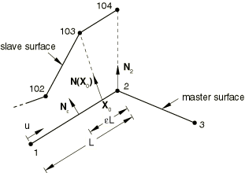

Before initiating the search for the nodal subset of the master surface nodes that will interact with each node on the slave surface, unit normal vectors are computed for all the nodes on the master surface. For example, the unit normal vector  is computed by averaging the unit normal vectors of segments 1&#8211;2 and 2&#8211;3. The user can also specify the normal vector for each node on the master surface. Additional unit normal vectors are computed for each segment a distance  from each end of the segment, where  is a fraction and  is the length of the segment; e.g., . Currently the value of  is set to 0.5, and the user cannot change this value. The unit normals computed are then used to define a smooth varying normal vector, , at any point, , on the master surface.

An "anchor" point on the master surface, , is computed for each slave node so that the vector formed by the slave node and  coincides with the normal vector . Suppose that a search for the anchor point, , of slave node 103 reveals that  is on segment 1&#8211;2. Then, we find that

where  and  are the coordinates of nodes 1 and 2, respectively, and  is calculated so that  coincides with . Moreover, the contact plane tangent direction, , at  is chosen so that it is perpendicular to ; i.e.,

where  is a (constant) rotation matrix.

The small-sliding contact constraint is achieved by requiring that slave node 103 interact with the tangent plane whose current anchor point coordinates are, at any time, given by

where  and , and whose current tangent direction is given by

where  and . Since the above expressions for the point  and the vector  resulted from barycentric (affine) combinations of the points  and ---that is,

the contact plane will be mapped properly under affine transformations such as translation, scaling (stretching), and rotation.

Next, suppose that a search for the anchor point of slave node 104 reveals that the anchor point is coincident to the master node 2. In this case the anchor point is chosen to be , or in terms of the coordinates of the three master nodes 1, 2, and 3,

where , , and . The contact tangent direction at  is simply

However, we want to express  in terms of the coordinates of the three nodes 1, 2, and 3 to be able to track the evolution of the tangent plane. To this end, we solve for the  from the equation

subject to the barycentric constraint

The barycentric constraint ensures that the resulting expression for the contact plane tangent direction behaves properly under affine transformations such as translations and rotations.
### Contact formulation as a constrained variational principle

At each slave node that can come into contact with a master surface we construct a measure of overclosure  (penetration of the node into the master surface) and measures of relative slip . These kinematic measures are then used, together with appropriate Lagrange multiplier techniques, to introduce surface interaction theories for contact and friction, as described in "Contact pressure definition,"  Section 5.2.1, and "Coulomb friction,"  Section 5.2.3.

In two dimensions the overclosure  along the unit contact normal  between a slave point  and a master line , where  parametrizes the line, is determined by finding the vector  from the slave node to the line that is perpendicular to the tangent vector  at . Mathematically, we express the required condition as

when

Similarly, in three dimensions the overclosure  along the unit contact normal  between a slave point  and a master plane , where  parametrize the plane, is determined by finding the vector  from the slave node to the plane that is perpendicular to the tangent vectors  and  at . Mathematically, we express the required condition as

when

If at a given slave node , there is no contact between the surfaces at that node, and no further surface interaction calculations are needed. If , the surfaces are in contact. The contact constraint  is enforced by introducing a Lagrange multiplier, , whose value provides the contact pressure at the point. To enforce the contact constraint, we need the first variation ; and for the Newton iterations, we need the second variation, . Likewise, if frictional forces are to be transmitted across the contacting surfaces, the first variations of relative slip, , and the second variations, , are needed in the formulation. The derivation of some of these quantities is described next for all four small-sliding contact formulations.
### Formulation for two-dimensional small-sliding deformable contact

For the case of two-dimensional small-sliding deformable contact, a point on the contact line associated with a slave node  is represented by the vector

where, as described previously, the line's anchor point------and its tangent vector------are functions of the current master node coordinates, . Hence, the vector  is, in general, a nonunit vector. Linearization of [Equation 5.1.1&#8211;1](05s01a132.md) yields

where , , and .

Taking the dot product of [Equation 5.1.1&#8211;4](05s01a132.md) with  results in the following expression for :

Likewise, taking the dot product of [Equation 5.1.1&#8211;4](05s01a132.md) with the normalized tangent vector  and setting  results in the following expression for the variation in slip:

Suitable expressions for  and  can be derived by linearizing [Equation 5.1.1&#8211;4](05s01a132.md) and applying the techniques highlighted above. Since the resulting expressions do not provide additional insight into the understanding of this capability, they will not be presented here.
### Formulation for three-dimensional small-sliding deformable contact

The three-dimensional small-sliding deformable contact formulation is a straightforward generalization of the previous two-dimensional formulation. A point on the contact plane associated with a slave node  is represented by the vector

where the plane's anchor point------and its two tangent vectors--- and ---are functions of the current master node coordinates . Linearization of [Equation 5.1.1&#8211;2](05s01a132.md) yields

where  and .

Taking the dot product of [Equation 5.1.1&#8211;7](05s01a132.md) with  results in the following expression for :

Likewise, taking the dot product of [Equation 5.1.1&#8211;7](05s01a132.md) with  and setting  results in the following expression for the variation of the first slip component:

Similarly, taking the dot product of [Equation 5.1.1&#8211;7](05s01a132.md) with  and setting  results in the following expression for the variation of the second slip component:

### Formulation for two-dimensional small-sliding rigid contact

The formulation for two-dimensional small-sliding rigid contact follows from its deformable counterpart by exploiting the fact that the evolution of the contact plane is fully determined by the motion of the rigid body's reference node. [Figure 5.1.1&#8211;2](05s01a132.md) shows how the undeformed coordinates  of the contact plane's anchor point are related vectorially to the undeformed coordinates of the rigid reference node, , and the relative position vector .We can express this relationship as

Figure 5.1.1&#8211;2 Rigid body reference geometry.

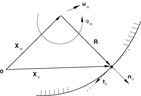

Suppose the rigid reference node undergoes a motion described by the displacement vector  and the rotation vector , then the current coordinates of the contact plane's anchor point are given by

where  is the orthogonal matrix that produces the rotation  (see "Rotation variables,"  Section 1.3.1) and  is the current position vector from the rigid reference node to the anchor point. The rotation matrix is also used to obtain the contact plane's current tangent and current normal as follows:

where  and  are the initial contact tangent and normal at , respectively, as shown in [Figure 5.1.1&#8211;2](05s01a132.md). By definition, a rigid surface cannot stretch; therefore, a point on the rigid contact line associated with a slave node  is represented by the vector

where---unlike the vector  in [Equation 5.1.1&#8211;3](05s01a132.md)---the tangent  is always a unit vector.

Linearization of [Equation 5.1.1&#8211;11](05s01a132.md) and [Equation 5.1.1&#8211;12](05s01a132.md) results in the following expressions for the first variations of the anchor coordinates and the contact plane's tangent:

Replacing  by  in [Equation 5.1.1&#8211;5](05s01a132.md), noting that , and substituting for  and  from [Equation 5.1.1&#8211;13](05s01a132.md) results in the following expression for :

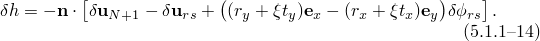Similar manipulation of [Equation 5.1.1&#8211;6](05s01a132.md) yields the following expression for 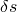:

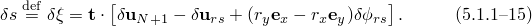
### Formulation for three-dimensional small-sliding rigid contact

The three-dimensional small-sliding rigid contact formulation can also be derived from its deformable counterpart by generalizing some of the expressions that were introduced in the previous section. In particular, in this formulation the rigid reference node can undergo an arbitrary finite rotation described by the rotation vector 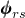. Consequently, [Equation 5.1.1&#8211;13](05s01a132.md) for the variations of the anchor point coordinates and the contact plane's tangent generalize to

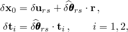where 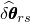 is the skew-symmetric matrix associated with the linearized rotation 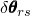, as explained in "Rotation variables,"  Section 1.3.1.

Replacing 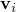 by  in [Equation 5.1.1&#8211;8](05s01a132.md) through [Equation 5.1.1&#8211;10](05s01a132.md) and substituting for  and 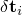 from above results in the following expressions for , 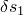, and 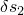:

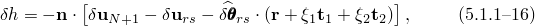

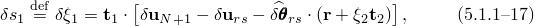

### Reference

### Reference

"Contact formulations in Abaqus/Standard,"  Section 38.1.1 of the Abaqus Analysis User's Guide