# 5.1.3 Finite-sliding interaction between a deformable and a rigid body

### 5.1.3 Finite-sliding interaction between a deformable and a rigid body

**Product: **Abaqus/Standard

Abaqus/Standard provides two formulations for modeling the interaction between a deformable body and an arbitrarily shaped rigid body that may move during the history being modeled. The first is a small-sliding formulation in which the contacting surfaces can only undergo relatively small sliding relative to each other, but arbitrary rotation of the surfaces is permitted. This formulation is discussed in "Small-sliding interaction between bodies,"  Section 5.1.1. The second is a finite-sliding formulation where separation and sliding of finite amplitude and arbitrary rotation of the surfaces may arise. This formulation is discussed in this section.

The finite-sliding rigid contact capability is implemented by means of a family of contact elements that Abaqus automatically generates based on the data associated with the user-specified contact pairs. At each integration point these elements construct a measure of overclosure (penetration of the point on the surface of the deforming body into the rigid surface) and measures of relative shear sliding. These kinematic measures are then used, together with appropriate Lagrange multiplier techniques, to introduce surface interaction theories (contact and friction). A library of interaction theories is provided in Abaqus---these may be thought of as a library of "surface constitutive models." In this section we discuss only the kinematics of the interacting surfaces. The surface constitutive models are described in Chapter 4, "Mechanical Constitutive Theories."

Let  be a point on the deforming mesh, with current coordinates . Let  be the "rigid body reference node"---the node that defines the position of the rigid body---with current coordinates . Let  be the closest point on the surface of the rigid body to  at which the normal to the surface of the rigid body, , passes through . Define  as the vector from  to . The geometry described by these quantities is shown in [Figure 5.1.3&#8211;1](05s01a134.md).

Figure 5.1.3&#8211;1 Rigid surface interface geometry.

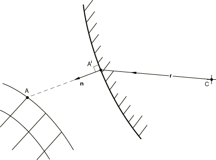

Let  be the distance from  to  along : the "overclosure" of the surfaces. From the definitions introduced above,

Then if  there is no contact between the surfaces at , and no further surface interaction calculations need be done at this point. Here  is the clearance below which contact occurs. For a "hard" surface , but Abaqus/Standard also allows a "softened" surface to be introduced in which  may be nonzero (although  is usually very small compared to other dimensions). If  the surfaces are in contact. To enforce the contact constraint we will need the first variation of , , and its second variation, . These quantities are now derived.

Let ,  be locally orthogonal, distance measuring surface coordinates on the surface at . The  measure distance along the tangents  to the surface at : these tangents are constructed according to the standard Abaqus convention for such tangents to a surface in space. As the point  and the rigid body move, the projected point  will move along. The movement consists of two parts: movement due to motion of the rigid body and motion relative to the body

where  is the "slip" of point . The normal  will also change due to rotation of the rigid surface and due to slip along the surface

The linearized form of the contact equation, thus, becomes

For "hard" contact  exactly, and for soft contact we will assume  as well. The linearized kinematic equation, thus, becomes

This equation can be split into normal and tangential components, which yields the contact equation,

and the slip equations,

To obtain the second variation of , it will again be assumed that . In addition, it will be assumed that , which is accurate for relatively "hard" contact. It then directly follows that

and from the linearized kinematic equation follows

where we have used . The first term corresponds to a second-order variation on the vector  for rigid body rotations around point  and is given by (see "Rotation variables,"  Section 1.3.1):

The second term in the expression for the second variation is obtained with the previously used expression for the "slip" along the surface:

The third term follows from the expression for the rigid body rotation:

Finally, the fourth term is obtained by differentiation along the surface coordinates:

where

is the surface curvature matrix.

Substitution of the last four expressions in the expression for the second variation yields

As in the first variation, one can split the second variation into a normal and tangential components. For the normal component one finds

and for the tangential components,

The expression involving  can be simplified somewhat. Observe that ; hence,

Similarly

If the local surface coordinate system is created by projection of a tangential Cartesian &#8211; system onto the surface, it is readily established that the last terms vanish. Hence, we will assume that the last term in the second variation is zero. The final result is obtained by substitution of the expressions for the first-order variation of the slip in the expressions for the second variation. After some reordering and with  this furnishes

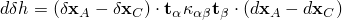

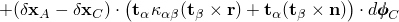

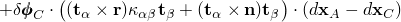

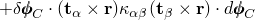

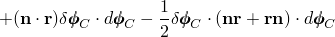

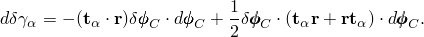The first two terms of the expression for  will only need to be included if slip occurs, whereas the expression for 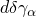 only needs to be taken into account if frictional forces are transmitted.

For dynamic applications we need the velocity and acceleration terms  and 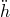 to calculate impact forces and impulses correctly. These terms are

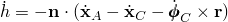(this is the same form as the first variation of ); and

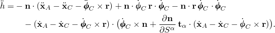
### Reference

### Reference

"Contact formulations in Abaqus/Standard,"  Section 38.1.1 of the Abaqus Analysis User's Guide