# 5.2.1 Contact pressure definition

### 5.2.1 Contact pressure definition

**Products: **Abaqus/Standard  Abaqus/Explicit

The contact modeling capabilities in Abaqus allow access to a library of "surface constitutive models." Part of this library in Abaqus/Standard is the definition of the contact pressure between two surfaces at a point, , as a function of the "overclosure," , of the surfaces (the interpenetration of the surfaces). Two models for 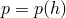 are provided as described below.
### Hard contact

In this case

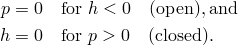

The contact constraint is enforced with a Lagrange multiplier representing the contact pressure in a mixed formulation. The virtual work contribution is

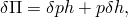and the linearized form of the contribution is

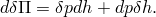
### Softened contact defined with an exponential pressure-overclosure relationship

This model provides an exponential &#8211; relationship, as shown in [Figure 5.2.1&#8211;1](05s02a135.md).

Figure 5.2.1&#8211;1 "Softened" pressure-overclosure relationship using an exponential law.

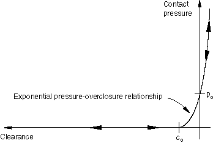

The user defines an initial contact distance, , and a typical pressure value, 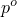, which is the pressure value at zero overclosure (). Then, we define |  | for , |
| --- | --- |
|  | for , | and |  | for , |
| --- | --- |
|  | for . | To avoid numerical difficulties at high penetration (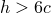), a linearized pressure-overclosure relation with continuous slope is used.
### Softened contact defined with a tabular pressure-overclosure relationship

The pressure-overclosure (-) relationship can be entered directly in tabular form as shown in [Figure 5.2.1&#8211;2](05s02a135.md).

Figure 5.2.1&#8211;2 "Softened" pressure-overclosure relationship defined in tabular form.

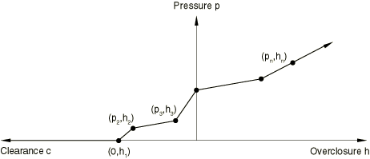
### Softened contact defined with a linear pressure-overclosure relationship

The linear pressure-overclosure relationship is similar to the tabular relationship except that the linear form requires only a single value to be input to define the slope and the curve always passes through the origin.
### Softened contact implementation

A mixed formulation is used because the exponential stiffness associated with softened contact tends to slow down convergence or, due to the development of excessive contact stresses, may cause divergence. For the mixed formulation the virtual work contribution is

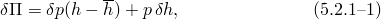where  is the contact pressure,  is the actual overclosure, and 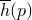 is the overclosure associated with the contact pressure, . A local Newton loop is used to calculate 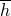 for the current value of . The linearized form of this contribution is

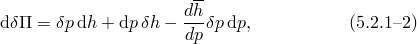where 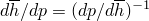 is evaluated for the overclosure . Since there is no term involving 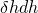, there is a zero on the diagonal of the Jacobian. A zero on the diagonal is not desirable because it may lead to equation solver problems if a rigid body mode is constrained only by contact elements. Hence, a small reference stiffness  is introduced by splitting the contact pressure as follows:

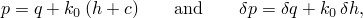where  is a Lagrange multiplier and  is a small reference stiffness (see [Figure 5.2.1&#8211;1](05s02a135.md)):

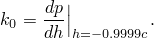

Substituting for the pressure  in [Equation 5.2.1&#8211;1](05s02a135.md) and [Equation 5.2.1&#8211;2](05s02a135.md), we obtain

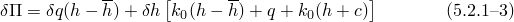and

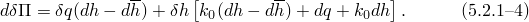Further,

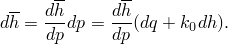Therefore, substituting for 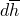 in [Equation 5.2.1&#8211;4](05s02a135.md),

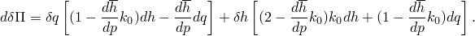Thus, the corresponding system of equations in matrix form is

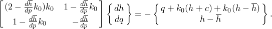

In the mixed formulation the difference between the actual and the calculated overclosure 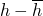 will go to zero as part of the iterative solution process. The difference must be sufficiently small to obtain an accurate solution. The admissible error in  is set to 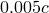 for 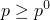. For 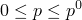 the admissible error is interpolated linearly between  and 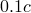, where  represents the tolerance level at 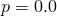; alternatively, the tolerances can be specified by the user as part of the solution controls.
### Viscous damping option

In addition to the surface constitutive models described above, where the contact pressure is a function of the surface overclosure, Abaqus/Standard allows for the definition of a "viscous" pressure that is proportional to the relative velocity, , at which the surfaces approach or separate from each other. This option is intended for the regularization of snap-through problems involving contact where convergence difficulties arise due to the sudden violation of contact constraints.

The damping pressure, , is given by

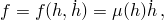where  is the damping coefficient. This coefficient is specified as a function of the overclosure, , as follows:

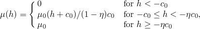where  is the value of the damping coefficient at zero overclosure and  is the fraction of the overclosure interval  over which the damping coefficient is equal to .

The virtual work contribution associated with the damping pressure is

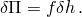The contribution to the stiffness matrix for the Newton solution is given by the linearized form of the virtual work contribution:

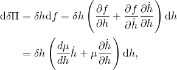where

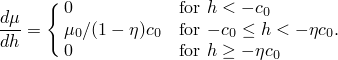

In static analysis the velocity is defined as the displacement increment divided by the time increment. Therefore, 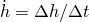, and the stiffness contribution reduces to

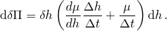

The previous expression also applies to dynamics if the backward Euler time integration operator is used. In the case of dynamics with the Hilber-Hughes-Taylor time integration operator, the stiffness contribution can be written as

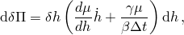where  and  are the Hilber-Hughes-Taylor time integration operator parameters. The viscous damping option cannot be used in a Riks analysis since velocity is not defined.
### Reference

### Reference

"Contact pressure-overclosure relationships,"  Section 37.1.2 of the Abaqus Analysis User's Guide