# 5.2.3 Coulomb friction

### 5.2.3 Coulomb friction

**Products: **Abaqus/Standard  Abaqus/Explicit

An extended version of the classical isotropic Coulomb friction model is provided in Abaqus for use with all contact analysis cababilities. The extensions include an additional limit on the allowable shear stress, anisotropy, and the definition of a "secant" friction coefficient.

The standard Coulomb friction model assumes that no relative motion occurs if the equivalent frictional stress

is less than the critical stress, 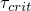, which is proportional to the contact pressure, , in the form

where  is the friction coefficient that can be defined as a function of the contact pressure, ; the slip rate, ; the average surface temperature at the contact point; and the average field variables at the contact point. Rate-dependent friction cannot be used in a static Riks analysis since velocity is not defined. In Abaqus it is possible to put a limit on the critical stress:

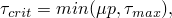where 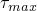 is user-specified. If the equivalent stress is at the critical stress 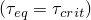, slip can occur. If the friction is isotropic, the direction of the slip and the frictional stress coincide, which is expressed in the form

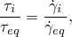where 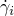 is the slip rate in direction  and  is the magnitude of the slip velocity,

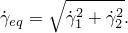As will be shown later, the same laws can be used for anisotropic friction after some simple transformations.

The above behavior can be modeled in Abaqus/Standard in two different ways. By default, the condition of no relative motion is approximated by stiff elastic behavior. The stiffness is chosen such that the relative motion from the position of zero shear stress is bounded by a value 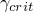. (In the Abaqus Analysis User's Guide  is referred to as the allowable maximum elastic slip.) The critical slip value, , can be specified by the user. If it is not specified by the user,  is, by default, set to 0.5% of the average length of all contact elements in the model. It is worth noting that this approximate implementation method can also be considered an implementation of a nonlocal friction model; that is, a friction model for which the Coulomb condition is not applied pointwise but weighted over a small area with a so-called mollifying function ([Zhong, 1989](07s01a01-References.md)). See [Oden and Pires (1983)](07s01a01-References.md) for further discussion of nonlocal friction models.

Optionally, the relative motion in the absence of slip can be made exactly zero with the use of a Lagrange multiplier formulation. Although this procedure appears attractive because of the exact sticking constraint, it has two disadvantages:

The additional Lagrange multipliers increase the cost of the analysis.

The presence of rigid constraints tends to slow or sometimes prevent convergence of the Newton solution scheme used in Abaqus/Standard. This is likely to occur in areas where contact conditions change.A special case of friction in Abaqus/Standard is so-called rough friction, where it is assumed that there is no bound on the shear stress; that is, no relative motion can occur as long as the surfaces are in contact. Rough friction is implemented with the Lagrange multiplier method.

In Abaqus/Explicit the relative motion in the absence of slip is always equal to zero if the kinematic contact algorithm is used with hard tangential surface behavior; at the end of each increment the positions of the nodes on the contact surfaces are adjusted so that the relative motion is zero. With the penalty contact algorithm in Abaqus/Explicit the relative motion in the absence of slip is equal to the friction force divided by the penalty stiffness.
### Elastic stick formulation

In the elastic stick formulation in Abaqus/Standard, the "elastic" tangential slip 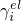 is defined as the *reversible* relative tangential motion from the point of zero shear stress. The elastic slip is related to the interface shear stress with the relation

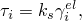where  is the (current) "stiffness in stick," which follows from the relation

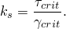Since  may be dependent on contact pressure, slip rate, average surface temperature at the contact point, and field variables,  may change during the analysis. The behavior remains elastic as long as the equivalent stress does not exceed the critical stress; hence,

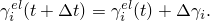Consistent linearization of this expression yields

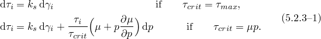The contributions from the contact pressure are nonsymmetric for the second case. Since the slip rate is zero in the elastic stick formulation, derivatives with respect to the slip velocity are not needed.

The above expressions hold if the equivalent shear stress remains less than the critical stress. If the equivalent stress exceeds the critical stress, slip must be taken into consideration so that the condition 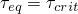 is satisfied. Let the starting situation be characterized by the elastic slip 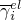. The critical stress at the end of the increment follows from the contact pressure, , and the slip rate, 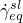.

Let the (as yet unknown) elastic slip at the end of the increment be  and the slip increment be 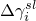. Consistency requires that

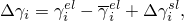and the shear stress at the end of the increment follows from the elasticity relation,

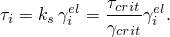The slip increment is related to the stress at the end of the increment with the backward difference approach:

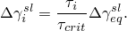With these equations and the critical stress equality 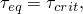 it is possible to solve for , , and . Elimination of  and  from the above equations yields,

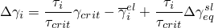or

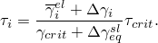It is convenient to define the "elastic predictor strain"

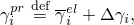which simplifies the expression for the stress to

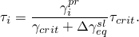Substitution in the critical stress equality yields

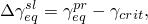where

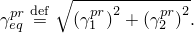Substitution in the expression for  and introduction of the normalized slip direction 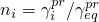 furnishes the final result

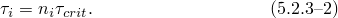Here  is a function of the slip rate, which is obtained with

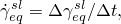where  is the time increment in a static analysis. In the case of dynamics with the Hilber-Hughes-Taylor time integration operator,  is scaled by the Hilber-Hughes-Taylor time integration operator parameters,  and .

For the iterative solution scheme this equation must be linearized. Some straightforward algebra yields

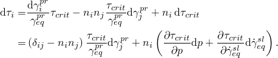With the expression for the equivalent slip the final result is

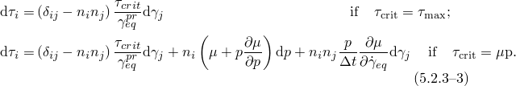 In this case the unsymmetric terms may have a strong effect on the speed of convergence of the Newton scheme. Hence, use of the unsymmetric equations solver is strongly recommended for the analysis of problems in which sliding friction occurs. In the case of dynamics with the Hilber-Hughes-Taylor time integration operator,  is scaled by the Hilber-Hughes-Taylor time integration operator parameters.
### Frictional stress due to forced sliding in static analysis

If the user specifies different velocities for two bodies in contact as a predefined field, it is assumed that the slip velocity follows from the prescribed motion and is independent of the displacement values. The frictional stresses then follow from

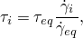 where

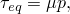 and

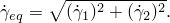  are the tangential slip velocities derived from the user-defined fields ().
### Friction contributions for complex eigenvalue extraction analysis

At the contact nodes at which the velocity differential is imposed, the linearized shear stress can be expressed in the following form:

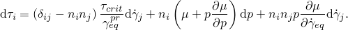In the equation above the first term is generated by the friction forces acting in the direction perpendicular to the direction of slip. The third term exists if the friction coefficient depends on velocity. In the complex eigenvalue extraction analysis both terms contribute to the damping matrix. The second term contributes to the stiffness matrix.
### Viscous stick formulation for steady-state transport

For steady-state transport a viscous stick formulation is used. In this case the "viscous" tangential slip rate, 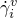, is related to the interface shear stress by

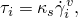 where  is the "stick viscosity," which follows from the relation

 The allowable viscous slip is defined as a fraction of the relative tangential velocity

where  is a user-defined slip tolerance,  is the angular spinning velocity, and  is the radius of a point on the contact surface in the undeformed configuration.
### Exact stick formulation

In Abaqus/Standard Lagrange multipliers are used to enforce exact sticking conditions. A constraint term enforced with Lagrange multipliers 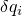 is added to the virtual work statement:

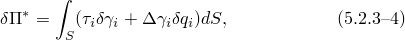where  is a Lagrange multiplier. By taking the rate of change of [Equation 5.2.3&#8211;4](05s02a137.md), the rate of virtual work is obtained:

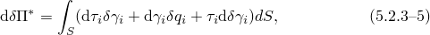where the last term results from a nonlinear relation between nodal displacements and relative motion . This term is nonzero only for contact with finite sliding (see "Finite-sliding interaction between deformable bodies,"  Section 5.1.2, and "Finite-sliding interaction between a deformable and a rigid body,"  Section 5.1.3).

To obtain a complete formulation, a relationship between 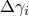, , and  must be defined. For sticking conditions a suitable relation is

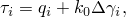with  a reference stiffness selected internally in Abaqus. The reference stiffness can be considered to model a spring that is in parallel to the sticking constraint. Since the constraint prevents relative motion, the reference stiffness has no physical significance and is added only to eliminate zero terms on the diagonal of the stiffness matrix that could cause equation solver problems. The variational and rate forms of the equation for  are readily obtained as

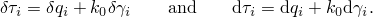Substitution in [Equation 5.2.3&#8211;5](05s02a137.md) yields

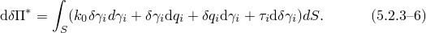

If the element is slipping,  can take an arbitrary value. Consequently the terms involving  in [Equation 5.2.3&#8211;4](05s02a137.md) and [Equation 5.2.3&#8211;5](05s02a137.md) vanish. With the backward difference method, the frictional stress is obtained as

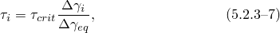and the linearized form is

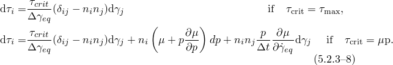The rate of virtual work can, hence, be written in the form

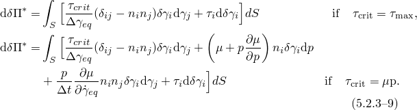Observe that for two-dimensional problems the term involving 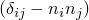 vanishes. In the case of dynamics with the Hilber-Hughes-Taylor time integration operator,  is scaled by the Hilber-Hughes-Taylor time integration operator parameters.

To determine whether an element sticks or slips, the following tests are used. If the element is currently sticking, it is checked whether the magnitude of the frictional stress exceeds the critical value. Hence, if

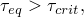the state is changed to slipping.

If the element is slipping, the direction of slip is compared with the frictional stress  applied at the start of the iteration. If at the end of the iteration

the state is changed to sticking.
### Anisotropic friction

In anisotropic friction the friction coefficients in the two (principal) directions are different; hence, the critical shear stresses are different:

The two critical shear stresses are at the extreme points of the friction ellipse, given by the equation

This suggests definition of the scaled shear stresses,

where  is the average friction coefficient defined by

Hence, the (scaled) equivalent frictional stress is defined by

and the average critical stress

where  is the user-specified limiting shear stress, which is applied to the scaled shear stresses. No slip will occur if , and slip can occur if .

If slip occurs, it is assumed that the direction of slip is governed by an associated slip law:

Hence, scaled rates of slip are defined by

and the (scaled) equivalent slip rate

As a result, the direction of the scaled slip and the scaled shear stress coincide:

Since these equations have exactly the same structure as the equations for isotropic friction, the same solution algorithms can be used to get the incremental and linearized equations in terms of the scaled stress and slip. The actual stresses are readily obtained from the scaled stresses with [Equation 5.2.3&#8211;10](05s02a137.md), and the linearized equations are scaled with the same factors.

In the anisotropic elastic stick formulation, it is assumed that the stiffness in stick in terms of the *scaled* stress and slip is constant:

hence, the scaled stress is related to the scaled elastic slip by the relation

In terms of the actual stress and strain in the - and -directions, this implies

with

Hence, the anisotropy in terms of the stiffness in stick is more pronounced than the anisotropy in terms of critical stress.
### Viscous damping

In addition to the friction models described above, Abaqus allows for the definition of a "viscous" shear stress  that is proportional to the relative tangential velocity . This viscous damping in the tangential direction occurs if

damping in the contact direction is included and the tangent fraction is nonzero; or

contact controls are used to stabilize rigid body modes automatically in multi-body contact analysis. The viscous damping stress is proportional to the tangential damping coefficient , which is a function of the overclosure as follows:

where  is the value of the tangential damping coefficient at zero overclosure and  is the fraction of the overclosure interval  over which the damping coefficient is equal to .

The virtual work contribution associated with the viscous shear stress is

The contribution to the stiffness matrix for the Newton solution is given by the linearized form of the virtual work contribution:

where

In static analysis the velocity is defined as the displacement increment divided by the time increment. Therefore, , and the stiffness contribution reduces to

The previous expression also applies to dynamics with the backward Euler time integration operator. In the case of dynamics with the Hilber-Hughes-Taylor time integration operator,  is defined by the dynamic time integration operator and the stiffness contribution can be written as

where  and  are the Hilber-Hughes-Taylor time integration operator parameters. Viscous damping cannot be used in a Riks analysis since velocity is not defined.
### Reference

### Reference

"Frictional behavior,"  Section 37.1.5 of the Abaqus Analysis User's Guide