# 5.2.4 Thermal interface definition

### 5.2.4 Thermal interface definition

**Products: **Abaqus/Standard  Abaqus/Explicit

Abaqus/Standard allows heat flow across an interface via conduction or radiation. Generally, both modes of heat transfer are present to some degree. Regardless of the mode, heat transfer across the interface is assumed to occur only in the normal direction.
### Conduction

Heat conduction across the interface is assumed to be defined by

where  is the heat flux per unit area crossing the interface from point  on one surface to point  on the other,  and  are the temperatures of the points on the surfaces, and  is the gap conductance.

The derivatives of  are

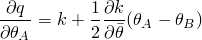and

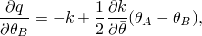where

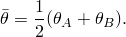
### Radiation

The heat flow per unit area between corresponding points is assumed to be given by

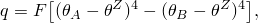where  is the value of absolute zero temperature on the temperature scale being used;  is the heat flux per unit surface area crossing the gap at this point, from surface  to surface ;  and  are the temperatures of the two surfaces; and  is the gap radiation constant derived from the emissivities of the two surfaces.

The derivatives of  are

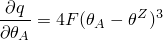and

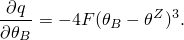
### Jacobian matrix

The contribution to the variational statement of thermal equilibrium is

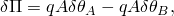where  is the area. The contribution to the Jacobian matrix for the Newton solution is

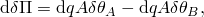where

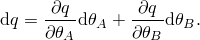

For "tied" thermal contact the temperature at point  is constrained to have the same temperature as point . The Lagrange multiplier method is used to impose the constraint by augmenting the thermal equilibrium statement as follows:

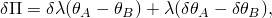where  is the Lagrange multiplier. The contribution to the Jacobian matrix for the Newton solution is

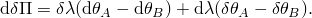
### Reference

### Reference

"Thermal contact properties,"  Section 37.2.1 of the Abaqus Analysis User's Guide