# 5.2.5 Heat generation caused by frictional sliding

### 5.2.5 Heat generation caused by frictional sliding

**Products: **Abaqus/Standard  Abaqus/Explicit

For coupled temperature-displacement and coupled thermal-electrical-structural analyses in Abaqus/Standard the user can introduce a factor, , which defines the fraction of frictional work converted to heat. The fraction of generated heat into the first and second surface,  and , respectively, can also be defined. This heat generation capability is to be used only in coupled temperature-displacement and coupled thermal-electrical-structural analyses.

The heat fraction, , determines the fraction of the energy dissipated during frictional slip that enters the contacting bodies as heat. Heat is instantaneously conducted into each of the contacting bodies depending on the values of  and . The contact interface is assumed to have no heat capacity and may have properties for the exchange of heat by conduction and radiation.

Refer to "Small-sliding interaction between bodies,"  Section 5.1.1, and "Finite-sliding interaction between deformable bodies,"  Section 5.1.2, for explanations of the notation used for the shape functions and contact parameters involved in the small-sliding and slide line theory. Note that the shape functions for interpolation of the temperature field may be different from the interpolation functions for the displacements; for example, if the underlying elements are of second order, the displacements are interpolated using quadratic functions, whereas the temperature field is interpolated using linear shape functions. Hence, the temperature interpolator will be denoted with the symbol  and the displacement interpolation will be denoted with the symbol . Only the heat transfer terms will be discussed in the following.

The heat flux densities---, going out the surface on side 1, and , going out the surface on side 2---are given by

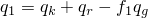and

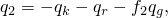where  is the heat flux density generated by the interface element due to frictional heat generation, 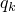 is the heat flux due to conduction, and 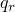 is the heat flux due to radiation.

The heat flux density generated by the interface element due to frictional heat generation is given by

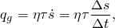where  is the frictional stress, 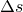 is the incremental slip, and  is the incremental time. The frictional stress is dependent on the contact pressure, ; the friction coefficient, ; and the temperatures on either side of the interface.

The heat flux due to conduction is assumed to be of the form

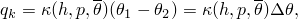where the heat transfer coefficient 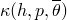 is a function of the average temperature at the contact point, 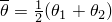; the overclosure, ; and the contact pressure, . 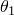 and  are the temperatures of side 1 and side 2, respectively.

The heat flux due to radiation is assumed to be of the form

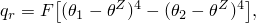where  is the gap radiation constant (derived from the emissivities of the two surfaces) and  is the absolute zero on the temperature scale used.

Using the Galerkin method the weak form of the equations can be written as

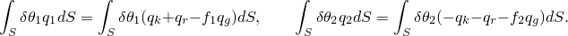The contribution to the variational statement of thermal equilibrium is

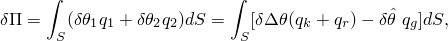where 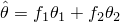. The contribution to the Jacobian matrix for the Newton solution is

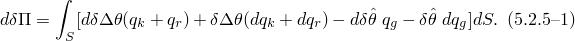

At a contact point the temperatures can be interpolated with

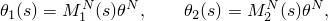where  is the temperature at the th node associated with the interface element. Note that the summation convention will be used for all superscripts. Therefore, the temperature variables can be written as follows:

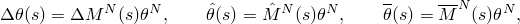where 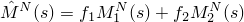 and 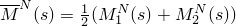. Substituting the above expressions into [Equation 5.2.5&#8211;1](05s02a139.md), we obtain

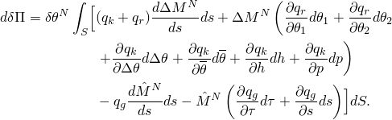After rearranging and expanding terms, we obtain

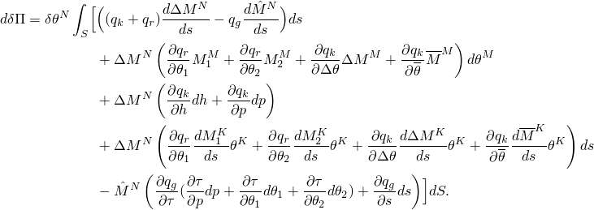Expanding the terms involving frictional heat generation yields

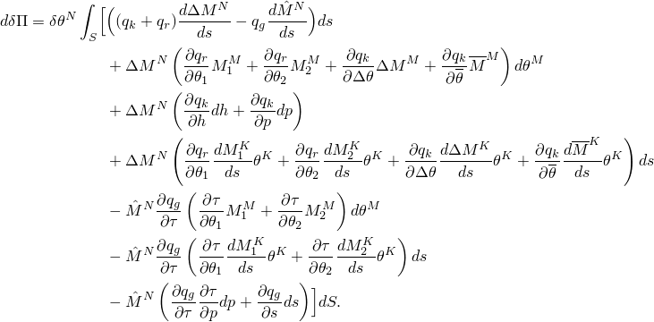The derivatives of , , and , are as follows:

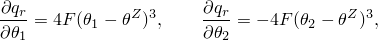

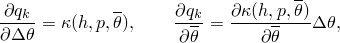

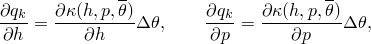

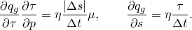

For contact pairs and slide line elements, each integration point is associated with a unique slave node. If we associate 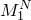 with the slave surface, then  will again have only a single nonzero entry equal to one and the derivatives of  with respect to  vanish. In contrast, on the master surface there will be multiple nonzero entries in 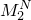, which are a function of the position on the master surface at which contact occurs.

For GAPUNIT and DGAP elements each contact (integration point) is directly associated with a node pair. Hence,  and  each have one nonzero entry that is equal to one, and all terms involving derivatives of  and  with respect to  vanish.

The variations of overclosure, , and slip, , can be written as linear functions of the variations of displacement. These expressions, which determine the form of the  matrix for contact elements, have been derived in "Small-sliding interaction between bodies,"  Section 5.1.1, and "Finite-sliding interaction between deformable bodies,"  Section 5.1.2.
### References

### References

"Fully coupled thermal-stress analysis,"  Section 6.5.3 of the Abaqus Analysis User's Guide

"Fully coupled thermal-electrical-structural analysis,"  Section 6.7.4 of the Abaqus Analysis User's Guide

"Thermal contact properties,"  Section 37.2.1 of the Abaqus Analysis User's Guide