# 5.2.6 Heat generation caused by electrical current

### 5.2.6 Heat generation caused by electrical current

**Product: **Abaqus/Standard

For coupled thermal-electrical and coupled thermal-electrical-structural analyses in Abaqus/Standard the user can introduce a factor, , which defines the fraction of electrical dissipation in the contact zone converted to heat. The fraction of generated heat into the first and second surface,  and , respectively, can also be defined.

The heat fraction, , determines the fraction of the energy dissipated due to electrical current that enters the contacting bodies as heat. Heat is instantaneously conducted into each of the contacting bodies depending on the values of  and . The contact interface is assumed to have no heat capacity and may have properties for the exchange of heat by conduction and radiation.

The heat flux densities, , going out the surface on side 1, and , going out the surface on side 2, are given by

and

where  is the heat flux density generated by the interface element due to electrical current,  is the heat flux due to conduction, and  is the heat flux due to radiation.

The heat flux due to conduction is assumed to be of the form

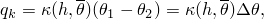where the heat transfer coefficient 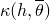 is a function of the average temperature at the contact point, , and overclosure, .  and  are the temperatures of side 1 and side 2, respectively.

The heat flux due to radiation is assumed to be of the form

where  is the gap radiation constant (derived from the emissivities of the two surfaces) and  is the absolute zero on the temperature scale used.

The electrical flux density, , in the interface element is given in terms of the difference in the electric potential, 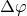, across the interface:

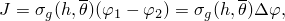where the gap electrical conductance 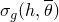 is a function of the overclosure, , and the average temperature at the contact point, . 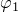 and 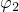 are the electric potentials of side 1 and side 2, respectively.

In a steady-state analysis the heat flux density generated by the interface element due to electrical current is given by

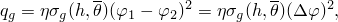where  is the fraction of dissipated energy converted to heat. In a transient analysis the average heat flux density is given by

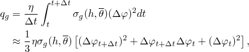where  is the time at the start of an increment and  is the time increment.

Using the Galerkin method, the weak form of the equations can be written as

The contribution to the variational statement of thermal equilibrium is

where . The contribution to the Jacobian matrix for the Newton solution is

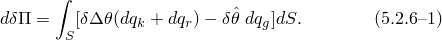At a contact point the temperatures can be interpolated with

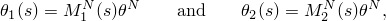where  is the temperature at the th node associated with the interface element. Note that the summation convention will be used for all superscripts. Therefore, the temperature variables can be written as follows:

where  and . Substituting the above expressions to [Equation 5.2.6&#8211;1](05s02a140.md), we obtain

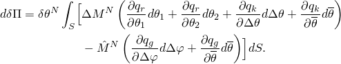The derivatives of , , and , are as follows:

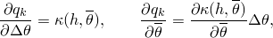and in a steady-state analysis

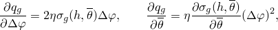while in a transient analysis

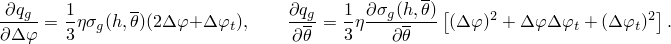

Similarly, the contribution to the variational statement of electrical equilibrium is

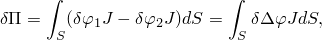and the contribution to the Jacobian matrix for the Newton solution is

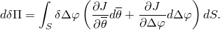The derivatives of  are

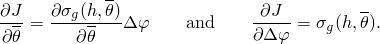
### References

### References

"Coupled thermal-electrical analysis,"  Section 6.7.3 of the Abaqus Analysis User's Guide

"Fully coupled thermal-electrical-structural analysis,"  Section 6.7.4 of the Abaqus Analysis User's Guide

"Electrical contact properties,"  Section 37.3.1 of the Abaqus Analysis User's Guide