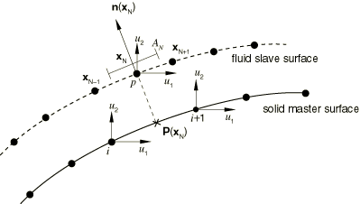
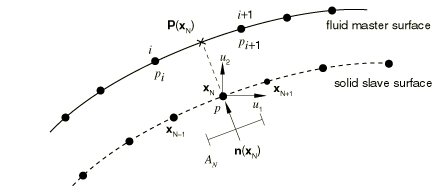

# 5.2.7 Surface-based acoustic-structural medium interaction

### 5.2.7 Surface-based acoustic-structural medium interaction

**Products: **Abaqus/Standard  Abaqus/Explicit

Abaqus provides two alternatives for modeling interaction between acoustic and structural media: surface-based interaction or acoustic interface (ASIn) elements. Both are available in Abaqus/Standard, but only the surface-based capability is available in Abaqus/Explicit. If the special-purpose interface elements (ASIn) are used, interacting structural and acoustic nodes must be shared by the two meshes. The surface-based capability can be used for structural and acoustic meshes that have different node numbering and whose surface meshes may not be spatially coincident. The ease of use and low computational cost of the surface-based procedure make it preferable to the element-based approach.
### The equations on the contact interface between the structure and the acoustic medium

In the surface-based method the tractions and volumetric acceleration fluxes are computed between structural and acoustic media. In place of consistent distributed tractions or fluxes on both media, one side (identified as the "slave") receives point tractions/fluxes based on interpolation with the shape functions from the other ("master") side. Either the acoustic fluid or the structural solid can be the slave or master, and no Lagrange multipliers are introduced in the formulation. The basis for deciding which to make slave or master is discussed in the Abaqus Analysis User's Guide.

The transient expressions for the coupled acoustic-structural problem are

(acoustic medium) and

(structural medium), where  is the normal vector pointing into the fluid. The fluid-solid surface consists of the union of the directly coupled fluid-solid region, , and a region coupled via a "reactive" acoustic surface or impedance boundary, . Of primary interest here are those terms integrated over , which couple the two variational equations. The fluid impedance integral, over , depends only on the acoustic pressure field and its variations, so it is unaffected by the contact with the solid. The derivation for the steady-state case is formally identical to the transient case and will not be discussed here. For details of the differences in transient and steady-state acoustics in Abaqus, see "Coupled acoustic-structural medium analysis,"  Section 2.9.1.

When ASIn elements are used (see "Acoustic interface elements,"  Section 32.13.1 of the Abaqus Analysis User's Guide), the formulation requires that the fluid and solid elements be geometrically and nodally conformal so that the shape functions for the structural displacements and the acoustic pressures are identical. The shape functions are integrated using standard methods to yield element matrices of dimension equal to the number of surface nodes on the element. The complete fluid-solid coupling matrices are formed by the sum over the element faces; that is, a standard element assembly operation. The two final coupling matrices have the sparsity pattern of the coupled fluid-solid element faces.

In surface-based coupling the interaction surface  is formed by the boundary between possibly nonconforming structural and acoustic meshes. Therefore, the fluid-solid coupling matrix cannot be broken up into a sum over element faces as simply as in the ASIn case. To derive the coupling matrices in the surface-based procedure, we use a variation of the master-slave procedure used in small-sliding contact (see "Small-sliding interaction between bodies,"  Section 5.1.1). At the start of an analysis, the projections  of slave nodes onto the master surface are found, and the areas  and normals  associated with the slave nodes are computed. The projections are points  on the master surface; master nodes in the vicinity of this projection are identified. Variables at the slave nodes  are then interpolated from variables at the identified master surface nodes near the projection .

Since the physical degrees of freedom for the fluid and solid meshes are different, two cases must be treated. The two cases handle the discretization of the coupling terms differently.
### Solid/structural master, fluid slave

If the fluid medium surface is designated as the slave, we constrain values at each fluid node to be an average of the values at nearby master surface nodes (see [Figure 5.2.7&#8211;1](05s02a141.md)). The pointwise fluid-solid coupling condition,

is enforced at the slave nodes, resulting in displacement degrees of freedom added to the fluid slave surface. These slave displacements are constrained by the master displacements and thereby eliminated; the slave pressures are not constrained directly.

Figure 5.2.7&#8211;1 Fluid slave.

Hence, the fluid equation coupling term

is equal to

This term is now approximated, at the slave node level, by the interpolated values of structural displacements at the nearby master nodes times the area of the slave node:

where  is the master surface interpolant evaluated at the projection of the slave node,  are the structural accelerations at the master nodes, and  is the normal vector, pointing into the fluid, evaluated at the slave node. The summation extends over all master nodes  in the vicinity of the slave node projection  (see [Figure 5.2.7&#8211;1](05s02a141.md)). The computation is repeated for each slave node  on the surface  and assembled to form the entire coupling matrix.

Similarly, the contribution to the pressure coupling term in the structural equation due to slave node  is approximated by

where  is the acoustic pressure at slave node , and the sum is again over the master nodes  in the vicinity of the slave node projection.

These expressions for the coupling terms result in matrices that are the transpose of each other. The normal vectors at the slave surface are used, so these vectors must be well-defined (see "Surfaces: overview,"  Section 2.3.1 of the Abaqus Analysis User's Guide).
### Fluid master, solid/structural slave

If the solid medium is designated as the slave, the values on this surface are constrained to equal values interpolated from the master surface. The pointwise fluid-solid coupling condition is again enforced at the slave nodes, resulting in acoustic pressure degrees of freedom added to the solid slave surface (see [Figure 5.2.7&#8211;2](05s02a141.md)). These slave pressures are constrained by the master surface acoustic pressures and eliminated; the slave displacements are not constrained directly. Hence, the contribution to the coupling term in the acoustic equation for a single slave node  is approximated by

where  is the structural acceleration at the slave node and  are the interpolants on the fluid (master) surface evaluated at the projection . The summation extends over the master nodes  in the vicinity of the slave node projection and is repeated for all solid/structural nodes in the surface  to compute the entire coupling matrix.

Figure 5.2.7&#8211;2 Fluid master.

The contribution of a slave node to the coupling term in the structural equation is approximated by

where  is the pressure at master node  and the sum is again over the master nodes in the vicinity of the slave node projection .
### Reference

### Reference

"Acoustic, shock, and coupled acoustic-structural analysis,"  Section 6.10.1 of the Abaqus Analysis User's Guide