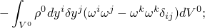
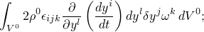
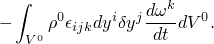

# 6.1.1 Centrifugal, Coriolis, and rotary acceleration forces

### 6.1.1 Centrifugal, Coriolis, and rotary acceleration forces

**Product: **Abaqus/Standard

Many of the elements in Abaqus allow centrifugal, Coriolis, and rotary acceleration forces to be included. This section defines these load types.

It is assumed that the model (or that part of it to which these forces are applied) is described in a coordinate system that is rotating with an angular velocity, , and/or an angular (rotary) acceleration, . Let  be a right-handed set of unit, orthogonal vectors that form a basis for this system. Then,  and .

If the angular velocity is cast as

where  is the magnitude of  and  is the unit axis of rotation, the rotary acceleration is

where the term  represents the effect of the motion of the axis of rotation (precessional motion);

 is the magnitude of the rotary acceleration; and  is the axis of rotary acceleration. If , then  and . In component form

and

Let  be a point on the axis of rotation. The position of a material particle, , can be written

where , , are the coordinates of the point in the rotating basis system. Taking time derivatives,

and

We assume that the origin of the rotating system, , is fixed, so that

With this simplification

and

The virtual work contribution from the d'Alembert forces is

where  is the mass density of the body in its reference configuration, where its volume is  and  is a virtual variational field. For the part of the body described in the rotating system, the acceleration, , is given by [Equation 6.1.1&#8211;1](06s01a142.md), while  only, since  and  are prescribed and  is fixed. Thus,

Simplifying,

The terms in  can be identified as follows. The first term,

is the usual "consistent mass matrix" term associated with acceleration of the material particles with respect to the rotating system.

Writing the angular velocity of the rotating basis system as its components in that system, , gives the second term as

where  is the alternator tensor. This term is the Coriolis force term and arises whenever there is velocity in the rotating system, which can happen in dynamic analysis or in quasi-static cases in which a constant velocity has been introduced (for example, by defining an initial velocity).

The third term is, likewise, rewritten as

This term is the centrifugal load term.

Similarly, the fourth term is rewritten as

This term is the rotary acceleration load term.

In Abaqus/Standard the centrifugal load, Coriolis, and rotary acceleration terms contribute to the "load stiffness matrix." The centrifugal load term has a symmetric load stiffness matrix,

the Coriolis term has an antisymmetric "load damping matrix,"

and the rotary acceleration term has an antisymmetric load stiffness matrix,

### Reference

### Reference

"Distributed loads,"  Section 34.4.3 of the Abaqus Analysis User's Guide