# 6.1.2 Baseline correction of accelerograms

### 6.1.2 Baseline correction of accelerograms

**Product: **Abaqus/Standard

Abaqus/Standard offers baseline correction of acceleration records for time domain analysis. The correction technique is that proposed by [Newmark (1973)](07s01a01-References.md). An acceleration correction, 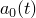, is added to the raw data record, 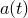, to produce a corrected acceleration record, 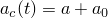, such that the mean square velocity over the time of the event is minimized. The acceleration correction is parabolic over any number of time intervals during the event:

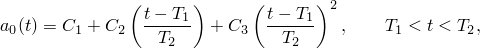where 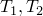 denote the limits of a time interval and 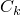, , are constants obtained from the velocity minimization:

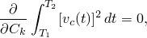where 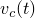 is the corrected velocity record obtained by integrating the corrected acceleration record, 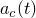.

It can be shown that the  are defined for each time interval by

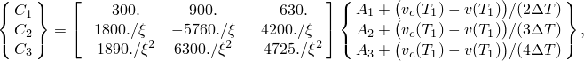where 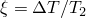; 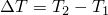; and , , and  are defined as

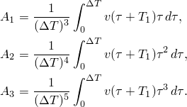Here  denotes the uncorrected velocity record obtained by integration of the uncorrected acceleration record, . These velocities are obtained by assuming the uncorrected and the corrected acceleration vary linearly over each time increment of the original acceleration history. This is not exact for the corrected acceleration record (because of the parabolic variation of the correction in time), but it is assumed that the acceleration history is discretized at sufficiently small time increments so that this is an insignificant error.
### Reference

### Reference

"Amplitude curves,"  Section 34.1.2 of the Abaqus Analysis User's Guide